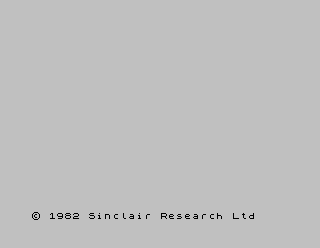

# 2. zx-dart

_08-06-2012_ _Juan Mellado_

He desarrollado un emulador de ZX Spectrum en Dart. ZX Spectrum fue uno de los ordenadores más populares durante la década de los ochenta, y este año se cumplieron treinta desde su creación. Dart es un nuevo lenguaje de programación que está desarrollando Google. He llamado zx-dart al proyecto y lo he liberado como código abierto.

- [https://github.com/jcmellado/zx-dart](https://github.com/jcmellado/zx-dart)

La versión de código nativo en Dart se puede ejecutar en Dartium, que es una versión de Chrome que incluye la máquina virtual de Dart. Aunque el rendimiento es pésimo, no alcanza ni un frame por segundo. Hay que tener en cuenta que Dart todavía está en desarrollo, las mejoras tienen que ir llegando poco a poco, además de que la especificación oficial del lenguaje cambia cada pocas semanas, por lo que el código escrito hoy puede que no funcione mañana.

Dart viene acompañado de una herramienta llamada (actualmente) dart2js que convierte el código Dart a JavaScript, de forma que se pueda ejecutar directamente en Chrome sin necesidad de la máquina virtual de Dart. Afortunadamente esta versión alcanza los 20 FPS en mi máquina y el emulador se deja probar, aunque para una simulación realista de un Spectrum debería alcanzar al menos 50 FPS.

El emulador que he implementado está basado en JSpeccy. Realiza una emulación básica de un Spectrum 48K, con carga de ROM y ejecución de BASIC. Le faltan muchas características básicas, como la generación de sonido o la posibilidad de cargar _snapshots_ por ejemplo. Pero hoy en día hay muchos emuladores bastante completos para casi cualquier plataforma, por lo que no merece la pena complicar el desarrollo para reinventar la rueda. Quizás un _port_ a Dart de algún emulador ya existente escrito en JavaScript podría ser una mejor opción.

Ha sido emocionante el primer arranque, después de múltiples fallos, y ver el famoso mensaje de _copyright_.
