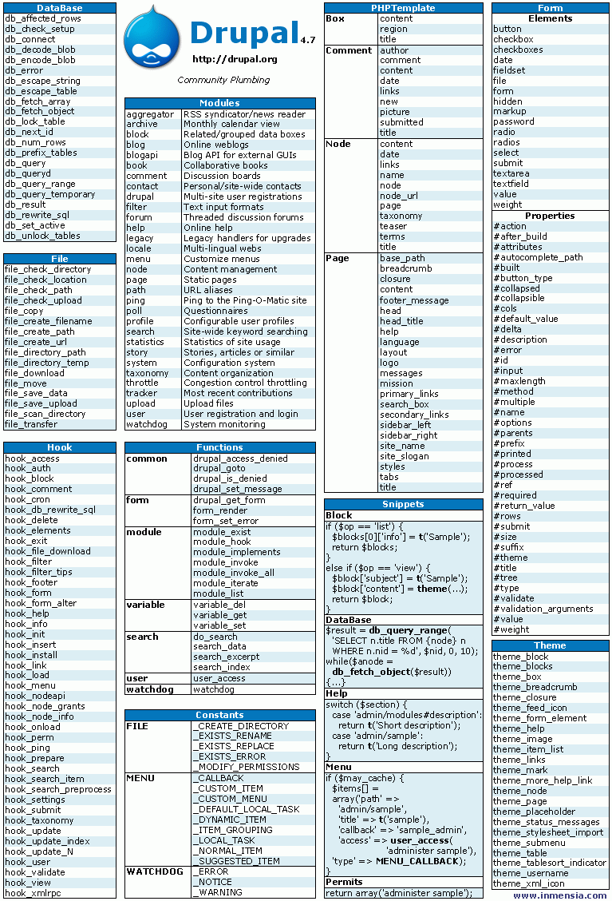

# 8. Drupal: Drupal 4.7 Cheat Sheet

_21-02-2006_ _Juan Mellado_

Todos los artículos de esta serie dedicada a Drupal han sido escritos hasta el momento en función de mi experiencia con la instalación, configuración, y personalización de la versión 4.6 de Drupal. A día de hoy la versión 4.7 ya está cercana a su liberación, y existe bastante información acerca de los cambios y mejoras incluidas en la misma. He recopilado parte de esta información y la he dispuesto de forma ordenada en una imagen en formato PNG, a la manera de una hoja resumen de fácil consulta, en una disposición que se conoce habitualmente con el nombre de "_Cheat Sheet_". Puede descargarse (66 Kb) o verse directamente en la _web_ pinchando en la imagen a tamaño reducido que se encuentra en esta página.



Las columnas izquierda y derecha contienen listados en orden alfabético de las funciones y _hooks_ de módulos relevantes y de uso frecuente: ```DataBase```, ```File```, ```Hook```, y ```Theme```. La tabla ```Form``` contiene la lista de controles y atributos disponibles para la construcción de formularios.

En la columna central izquierda puede verse a _Druplicon_ (el nombre del logo de Drupal), la URL de la página oficial, y el _slogan_ del CMS. Justo debajo hay un listado de los módulos básicos que se distribuyen con la instalación, junto con una descripción de la utilidad de cada uno de ellos. Esta primera parte de la columna está destinada a publicitar un poco Drupal y poner de relieve toda la funcionalidad que ofrece en su instalación básica. Las dos últimas tablas de esta columna son una lista de funciones de uso general utilizadas frecuentemente, y una lista de constantes utilizadas como parámetros en las funciones de gestión de ficheros, menús, y _logs_.

La columna central derecha contiene un listado de todas las variables por defecto que ofrece el _theme engine_ PHPTemplate. Y una última tabla con ejemplos de código fuente, con los _hooks_ mínimos que deben crearse para implementar un módulo, junto con un ejemplo de un acceso típico a base de datos.
