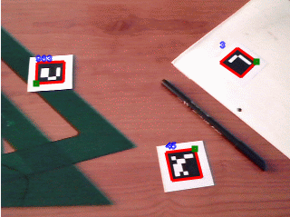

# 5. js-aruco

_30-05-2011_ _Juan Mellado_

He subido a un repositorio público todo el código JavaScript que he ido generando estos últimos días resultado de portar ArUco, una librería para la construcción de aplicaciones de realidad aumentada escrita en C++ utilizando _OpenCV_. He llamado _js-aruco_ al proyecto, espero que el nombre no me cause problemas, pero me parecía el más adecuado.

- [https://github.com/jcmellado/js-aruco](https://github.com/jcmellado/js-aruco)

En contra de mi costumbre, he creado una pequeña demo, que tiene la particularidad de que es capaz de obtener imágenes de una _webcam_ a través de una pequeña librería que he escrito en Flash, y que es capaz de capturar vídeo y enviar las imágenes a JavaScript. La demo requiere un ordenador bastante rápido, un navegador moderno actualizado (Chrome o Firefox), Flash para la captura de vídeo, y una _webcam_.

- [https://jcmellado.github.io/js-aruco/getusermedia/getusermedia.html](https://jcmellado.github.io/js-aruco/getusermedia/getusermedia.html)

La demo detecta los marcadores y dibuja un borde rojo alrededor de los mismos, muestra en azul los números identificadores de cada uno de ellos, y destaca las esquinas superiores izquierda con un pequeño cuadro verde para poder hacer un seguimiento de su orientación real con respecto a la cámara.



Los marcadores deben ser matrices de 7x7, con un borde negro de 1 celda de ancho. La matriz más interna de 5x5 puede tener filas con cualquiera de las siguiente combinaciones válidas:

```text
blanco - negro  - negro  - negro  - negro
blanco - negro  - blanco - blanco - blanco
negro  - blanco - negro  - negro  - blanco
negro  - blanco - blanco - blanco - negro
```
