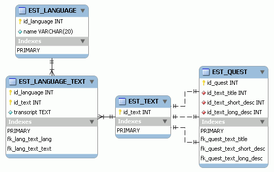

# 5. MMORPG DB: Idiomas

_24-05-2008_ _Juan Mellado_

Un español, un francés y un inglés están jugando a un MMORPG cuando ... lo que parece el comienzo de un buen chiste deja de serlo cuando nos damos cuenta que cada uno de ello habla un idioma distinto, y que nuestro modelo de datos ha de soportar esta pluralidad de lenguas.

El primer paso para abordar esta tarea sería distinguir claramente entre los textos que se distribuirán con la parte cliente, como los asociados a los controles de la interface de usuario por ejemplo, y los que se encontrarán en la parte servidora, como los nombres y descripciones de las misiones. O los que se utilizarán para la habitual _web_ de creación y mantenimiento de cuentas, aunque esto último es harina de otro costal. La idea es que cada jugador pueda leer en su idioma preferido toda la información que se le muestre en su monitor.

Los textos de la parte cliente tradicionalmente se distribuyen junto con la aplicación cliente, normalmente en ficheros de recursos, con tablas de cadenas de texto identificadas por un ID. En el código fuente, en los _scripts_, o en los ficheros descriptores de las interfaces, se hacen referencia a esos IDs evitando tener que escribir directamente cualquier tipo de texto estático dentro del programa. Se puede pensar en los ficheros de recursos como en pequeñas base de datos con una única tabla por idioma. La selección de un fichero u otro, es decir, de idioma, se realiza habitualmente durante la fase de instalación, o a través de una opción de configuración. A veces simplemente los clientes se descargan una versión personalizada para un país concreto sin posibilidad de cambio. Otra veces el propio programa detecta el idioma seleccionado en la configuración local del ordenador, arranca con ese idioma por defecto si está disponible, con otro idioma si no se encuentra, o se da la opción de elegir.

Lo que no debería ocurrir, o habría que evitar en la medida de lo posible, es que además de textos haya que cambiar gráficos en función del idioma. Un ejemplo típico de esta situación es una ventana intermedia de carga de nivel en la que se muestra una imagen con el texto "_Loading_". De igual forma, habría que evitar incrustar textos dentro de las texturas del mundo en que se desarrolle el juego, salvo cuando el contexto lo permita, e incluso lo fomente. Por ejemplo, en una ciudad rusa todo el mundo espera encontrar rótulos, anuncios y señalizaciones en cirílico, es el tipo de detalle que crea ambientación. Pero otra cosa muy distinta es hacer que el avance del juego dependa de la comprensión de esos textos, lo que puede llegar a ser muy frustrante. En algunas ocasiones, cuando no hay más remedio, se puede recurrir a _decals_ (calcomanías) para mostrar la información de forma gráfica en el idioma adecuado.

Los textos de la parte servidora pueden ser almacenados en la base de datos, aunque al ser información de carácter fundamentalmente estática, es probable que se recuperen al arrancar el servidor y se almacenen en algún tipo de _cache_, algo que intuitivamente se puede pensar también en hacer en la parte cliente, aunque probablemente limitándose al área o zona actual en juego.

El enfoque tradicional para almacenar textos en base de datos es añadir columnas a las tablas que lo necesiten. Por ejemplo, la tabla de misiones puede tener una columna llamada ```title```, otra ```short_description```, otra ```long_description```, y así sucesivamente. El problema de este enfoque es que sólo permite tener textos en un determinado idioma a un mismo tiempo. Es decir, si se escriben en inglés, todos los jugadores los verán en inglés. Si se dispone de varios servidores, entonces se pueden cargar los textos en un idioma distinto para cada uno de ellos, permitiendo que los jugadores se conecten a uno u otro según sus preferencias. Una aberración de este método es añadir tantas columnas como idiomas queramos soportar a cada tabla. Es decir, ```title_en```, ```title_es```, ```title_fr```, y extraer el texto de la columna adecuada en función del idioma. He visto desarrollos del modelo físico así, y por razones que deberían ser obvias a estas alturas no lo aconsejo en absoluto.

Un enfoque más acorde a los buenos principios de diseño nos aconsejaría crear una tabla de idiomas, una tabla de textos, una tabla de textos por idioma, y crear _foreign keys_ desde las tablas que lo necesiten.



Este modelo presenta algunas particularidades que deberían captar enseguida nuestra atención, como la ausencia de atributos en la tabla de textos, o las relaciones uno-a-uno con la tabla ```quest``` (misiones) que he puesto a modo de ejemplo de uso. El hecho de que carezca de atributos es algo circunstancial, en la práctica es probable que se quieran añadir algunas columnas adicionales para indicar el contexto en que se utiliza cada cadena de texto, o algún otro tipo de información necesaria para complementarla de forma dinámica. Más adelante hablaré acerca de esto último. Por su parte, las relaciones uno-a-uno nos indican que un mismo texto sólo se utilizará para una única cosa concreta. Es decir, un texto sólo podrá ser el título de una misión, pero no el nombre de un objeto, por mucho que se llamen igual. Esto ha de hacerse así para reforzar la idea de que cada registro es una entidad distinta, aunque representen cadenas de texto cuyo contenido sea el mismo. Por ejemplo, la palabra "salida" en español debe traducirse al inglés como "exit" o "out" según el contexto en que se encuentre, por lo que no podemos presuponer a priori que todas las cadenas con un mismo contenido vayan a tener una misma traducción.

Otra solución podría ser crear tantas tablas como idiomas soportemos, pero esto no es más que una ampliación de la solución que se planteaba anteriormente de crear una columna por idioma en cada tabla. En la práctica podría ser factible mediante la gestión adecuada de usuarios y sinónimos (alias), pero es algo que desgraciadamente no soportan todos los gestores de base de datos, incluidos MySQL y PostgreSQL. La idea es que se crean tantos usuarios como idiomas haya, y para cada uno de ellos se crea un sinónimo privado, con el mismo nombre para todos ellos, pero que apunte a una tabla distinta en cada caso, de forma que todos creen estar viendo una misma tabla cuando en realidad cada uno de ellos hace referencia a una distinta. El problema que plantea esta solución es que impide la creación de _foreign keys_, y es algo que se puede conseguir también con tablas privadas por usuario, o vistas normales, a costa quizás de una pérdida de rendimiento, o con vistas materializadas, si el gestor las soporta. Si el único motivo que justifica la utilización de este tipo de soluciones es el volumen de registros de la tabla de textos entonces se debe optar mejor por su particionado, algo para lo que la columna ```id_language``` parece ser una buena candidata.

Un esquema más complejo, a medio camino entre el almacenamiento de los textos en el servidor o en el cliente, pasaría por hacer que el cliente almacenase las cadenas de forma local, y que el servidor le enviara los IDs correspondientes en cada caso, en vez de los textos completos. Naturalmente esto implicaría que el cliente tendría que actualizarse periódicamente con los textos nuevos o modificados en la base de datos, así como cuando el servidor le enviara un ID que no pudiera resolver localmente.

Por su parte, hay otro tipo de textos, que no están incluidos dentro de la parte cliente o servidora de forma estática, y que son los generados por los jugadores a través de los populares _chats_. Quizás representen el caso más sencillo, ya que todo lo que se escribe normalmente se digiere tal cual. Aunque en algunos casos hay filtros de palabras según la política concreta de uso del _software_ de cada empresa. Incluso en ocasiones se establece el uso de un único idioma oficial, ya sea de forma global o por servidor.

Para finalizar, comentar que cuando se trabaja con textos en varios idiomas, o generados de forma dinámica, hay que prever además el espacio que ocuparán en tiempo de ejecución. El número de caracteres que compone cada palabra en cada idioma puede llegar a ser muy distinto. Es habitual ver en ocasiones como los textos se "cortan" impidiendo su visualización completa. Otra veces el problema se produce cuando los textos se componen dinámicamente con objeto de incluir dentro de ellos información obtenida en tiempo de ejecución, como por ejemplo el nombre del jugador. Son los típicos argumentos ```$1```, ```%1```, o ```{player_name}```, que se incluyen dentro de los propias cadenas, y que pueden llegar a ver los jugadores cuando falla el sistema de composición, al no poder resolverse correctamente todos los parámetros. En el juego "Portal", de Valve, los desarrolladores sacaron partido de este conocido error haciendo que la voz metálica femenina tan característica que nos acompaña durante el transcurso del juego leyera los textos tal cual, incluido el "_put player name here_".

Dejo para otra ocasión el uso de distintos juegos de caracteres, o peculiaridades propias de cada idioma, como la escritura de derecha a izquierda, por ejemplo.
