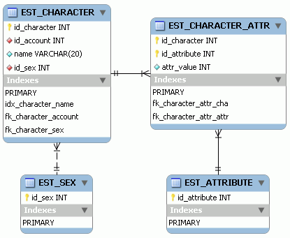

# 7. MMORPG DB: Avatares

_07-06-2008_ _Juan Mellado_

La personalización de los avatares por parte de los propios jugadores es algo que casi todo el mundo da por hecho hoy en día. Prácticamente se podría decir que es una obligación, no una opción. Tener la posibilidad de definir atributos concretos para los personajes permite que los jugadores se identifiquen más con ellos, creando cierto sentido de propiedad o identidad, al tiempo que permite disfrutar de un mismo juego desde puntos de vista distintos alargando la vida útil del mismo.

Las opciones más habituales incluyen la selección de raza, sexo, clase, o de todos ellos, según sea el caso. Esta selección inicial suele determinar tanto el aspecto físico del personaje como las características básicas del mismo, es decir, atributos clásicos como fortaleza o agilidad. En el reciente "_Age of Conan - Hyborian Adventures_" las opciones de creación de personaje permiten incluso definir la apariencia y complexión física de los personajes. Es decir, no sólo se puede elegir el color de piel o la forma del pelo, sino que se puede personalizar el tamaño de algunas partes del cuerpo, como el pecho por ejemplo. Naturalmente todo ello dentro de ciertos límites, no tendría ningún sentido que se pudiera crear un personaje con el pelo de color fucsia en un juego de ambientación medieval, rompería por completo la experiencia de juego. Algo radicalmente distinto a lo que ocurre en Second Life por ejemplo, donde la personalización "extrema" es parte importante de su éxito.

La creación de un personaje de tal o cual tipo a veces conlleva tener que seguir un guión distinto durante el juego, la historia en la que se ve uno inmerso es distinta. Pero sobre todo es bastante habitual que implique la adopción de unas características iniciales comunes a todos los personajes de ese tipo, normalmente mejorables a medida que se juega y se van alcanzando una serie de hitos intermedios. Aunque algunos jugadores más veteranos suelen comentar que preferirían poder configurar el detalle de estos valores por si mismos, para adaptarlos así mejor a su particular forma de jugar.

Los atributos comunes a todos los personajes pueden perfectamente incluirse como columnas dentro de la tabla de personajes. Evidentemente su número y significado variarán en función del diseño del juego, aunque parece lógico prever que normalmente serán _foreign keys_ a otras tablas para los casos de raza, género o clase. Mientras que para las características físicas, como el color de piel, altura, fortaleza, o agilidad, es probable que acaben siendo columnas de tipo numérico. Para otro tipo de atributos puede ser más complicado tomar una decisión. La cuestión es decidir si los atributos propios de cada clase, que no se comparten con el resto de clases, deben incluirse como columnas en la propia tabla de personajes, o deben almacenarse en una tabla aparte. O sea, decidir como se modelan las relaciones de "generalización", también conocidas como "herencia".

Supongamos que decidimos que las habilidades de los personajes estén representadas por un tótem que contenga distintos aspectos de su "espíritu", de forma que un guerrero sea un representante del espíritu del oso, del águila, o de cualquier otro tipo de animal característico. De igual forma, supongamos que un hechicero sea un representante del espíritu de la luz, o de las sombras. Y así sucesivamente. A la hora de almacenar estos atributos en base de datos se puede ampliar la tabla de personajes añadiendo columnas para irles dando cabida a todos ellos. El problema de esta solución es que la mayoría de las columnas nunca tendrán valor, o como mucho un valor numérico de cero, ya que no aplican a todas las clases, sólo a las específicas dentro de las cuales tienen sentido.

El criterio general normalmente aceptado para estos casos, aunque en continua discusión, es evitar tener que almacenar valores nulos en base de datos en la medida de lo posible. Así, si un atributo aplica para una clase, pero no para otra, lo aconsejado es crear una nueva tabla de especialización con esos atributos específicos, aunque sin llegar a crear una tabla específica para cada clase, sobre todo cuando el número de estas es elevado, porque en ese caso se corre el riesgo de acabar teniendo un diseño muy poco flexible que requiera escribir código a medida para la gestión de cada una de ellas.

Otra posibilidad interesante, a medio camino entre las dos anteriores, para evitar crear columnas o tablas en exceso, es tener columnas genéricas cuyo contenido deba interpretarse en función del contexto. Es decir, crear columnas con nombres tales como ```SPIRIT_1```, ```SPIRIT_2```, etc, e interpretar los valores que contienen como "espíritu del oso", o "espíritu de la luz", en función de si la clase del personaje es la de guerrero o la de hechicero. El inconveniente es que viendo el modelo, sin ninguna información adicional, no se puede saber a priori que significado concreto tiene cada campo, amén de que limita físicamente el número de atributos que se pueden tener a priori.

Este tipo de discusiones sobre alternativas de diseño suelen ser bastantes frecuentes, y por desgracia no hay una solución definitiva. En un modelo lógico se identificaría claramente una entidad "Personaje" y especializaciones de ella, como "Guerrero" o "Hechicero". Y probablemente todo el mundo estaría de acuerdo. Pero con el modelo físico ya sería otro cantar. Sobre todo porque es cuando entran en consideración los aspectos más espinosos del asunto, incluyendo ocupación, rendimiento, escalabilidad, dificultad, y costes.

La solución definitiva podría ser el uso de una ODBMS (_Object Database Management System_), o sea, una base de datos orientada a objetos. Pero como no es el caso de los gestores que estamos utilizando, he decidido utilizar una solución intermedia.



En el modelo se pueden ver varias tablas. La primera para los personajes, que contendría los atributos comunes para todos ellos, como su nombre, o una referencia a su género. La segunda para los tipos de atributos asociables a personajes, como "espíritu del oso" o "espíritu de la luz". Y la tercera para las relaciones entre las dos anteriores, y con el valor concreto de cada tipo de atributo para cada personaje.

La primera limitación obvia de este modelo es que estoy suponiendo que todos los atributos han de tener un valor de tipo numérico, lo cual es verdad para mi caso concreto. De igual forma, otra limitación del modelo es que un tipo de atributo sólo puede tener un único valor asociado, lo cual es nuevamente verdad para mi caso concreto. Y evidentemente, los requerimientos de almacenamiento también son más elevados que con algunas de las soluciones propuestas anteriormente, ya que esta requiere guardar la clave primaria de la tabla intermedia de valores, que además resulta estar compuesta por dos campos.

En el aspecto positivo, debe ser claro que este modelo permite añadir cualquier tipo de atributo sin necesidad de introducir cambios en el mismo. Es más, con el uso de tablas intermedias como la que he puesto entre personajes y tipos de atributos, es posible asociar los tipos a objetos, misiones, o cualquier otro tipo de entidad que se quiera. De hecho, en función de la implementación que se realice, ni siquiera haría falta modificar el _software_ para se tuviera en cuenta automáticamente.

En cuanto a la operativa de uso de la tabla intermedia, es claro que las inserciones sólo deberían realizarse una única vez, durante el proceso de creación del personaje, y puede que ocasionalmente si adquiere una nueva habilidad. Las actualizaciones irían por clave primaria, al igual que las consultas. Los borrados es bastante raro que se produzcan, ya que implicarían la eliminación del personaje de la base de datos, aunque bajo algunas circunstancias se podría permitir el cambio de unas habilidades por otras.

Para terminar, comentar que toda esta problemática se debería aislar, en la medida de lo posible, del resto del _software_ mediante una buena capa de abstracción. Es decir, probablemente un desarrollador al final sólo quiera poder disponer de un método que retorne el color de ojos de un personaje (```getEyeColor```), independientemente de cómo se encuentre almacenada físicamente esta información en base de datos.
