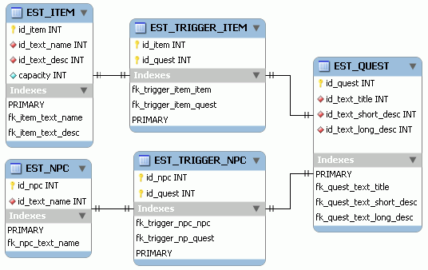
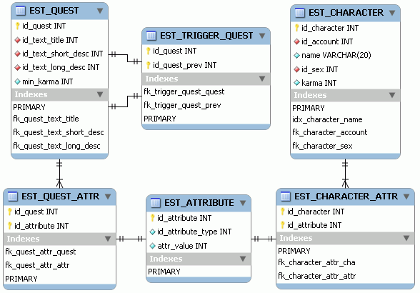
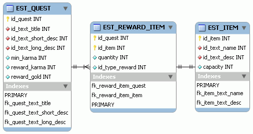

# 10. MMORPG DB: Misiones (2/4)

_19-07-2008_ _Juan Mellado_

En el artículo anterior se identificaron los componentes básicos de una misión en su acepción más clásica: iniciador, requisito, recompensa, objetivo, y seguimiento. En este artículo ha llegado el momento de desarrollar algunas soluciones para la construcción del modelo físico de base de datos que soporte los tres primeros componentes de dicha estructura.

Para la gestión de los iniciadores ya apunté que una posible solución era crear tablas de relación entre las entidades que inician las misiones, como personajes y objetos por ejemplo, con las propias misiones en si mismas. Adicionalmente, en función del diseño del juego concreto que se esté desarrollando, se podría añadir una o más columnas en dichas tablas que indiquen la acción que se tiene realizar para lanzar la misión, sobre el personaje (que suele ser hablar normalmente), o sobre el objeto (examinar normalmente).

En la primera imagen puede verse un esquema sencillo, donde aparece por primera vez la tabla de personajes no jugables, NPC (_Non-Player Character_). Lo más destacable desde un punto de vista técnico es que las claves primarias de las nuevas tablas son compuestas, lo cual no siempre es una buena idea, sobre todo de cara a futuras ampliaciones del modelo.

Para la gestión de los requisitos se puede simplemente añadir nuevas columnas a la tabla de misiones, con los valores de los atributos mínimos que debe tener el personaje para que se le pueda ofrecer la misión. Naturalmente esto dependerá, como casi todo, de las características concretas del juego que estemos desarrollando. Por ejemplo, imaginemos que los personajes tienen facción, raza, clase, y algún tipo de nivel o _karma_. Si los valores de esos atributos se encuentran almacenados en columnas de la tabla de personajes, entonces lo más natural es añadir también las columnas correspondientes en la tabla de misiones. De igual forma, si esos valores se encuentran en una tabla de pares (tipo, valor), entonces los más normal sería crear otra tabla con la misma estructura para las misiones. Y si se quiere que una misma misión la puedan realizar personajes de características distintas, entonces habrá que añadir nuevas tablas para guardar todas las posibles combinaciones.

En la segunda imagen puede verse un desarrollo del modelo que contempla un atributo fijo en la tabla de personajes, la columna de _karma_, que se ha añadido también a la tabla de misiones, en la forma de una columna con el mínimo de _karma_ necesario. De igual forma puede verse como se ha creado una tabla para valores de atributos variables para las misiones, a semejanza de la existente para los personajes, aunque algo modificada a como la desarrollé la primera vez en el artículo dedicado a la personalización de avatares.

En medio de este segundo esquema, puede verse además la tabla de misiones previas que deben haberse realizado anteriormente como requisito para poder optar a realizar una misión determinada. En un principio iba a ser una columna de la propia de tabla de misiones que apuntara a si misma, pero al final he decidirlo crear una nueva tabla para permitir que por ejemplo dos tramas del guión del juego se junten en una sola. A partir de aquí debe quedar claro que si se quisieran poner requisitos relacionados con otras entidades del juego, como por ejemplo que el personaje haya visitado un área concreta del mundo, entonces habría que ir añadiendo las tablas de relación correspondientes con la de misiones. Y lógicamente, habría que ir almacenando para cada personaje sus relaciones con esas entidades, como las misiones completadas o las áreas del mundo visitadas.

Para la gestión de recompensas hay que relacionar las misiones con el dinero y los objetos que se obtienen como recompensa por su finalización, y con cualquier otro tipo de beneficio que ofrezcan en función del juego concreto que se esté desarrollando. El dinero, a menos que se quieran tener varios tipos de divisas distintos, puede ir perfectamente almacenado como una columna más en la tabla de personajes, y por consiguiente en la de misiones. Se podría tratar como un tipo de objeto más, e insertarlo en la tabla de _items_, pero a mi particularmente esa idea no me acaba de convencer, lo considero más como el valor de un atributo del personaje (riqueza). Los objetos por su parte deben ir en tablas aparte que almacenen sus relaciones con las misiones, junto con una columna que indique la cantidad concreta que se ganará de cada una de ellos. Si además se quiere que la recompensa pueda tener una parte fija y otra variable, entonces habrá que añadir alguna columna más a dichas tablas que indique el tipo concreto de recompensa de cada lote particular de objetos.

En la tercera imagen puede verse como se ha ampliado el esquema con una nueva tabla intermedia de objetos ofrecidos como recompensa por cada misión, con la cantidad dada de cada uno de ellos, y un indicador de si pertenecen a la parte fija o variable. En la tabla de misiones he puesto a modo de ejemplo un par de columnas con recompensas de tipo fijo, como el _karma_ o el dinero. Evidentemente el esquema podría ampliarse con más tablas de recompensa, ya sea para relacionarlas con otras entidades, o con más pares (tipo, valor) como se hizo anteriormente.
