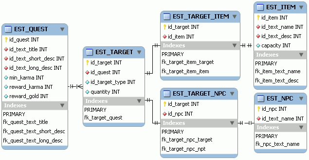

# 11. MMORPG DB: Misiones (3/4)

_26-07-2008_ _Juan Mellado_

En este artículo continúo la serie dedicada a las misiones centrándome en los objetivos. Es decir, en lo que hay que hacer para completar una misión. En la práctica esto es bastante parecido a la vida real, como por ejemplo cuando a un empleado a primeros de año se les establecen una serie de hitos que tiene que tratar de cumplir de cara a su subida salarial. Los más viciados lo tienen claro: "WoW no es un juego, es un trabajo".

Para la gestión de los objetivos, mi idea original consistía simplemente en añadir columnas a la tabla de misiones (```target_1```, ```target_2```, etc), de forma que cada una de ellas pudiera interpretarse libremente en función del tipo concreto de misión que se tratase. ¿Pero por qué pensé en saltarme el proceso de normalización en este punto en concreto? La respuesta está en que hasta ahora todo el modelo lo he ido construyendo basándome en mi experiencia en el diseño de aplicaciones de gestión, haciendo hincapié en distinguir claramente las entidades y sus relaciones, y encapsulando cada una de ellas en su propia tabla. De hecho, ninguna de las tablas que he ido presentando hasta ahora tiene una columna que pueda contener un valor nulo. Sin embargo, para el diseño de esta parte de las misiones, el modelo lo enfoqué pensando en la eficiencia, en reducir el número de accesos a base de datos necesarios para obtener los objetivos y realizar su posterior seguimiento. Y deber ser claro que si toda esta información está en las columnas de una única tabla, entonces bastará con hacer un único acceso, de ahí la solución que planteaba.

En la práctica, saltarse la normalización al diseñar la base de datos que dará soporte a un MMORPG es algo que parece bastante habitual. Sólo hay que echar un vistazo a los modelos que pueden encontrarse por Internet, o leer los comentarios que algunos desarrolladores dejan en sus _blogs_ o foros. La justificación de esto es que un MMORPG no es un producto al uso, no hay que verlo como una aplicación de gestión ordinaria, y que el uso de una base de datos relacional es una solución de carácter práctico. La alternativa, desarrollar un gestor propio de base de datos, resulta prohibitiva en la mayoría de los casos.

¿Pero entonces es correcto saltarse la normalización? No creo que haya una única respuesta a esta pregunta. Y mucho menos en una fase temprana del desarrollo. Lo lógico sería empezar realizando un diseño lo más normalizado posible al principio, y a medida que se vaya avanzando y probando, detectar que partes no funcionan y sustituirlas sugiriendo otros enfoques, incluyendo el abandono de la normalización si es preciso. En base a esto, voy a echar para atrás mi ideal original, y volver a presentar todo lo más normalizado posible.



En la imagen puede verse el modelo considerado para almacenar los objetivos de cada misión. La idea es que existe una tabla principal en la que se almacenan objetivos tales como "recolectar n _items_" o "matar n NPCs", y luego tablas auxiliares en las que se indican los _items_ o NPC concretos a los que hacen referencia dichos objetivos. De esta forma, si una misión consiste en "matar 6 Guardianes Dorados de la Frontera Sur, a 1 Capitán de la Guardia, y ya de paso, recuperar 1 Estandarte robado a la Compañía Imperial", entonces se almacenarían tres registros en la tabla de objetivos, dos en la de relación con los NPCs, y uno en la de relación con los _items_, siendo la columna de tipo en la tabla de objetivos la que indique a que tabla de relación hay que ir en cada caso concreto. O sea, para los objetivos de tipo "matanza" se iría a la de relación objetivo-NPC, para los objetivos de tipo "recolección" a la de objetivo-_item_, y así sucesivamente.

Por último, desde un punto de vista técnico, señalar que será necesario crear un índice por el ID de misión en la tabla de objetivos, ya que es por esa columna por donde primero se intentará acceder normalmente.
