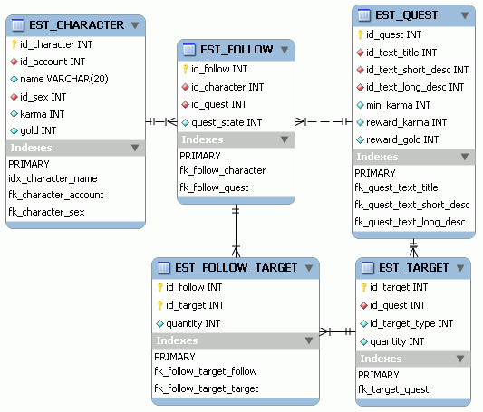

# 12. MMORPG DB: Misiones (4/4)

_02-08-2008_ _Juan Mellado_

La gestión del seguimiento de misiones debería diseñarse siguiendo el mismo estilo que se haya utilizado para la gestión de objetivos de las mismas. Es decir, si se ha diseñado un modelo con tablas que permiten definir misiones típicas como "matar N monstruos de tipo X", entonces parece lógico que se deban añadir más tablas que almacenen el número concreto de monstruos de este tipo que se han matado desde que se aceptó la misión. No obstante, para otro tipo de misiones típicas, como "recolectar N objetos de tipo X", puede que no se quiera hacer eso, e ir directamente al inventario a contar cada vez el número de objetos de ese tipo que se tiene en cada momento. La principal diferencia entre el primer y segundo tipo de misiones es que las primeras exigen gestionar un contador, y las segundas realizar un recuento. El número de objetos de un determinado tipo puede obtenerse directamente del inventario, por lo que almacenarlo en otra tabla sería guardar información redundante.

Otro aspecto interesante del seguimiento es el estado de las misiones con respecto al personaje. Una misión empieza cuando un personaje la acepta, así que hará falta una tabla que relacione a los personajes con las misiones que han aceptado y el estado en que se encuentran. A priori, una misión puede estar en curso o completada, aunque esto es algo que dependerá enteramente del juego concreto que se esté desarrollando. Las misiones de escolta por ejemplo pueden marcarse como fracasadas, que vendría a ser una especie de estado intermedio entre los dos anteriores. Esto puede realizarse con un modelo físico compuesto por una tabla con al menos tres columnas, una con el ID del personaje, otra con el ID de la misión, y otra con el estado de la misión respecto al personaje. Aunque también es posible realizar el modelo con varias tablas, guardando en una de ellas las misiones en curso, y en otras las misiones completadas o fracasadas. Una tabla para cada estado distinto. Esta segunda solución tiene la ventaja de reducir el número de registros en una tabla de trabajo que a priori tendrá un gran número de ellos, y evitar tener que realizar búsquedas o agrupaciones por la columna de estado. Lo curioso es que, de hacerse así, habría que borrar registros de una tabla e insertarlos en otra para cambiarlas de estado, y sería la primera vez que se borra algo, ya que hasta ahora todo han sido inserciones y actualizaciones.

Si una misma misión puede repetirse varias veces por un mismo personaje, entonces hay que plantearse como se quiere hacer la gestión de ese caso particular. Una primera solución, utilizando una columna de estado, podría consistir simplemente en cambiar el estado de la misión con respecto al personaje, y ponerla de nueva en curso cada vez que se repita. El inconveniente de este método es que se perdería el histórico, ya que además del cambio de estado, habría que actualizar las tablas auxiliares de seguimiento para reiniciar los contadores asociados a la misma. Otra solución, si no se quiere perder el histórico, consistiría en permitir guardar en una misma tabla más de una vez la misma pareja (personaje, misión), descartando la idea intuitiva de utilizar esas dos columnas como clave primaria compuesta de la tabla y crear un nuevo ID exclusivo para dicha relación.

En la imagen pueden verse las dos nuevas tablas que se han añadido para el seguimiento. Por una parte la que relaciona a los personajes con las misiones, que incluye una columna con el estado de la misión con respecto al personaje, y por otra parte la que relaciona a esta primera tabla con la de los objetivos concretos de cada misión, que incluye una columna para almacenar el grado de avance de cada uno de ellos. Esta última tabla puede verse como un almacén temporal, ya que una vez completada una misión los registros correspondientes podrían borrarse, a menos que se quiera conservar el histórico o almacenar en ella información complementaria con fines estadísticos. Otra solución sería borrarla cada cierto tiempo mediante algún proceso automatizado (_batch_), eliminando los registros correspondientes a misiones completadas.

Desde un punto de vista técnico, habrá que tener en cuenta además que posiblemente sea necesario definir un índice compuesto, no único, sobre las columnas de personaje y misión de la tabla de seguimiento principal, ya que será por esas dos por donde normalmente se acceda.
