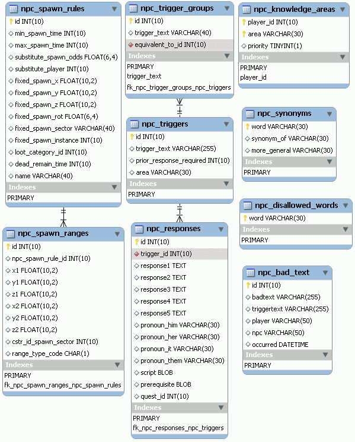

# 20. PlaneShift (6/10)

_29-11-2008_ _Juan Mellado_

NPC es el acrónimo de "Non-Player Character", un término que se utiliza para denotar a los personajes que no manejan directamente los jugadores, sino el juego. Todas las criaturas que pueden encontrarse en los mundos virtuales, ya sean monstruos hostiles, codiciosos vendedores, o experimentados instructores, entran dentro de esta categoría. Muchos jugadores se refieren a ellos también con el término "_mobs_", una abreviatura de "_mobile objects_", sobre todo cuando son criaturas contra las que se puede pelear.

En el modelo de base de datos de PlaneShift los NPCs reciben, a grandes rasgos, el mismo tratamiento que los personajes manejados por los jugadores. No obstante, existen tablas específicas donde se almacenan las características particulares de este tipo de entidades, como las reglas que definen el proceso de regeneración automática de los mismos (_spawn_), y las recompensas que pueden obtenerse al despojar sus cuerpos tras un combate (_loot_).



La tabla de reglas de _spawn_ almacena, entre otros, el detalle del rango de tiempo que debe transcurrir entre la muerte y resurrección de un NPC, la posición en la que debe regenerarse, y una referencia a las reglas de _loot_ que deben aplicársele. Respecto a la posición de aparición, se distinguen dos casos. Por un lado los NPCs que tienen un lugar concreto fijo de aparición, y por otro lado los que tienen un rango de posiciones más amplio donde aparecer. En el primer caso se suministran las coordenadas espaciales concretas en la propia tabla, junto con una referencia a un sector del mundo, y la dirección inicial en la que debe mirar la criatura. En el segundo caso existe una tabla auxiliar con los posibles rangos de aparición que almacena pares de coordenadas que definen regiones. Para entender como se interpretan esos pares de coordenadas hay que mirar el valor de la columna ```range_type_code```, que en los registros de ejemplo toman los valores "```A```" o "```L```", lo que parece indicar que las dos coordenadas delimitan una "Área" rectángular, o un segmento sobre una "Línea" recta. Interesante solución. Otras columnas de estas tablas tienen un significado más complicado de entender atendiendo sólo a la definición del modelo.

Como ya he comentado alguna que otra vez, PlaneShift es un juego en el que sus desarrolladores tratan de dar prioridad al "_role playing_". No es un juego para ir corriendo de un lado a otro. La interacción con los NPCs es a través de diálogos escritos, y ello implica que el sistema ha de ser capaz de reconocer los textos que introducen los jugadores. Para ello existe una serie de tablas entre las que se incluye un diccionario de sinónimos. Gracias a ella, se puede abordar a un NPC con _hi_, _hello_, _bonjour_, o _buenos días_ de forma indistinta, por poner sólo algunos ejemplos. Otras tablas incluyen una lista "negra" de palabras no permitidas, y un registro de cuando algún jugador las pronunció.

Todo el proceso de interacción de los personajes con el mundo en este tipo de juegos se basa en el concepto de "_trigger_", cuya traducción literal sería "disparador". Cuando un jugador aborda a un NPC, o interacciona de alguna forma con un objeto, se dispara un evento como respuesta. En el caso de los NPCs, sus respuestas a los comentarios o preguntas que les hacen los jugadores están controladas por los registros almacenados en las correspondientes tablas de _triggers_. Hay una primera tabla de grupos que aglutina tipos de acciones equivalentes, una segunda con las frases concretas con los que los jugadores pueden provocar dichas reacciones, como "_greetings_" o "_give me fruit_", y una tercera que almacena las respuestas que provocan en los NPCs, como "_Hello friend_" o "_I have the following fruits: pear, plum_". En esta última tabla de respuestas se puede ver que existen cinco columnas para otras tantas posibles respuestas que se deben escogerse aleatoriamente. De igual forma, se aprecian dos columnas de tipo ```BLOB```, una para establecer precondiciones, como la de pertenecer a una facción concreta por ejemplo, y otra para almacenar _scripts_ que desencadenen efectos o acciones concretas, como el proceso de asignación de una _quest_ por ejemplo.

Alguna que otra tabla suelta que he puesto en la imagen incluye información relacionada con los NPCs, como las KAs (_Knowledge Areas_), o áreas de conocimiento, que son las distintas habilidades o profesiones que pueden desarrollar los personajes en el juego.
