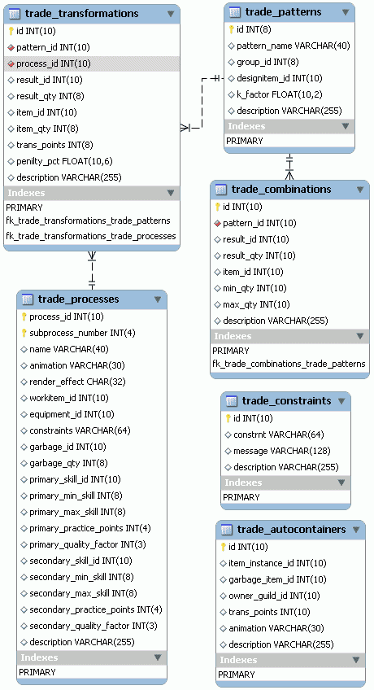

# 23. PlaneShift (9/10)

_20-12-2008_ _Juan Mellado_

En los juegos de ambientación medieval, como es el caso de PlaneShift, es bastante normal que se permita a los jugadores desarrollar algún tipo de profesión mediante la cual puedan crear objetos propios empleando elementos clásicos de esta época, como yunques o forjas por ejemplo. Estas profesiones, así como los objetos que pueden crearse, están también almacenados en base de datos. Por un lado hay un primer grupo de tablas donde están las habilidades que pueden desarrollarse, junto con los instructores que las enseñan, y por otro lado hay un grupo de tablas con los procesos y patrones (recetas, fórmulas, etc) disponibles. Me ha llamado más la atención este segundo grupo, así que este artículo sólo toca esa parte en concreto. Algunas de las tablas de base de datos referidas a este tema son de las pocas que están comentadas, aunque sólo dentro de los propios _scripts_ de creación, los comentarios no forman parte de la definición de las mismas.



Una "transformación" (_transformation_) define como un jugador puede crear un nuevo objeto a partir de otro. Cada transformación se compone de un "patrón" (_pattern_) y de un "proceso" (_process_). Por ejemplo, una transformación podría consistir en la creación de una espada mediante la fundición y posterior tratamiento de varias menas de hierro. La tabla de transformaciones en base de datos tiene dos primeras referencias, una a la tabla de patrones, y otra a la tabla de procesos. A continuación sigue un referencia a la tabla de objetos, para indicar que tipo de objeto se crea, y el número de ellos que se genera cada vez. Después sigue una referencia al tipo de objeto a transformar, junto con el número requerido de ellos. Luego está la cantidad de tiempo necesaria para completar la transformación (aunque la columna se llama ```trans_points```), un porcentaje a aplicar sobre la calidad del objeto creado, y cierra la típica columna de descripción.

La tabla de patrones por su parte tiene varias columnas de significado claro, como el ID para la clave primaria, el nombre corto de la receta, la descripción larga, una referencia a la tabla de objetos para indicar cual de ellos permite crear, y un ID de grupo para los patrones de un mismo tipo. Sin embargo, tiene otra columna llamada ```k_factor``` cuyo significado no queda claro atendiendo sólo a su declaración. Puede estar relacionada con las "_Knowledge Areas_", o "áreas de conocimiento" que tiene el juego y mediante las cuales se controlan las distintas habilidades necesarias para el desarrollo de profesiones. Otra columna de significado un tanto confuso es la del tipo de objeto generado, ya que es opcional, por lo que no se ha interpretar al pie de la letra. Es decir, un mismo patrón se puede utilizar para crear más de un tipo de objeto. No todo patrón corresponde con una única receta, diseño o fórmula. El ejemplo claro de esto es el patrón llamado "```Baking```" (hornear) que está asociado a un montón de transformaciones culinarias distintas.

La tabla de procesos tiene un número de "subproceso", para la elaboración de objetos en varias fases. Un par de columnas con los nombres de la animación y el efecto gráfico a mostrar mientras se elabora el objeto. Una referencia al objeto necesario para llevar a cabo el proceso, como por ejemplo un yunque. Y otra referencia más a la tabla de objetos para indicar esta vez el tipo de objeto que debe llevar equipado el personaje, como por ejemplo un martillo de herrero. A continuación sigue una referencia a una tabla de "restricciones" (_constraints_), que son condiciones especiales que deben darse para la ejecución del proceso. Una nueva referencia a la tabla de objetos señala a un tipo de objeto "basura" (residuo) que se genera si la transformación no se produce correctamente, junto con el número que de estos objetos pueden llegar a generarse. Después hay dos grupos de cinco columnas cada uno, las cinco primeras relacionadas con la habilidad primaria que debe poseerse para realizar la transformación, y las cinco segundas, de idéntico significado, para una posible habilidad secundaria. Estas columnas incluyen una referencia a la tabla de habilidades, un valor mínimo y máximo de habilidad requerida, un valor de puntos de aprendizaje ganados por el personaje al realizar la transformación, y un porcentaje que afecta a la calidad del objeto de forma directamente proporcional a la habilidad del personaje que lo crea. Cierra de nuevo la tabla la típica columna de descripción.

La tabla de restricciones almacena las condiciones que deben darse para que los jugadores puedan ejecutar los procesos. Es una tabla muy sencilla, y en los registros de ejemplo se observa que son restricciones de tipo temporal ("```You can not complete the work at this time of the day!```"), de ubicación ("```You can not finish this work here!```"), y así sucesivamente. En el campo de descripción de esta tabla se indica que se pueden indicar parámetros concretos, como una hora del día o lugar concreto en el que tiene que estar el personaje.

Una "combinación" (_combination_) define como un jugador puede crear un nuevo objeto mediante la agrupación de una cantidad determinada de otros. Es similar a una transformación, con la diferencia que no aplica un proceso, sólo un patrón. Las columnas de la tabla de combinaciones son muy similares a las de la tabla de transformaciones. Patrón, objeto resultante, cantidad resultante, objeto de partida, mínima y máxima cantidad de objetos de partida, y una descripción.

La última tabla del modelo de esta parte almacena lo que se denominan "autocontenedores" (_autocontainers_). Un nombre un tanto extraño quizás. Mirando los registros de ejemplo se observa que contiene los objetos utilizados para crear otros, como por ejemplo los yunques y las forjas. La columna más importante a mi juicio es la que hace referencia a la tabla de objetos instanciados en el mundo virtual, lo que define su ubicación concreta dentro del mundo, junto con el resto de atributos que tienen los objetos en general. Es decir, que esta tabla se utiliza para modelar físicamente la herencia, como una clase especializada de objetos.
