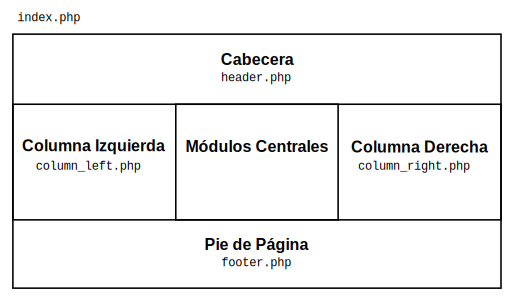

# 22. osCommerce: Templates

_07-05-2007_ _Juan Mellado_

Una vez configuradas todas las opciones del menú de administración, y dado de alta el catálogo de productos que se venderá a través de la tienda virtual, es tiempo de pensar en el aspecto visual que tendrá la _web_. Dejar la tienda con el diseño y apariencia que proporciona osCommerce por defecto puede ser la opción más rápida y fácil para empezar, pero es conveniente pensar en que antes o después se deberán realizar cambios en el aspecto de la misma con el objetivo de conseguir que nuestro sitio se distinga del resto.

Desgraciadamente la versión actual de osCommerce no proporciona ninguna opción de menú a través de la que se pueda cambiar el aspecto de la _web_ en cuanto a su diseño se refiere. Todos los cambios han de realizarse modificando directamente los ficheros que componen el código fuente del _software_, razón por la que no es de extrañar que hayan proliferado en Internet los sitios dedicados a la creación de _templates_ (plantillas) para osCommerce. Los _templates_ no son más que modificaciones de los fuentes de osCommerce que proporcionan a la _web_ un diseño distinto al que se muestra por defecto.

El propósito de este artículo es tratar de explicar como se encuentra estructurado el diseño de un sitio _web_ gestionado con osCommerce, y como se puede modificar dicha estructura para realizar cambios en la composición y aspecto de los distintos elementos que se muestran en la tienda.

## 22.1. Estructura

La estructura básica de la _web_ creada por osCommerce es muy sencilla y se encuentra formada por cinco regiones principales maquetadas mediante tablas HTML. Empezando por la parte de arriba, la primera región que aparece es la cabecera, en la que se muestra normalmente una imagen con el logotipo de la _web_, y una serie de iconos de acceso rápido. A continuación están la segunda y tercera región, que son las columnas con los cuadros de opciones que se muestran a la izquierda y derecha de la _web_ respectivamente. La cuarta región contiene las opciones centrales en la que se muestra el mensaje de bienvenida, se listan los productos, y a través de la que interactúan los usuarios normalmente. Terminando en la parte inferior de la _web_ se encuentra el pie de página con la fecha, estadísticas, y mensajes de _copyright_.

La página _web_ principal de osCommerce se construye en el fichero ```catalog/index.php```, y cada una de las regiones antes mencionadas en su respectivo fichero PHP dentro del directorio ```catalog/includes```. Así, ```header.php``` corresponde a la cabecera, ```column_left.php``` a la columna izquierda, ```column_right.php``` a la columna derecha, y ```footer.php``` al pie de página.



Dentro de ```index.php``` se pueden localizar fácilmente las sentencias que incluyen las diversas regiones:

```php
...
<?php require(DIR_WS_INCLUDES . 'header.php'); ?>
...
<?php require(DIR_WS_INCLUDES . 'column_left.php'); ?>
...
<?php require(DIR_WS_INCLUDES . 'column_right.php'); ?>
...
<?php require(DIR_WS_INCLUDES . 'footer.php'); ?>
...
```

Sabiendo esto, es fácil realizar una modificación sencilla sobre el diseño, como eliminar la columna derecha por ejemplo, ya que basta con eliminar o comentar la sentencia que incluye dicha región:

```php
<?php //require(DIR_WS_INCLUDES . 'column_right.php'); ?>
```

Lo importante al realizar este tipo de modificaciones es entender que en realidad estamos cambiando el código fuente de nuestra versión instalada de osCommerce. Si en un futuro queremos actualizar a una versión superior de osCommerce entonces tendremos que volver a realizar esa misma modificación sobre los fuentes de la nueva versión. Entendido esto, debe ser claro que los _templates_ en realidad no son más que modificaciones realizadas sobre los fuentes de una determinada versión de osCommerce.

## 22.2. Logotipo

Posiblemente uno de los primeros cambios que se quiere hacer cuando se monta una tienda en Internet con osCommerce es cambiar el logotipo que aparece por defecto por uno propio. De acuerdo con lo visto en la sección anterior, es intuitivo pensar que la imagen se define en el fichero ```header.php``` que compone la región de cabecera, y de hecho es fácil encontrar dentro del mismo una línea como la siguiente:

```php
<td valign="middle"><?php echo '<a href="' . tep_href_link(FILENAME_DEFAULT) . '">'
. tep_image(DIR_WS_IMAGES . 'oscommerce.gif', 'osCommerce') . '</a>'; ?></td>
```

En esta sentencia se construye un enlace (_link_) en el que ```DIR_WS_IMAGES``` identifica el directorio donde se encuentran las imágenes subidas a la _web_, normalmente ```catalog/images```, y ```oscommerce.gif``` identifica el nombre del fichero que contiene el logotipo de osCommerce que se muestra por defecto. Para cambiar el logotipo de una forma sencilla basta con subir una imagen propia de dimensiones similares al directorio de imágenes, y sustituir ```oscommerce.gif``` por el nombre del nuevo fichero:

```php
<td valign="middle"><?php echo '<a href="' . tep_href_link(FILENAME_DEFAULT) . '">'
. tep_image(DIR_WS_IMAGES . 'logo_mi_tienda.gif', 'Mi Tienda') . '</a>'; ?></td>
```

El segundo parámetro de la función ```tep_image``` es el texto alternativo que se mostrará para la imagen, y es lógico cambiar el valor ```osCommerce``` por el nombre de nuestra tienda.

Relacionado con el logotipo, se encuentra también el icono de favoritos que muestran los navegadores normalmente junto a la URL del sitio en la barra de navegación, y en la carpeta de favoritos del usuario. Para crearlo normalmente bastará con dejar la imagen deseada en un fichero de nombre ```favicon.ico``` en el directorio raíz del servidor _web_.

## 22.3. Bloques

Los bloques, módulos o cajas (_boxes_), son las unidades de construcción con las que se construyen las páginas _web_ de la tienda. Los bloques son cada una de las opciones que aparecen enmarcadas dentro del sitio _web_ con un título, como el cuadro de búsqueda, el árbol de categorías del catálogo, la selección de fabricante, el cuadro de novedades, etc. Cada bloque se maqueta como una tabla HTML dentro de las regiones principales, que como ya se comentó anteriormente, son también a su vez tablas HTML.

Los bloques normalmente aparecen en las columnas izquierda y derecha de la _web_, por lo que nuevamente debería resultar intuitivo buscarlos en los ficheros correspondientes a dichas regiones: ```column_left.php``` y ```column_right.php```. Y de hecho, por cada bloque que se muestra en cada una de las columnas de la _web_ es fácil encontrar una sentencia similar a la siguiente:

```php
<?php
require(DIR_WS_BOXES . 'search.php');
?>
```

En esta sentencia de ejemplo, ```DIR_WS_BOXES``` identifica el directorio donde se encuentran los ficheros que contienen el código fuente de los distintos bloques que osCommerce proporciona, normalmente ```include/boxes```, y ```search.php``` identifica el bloque concreto incluido, en este caso el cuadro de búsqueda. A poco que se siga buscando es fácil identificar sentencias similares para incluir otros bloques, como el de la selección de monedas (```currencies.php```), el del cuadro de novedades (```whats_new.php```), y así sucesivamente. Los bloques tienen nombres en inglés bastante representativos de la funcionalidad ofrecida por los mismos.

El orden de visualización de los bloques dentro de las columnas en la _web_ es el mismo en que se encuentran sus sentencias de inclusión dentro de los ficheros PHP, de arriba hacia abajo.

## 22.4. Eliminar un bloque

Para eliminar un bloque de una columna basta con borrar o comentar la sentencia correspondiente a dicho bloque. Así, si queremos eliminar el bloque del cuadro de búsqueda basta con localizar y comentar la sentencia vista anteriormente:

```php
<?php
//require(DIR_WS_BOXES . 'search.php');
?>
```

En este punto es importante tener en cuenta que la visualización de un bloque a veces está condicionada por varios factores, como el hecho de que el visitante de la _web_ sea un cliente registrado de la tienda, que esté consultando el detalle de un producto concreto, o que esté completando el pago de un pedido. En función de todo esto acotar la porción correcta de código a comentar para un bloque concreto puede requerir un poco más de trabajo, aunque el patrón de búsqueda siempre será el mismo.

## 22.5. Cambiar un bloque de una columna a otra

Para cambiar un bloque de una columna a otra basta con borrar o comentar la sentencia correspondiente a dicho bloque en un fichero y ponerla en otro. Por ejemplo, para pasar el bloque de búsqueda de la columna izquierda a la derecha hay que comentar la sentencia del ejemplo del punto anterior en ```column_left.php``` y añadirla en ```column_right.php```.

## 22.6. Crear un bloque nuevo

Me gustaría añadir que incluso es posible crear bloques nuevos, es decir, bloques propios que no vengan incluidos con osCommerce. Para ello se requiere saber programar en PHP, y como punto de partida lo mejor es tomar un bloque sencillo que tengamos instalado y funcionando, y crear una copia del mismo adaptado a nuestras necesidades. La explicación detallada de la construcción de un nuevo bloque queda fuera del alcance de este artículo, ya que básicamente es un tema de programación y no de modificación del aspecto de osCommerce.

## 22.7. Elementos Complementarios

Si quiere construir su propio _template_ con el objetivo de personalizar al máximo posible el aspecto de su tienda, es bastante probable que quiera eliminar o cambiar alguno de los elementos complementarios que se muestran en la _web_, como los iconos de acceso rápido, la barra de navegación, o la línea que contiene la fecha actual del sistema y el contador con el número de páginas despachadas.

Siguiendo el mismo criterio establecido anteriormente, bastará con ver en que posición se encuentra el elemento que se quiere cambiar y localizar dentro del fichero PHP correspondiente las sentencias de código pertinentes.

## 22.8 Iconos de acceso rápido

Los iconos de acceso rápido son las imágenes que aparecen en la esquina superior derecha de la _web_ y que dan acceso a las opciones de "_Mi Cuenta_", "_Ver Cesta_", y "_Realizar Pedido_". Y como es lógico, teniendo en cuenta su posición dentro de la página, el código que compone estos tres iconos se encuentra en el fichero ```header.php```:

```php
<td align="right" valign="bottom"><?php echo
'<a href="' . tep_href_link(FILENAME_ACCOUNT, '', 'SSL') . '">'
. tep_image(DIR_WS_IMAGES . 'header_account.gif', HEADER_TITLE_MY_ACCOUNT) . '</a>&nbsp;&nbsp;
<a href="' . tep_href_link(FILENAME_SHOPPING_CART) . '">'
. tep_image(DIR_WS_IMAGES . 'header_cart.gif', HEADER_TITLE_CART_CONTENTS) . '</a>&nbsp;&nbsp;
<a href="' . tep_href_link(FILENAME_CHECKOUT_SHIPPING, '', 'SSL') . '">'
. tep_image(DIR_WS_IMAGES . 'header_checkout.gif', HEADER_TITLE_CHECKOUT) . '</a>'; ?>&nbsp;&nbsp;</td>
```

Si se quieren eliminar los iconos basta con comentar o eliminar esas líneas de código. Aunque si lo que se quiere es cambiar los iconos por otros más adecuados al estilo de la tienda hay que sustituir en el servidor _web_ las imágenes correspondientes: ```header_account.gif```, ```header_cart.gif```, y ```header_checkout.gif```.

Otro cambio bastante frecuente es querer eliminar los iconos dejando en su lugar enlaces de texto ordinarios, algo que se puede conseguir eliminando las llamadas a la función ```tep_image``` y sustituyéndolas por simples cadenas de texto. No obstante, hay que tener en cuenta que no se puede escribir directamente los textos en el código, ya que la tienda tiene que mostrar el texto correcto en función del idioma seleccionado por el visitante. La forma correcta de hacerlo, en este caso concreto, es utilizar las constantes predefinidas: ```HEADER_TITLE_MY_ACCOUNT```, ```HEADER_TITLE_CART_CONTENTS```, y ```HEADER_TITLE_CHECKOUT```. Aunque en realidad los enlaces de texto se muestran un poco más abajo en la _web_, junto a la barra de navegación, por lo que una mejor solución podría ser eliminar completamente estos iconos y cambiar de sitio si es preciso la línea de enlaces de la barra.

## 22.9. Barra de navegación

La barra de navegación es la línea de enlaces que muestra el camino seguido por el visitante de la _web_ para llegar a la página que se encuentra actualmente visitando. En inglés recibe habitualmente el descriptivo nombre de _breadcrumb_, cuya traducción vendría a ser algo como "_rastro de miguitas de pan_". Nuevamente, y habida cuenta su ubicación, podemos encontrarla en el fichero ```header.php```:

```php
<td class="headerNavigation">&nbsp;&nbsp;<?php echo $breadcrumb->trail(' &raquo; '); ?></td>
```

Como ya se mencionó en el apartado anterior, junto a la barra de navegación, se encuentra una lista de enlaces de texto equivalentes a los mostrados en la barra de iconos de acceso rápido:

```php
<td align="right" class="headerNavigation">
<?php if (tep_session_is_registered('customer_id')) { ?>
<a href="<?php echo tep_href_link(FILENAME_LOGOFF, '', 'SSL'); ?>"
class="headerNavigation"><?php echo HEADER_TITLE_LOGOFF; ?></a> &nbsp;|&nbsp;
<?php } ?><a href="<?php echo tep_href_link(FILENAME_ACCOUNT, '', 'SSL'); ?>"
class="headerNavigation"><?php echo HEADER_TITLE_MY_ACCOUNT; ?></a> &nbsp;|&nbsp;
<a href="<?php echo tep_href_link(FILENAME_SHOPPING_CART); ?>"
class="headerNavigation"><?php echo HEADER_TITLE_CART_CONTENTS; ?></a> &nbsp;|&nbsp;
<a href="<?php echo tep_href_link(FILENAME_CHECKOUT_SHIPPING, '', 'SSL'); ?>"
class="headerNavigation"><?php echo HEADER_TITLE_CHECKOUT; ?></a> &nbsp;&nbsp;</td>
```

## 22.10. Fecha y Estadísticas

En el pie de página de la _web_ puede verse por defecto la fecha actual del servidor y el número de solicitudes de página realizadas al servidor. Mientras que la primera información pienso que puede resultar útil para informar a los visitantes extranjeros de la hora local del país en que se encuentra la tienda, la segunda información nunca la he encontrado demasiado útil para un cliente, no veo que aporte ningún tipo de "valor añadido" a la experiencia de navegación por un sitio.

Al encontrarse en la parte inferior de la página, podemos localizar rápidamente el código que compone ambas líneas de información en el fichero ```footer.php```:

```php
<td class="footer">&nbsp;&nbsp;<?php echo strftime(DATE_FORMAT_LONG); ?>&nbsp;&nbsp;</td>
<td align="right" class="footer">&nbsp;&nbsp;<?php echo $counter_now . ' ' . FOOTER_TEXT_REQUESTS_SINCE . ' ' . $counter_startdate_formatted; ?>&nbsp;&nbsp;</td>
```

## 22.11. Mensajes y Errores

Cuando se está cambiando el aspecto de una _web_ es fácil fijarse sólo en las partes actualmente visibles en la misma, olvidando que muchos de los elementos que se muestran habitualmente por pantalla lo hacen de forma condicional. Por ejemplo, sólo se ven mensajes informativos y de error en la página cuando se produce algún tipo de evento digno de ser notificado a los visitantes. Dentro del nuevo diseño que se esté haciendo para una tienda hay que tener en cuenta este tipo de cosas y reservar un sitio para ellas dentro de la _web_.

osCommerce acumula los mensajes informativos y de error que se producen y los muestra todos juntos en la cabecera dentro de una tabla. En el fichero ```header.php``` puede localizarse las dos líneas con las condiciones que fuerzan la impresión de estos mensajes:

```php
...
if (isset($HTTP_GET_VARS['error_message']) && tep_not_null($HTTP_GET_VARS['error_message'])) {
...
if (isset($HTTP_GET_VARS['info_message']) && tep_not_null($HTTP_GET_VARS['info_message'])) {
...
```

Si se ve el código fuente completo de esa parte se observa que si se cumple alguna de las condiciones anteriores entonces se crea una tabla HTML para los mensajes y otra para los errores.

## 22.12. Estilo

Posiblemente el cambio más importante que se puede realizar en una _web_ para su personalización sea el establecer colores y fuentes de texto propios con el objetivo de cambiar la más que neutra apariencia que presenta el diseño de osCommerce por defecto. Es en el fichero ```stylesheet.css``` donde se establecen los estilos de los distintos elementos HTML que intervienen en las páginas _web_ de la tienda. Para realizar cambios en el mismo basta con ceñirse a las reglas del formato CSS, teniendo claro el elemento que se quiere modificar, y modificándolo en consecuencia. Por ejemplo, para cambiar los colores de texto y fondo de la _web_ hay que saber que estos son normalmente los atributos ```background``` y ```color``` de la clase ```BODY```, por lo que es fácil localizarlos y cambiarlos dentro de la hoja de estilo:

```css
BODY {
  background: #ffffff;
  color: #000000;
...
```

La mayoría de las clases del fichero son fáciles de identificar, ya que tienen nombres en inglés bastante representativos de su utilidad. Haciendo una breve inspección visual, se puede encontrar por ejemplo la clase ```header``` para la cabecera, ```headerNavigation``` para la barra de navegación, ```headerError``` y ```headerInfo``` para los mensajes informativos y de error respectivamente, y ```footer``` para el pie de página.

```css
TR.header {
  background: #ffffff;
}
TR.headerNavigation {
  background: #bbc3d3;
}
TD.headerNavigation {
  font-family: Verdana, Arial, sans-serif;
...
```

Los atributos de estilo de los bloques (_boxes_) están definidos por las clases que empiezan por ```infoBox```, aunque algunos detalles de presentación de los mismos, como los bordes por ejemplo, se construyen por código y mediante imágenes que se encuentran en el directorio ```catalog/images/infobox``` (```corner_left.gift```, ```corner_right.gif```, y ```corner_right_left.gif```).

```css
.infoBox {
  background: #b6b7cb;
}
.infoBoxContents {
  background: #f8f8f9;
  font-family: Verdana, Arial, sans-serif;
  font-size: 10px;
}
.infoBoxNotice {
  background: #FF8E90;
...
```

La utilidad de otras clases que aparecen en el fichero también es bastante evidente, como por ejemplo las que terminan en ```odd``` y ```even```, que se traducen como "impar" y "par" respectivamente, y se utilizan para establecer el color alterno de las filas en los listados de productos, opiniones, etc.

```css
TR.accountHistory-odd, TR.addressBook-odd, TR.alsoPurchased-odd, TR.payment-odd,
TR.productListing-odd, TR.productReviews-odd, TR.upcomingProducts-odd,
TR.shippingOptions-odd {
  background: #f8f8f9;
}
TR.accountHistory-even, TR.addressBook-even, TR.alsoPurchased-even, TR.payment-even,
TR.productListing-even, TR.productReviews-even, TR.upcomingProducts-even,
TR.shippingOptions-even {
  background: #f8f8f9;
}
```

El resto de clases puede irse identificando sin mayor problema, aunque muchas veces el enfoque más adecuado para este tipo de tarea es hacer ingeniería inversa. Es decir, partir del código de la página HTML generada por el servidor y enviada al navegador, mirar la clase CSS del elemento cuyo aspecto se quiere modificar dentro de la página HTML, y cambiar dicha clase dentro de la hoja de estilo para adaptarla a nuestras necesidades. De igual forma se puede ir buscando en los ficheros PHP el nombre una clase para ver en que contexto se utiliza.
