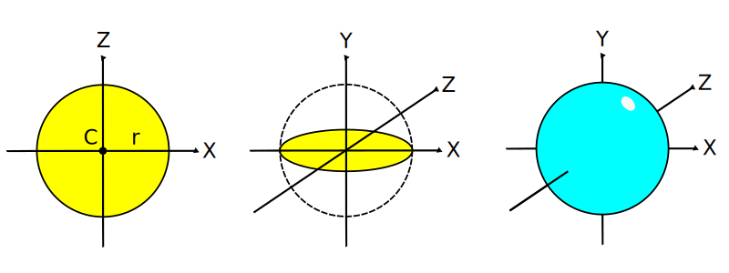
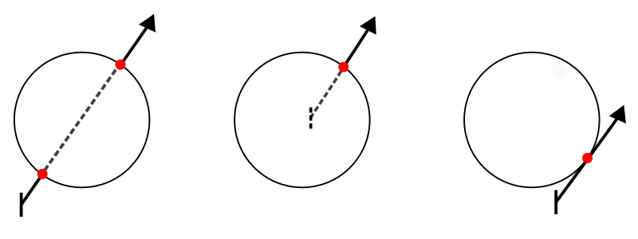

# 4. Ray Tracking: Intersección y Normal a una Esfera

_24-10-2005_ _Juan Mellado_

En el artículo anterior se presentaron una serie de fórmulas genéricas para el cálculo de los puntos de intersección entre los rayos y los objetos. En este artículo se concretará dicho cálculo para un tipo de objeto en particular, la esfera.

Se verá una solución algebraica sencilla, siempre teniendo en cuenta que no es la única que se puede utilizar, existen otras, como las geométricas, más eficientes, que pueden encontrarse en los textos de referencia.

Recordando lo visto en el artículo anterior acerca de la posibilidad de realizar los cálculos en el espacio local al objeto, en vez del espacio global de la escena, en este artículo se verá como calcular la intersección entre un rayo transformado (multiplicado por la inversa de la matriz de transformación del objeto) y la expresión canónica de la esfera, es decir, en el espacio local del objeto.

## 4.1. Intersección con una Esfera

Una esfera se define por su centro $C = (c_x, c_y, c_z)$ y su radio $r$, de forma que los puntos $(x, y, z)$ sobre su superficie son aquellos que verifican la siguiente ecuación:

$(x - c_x)^2 + (y - c_y)^2 + (z - c_z)^2 = r^2$

Básicamente, lo que dice la expresión matemática es que la superficie de una esfera es el conjunto de todos los puntos que se encuentran a una distancia $r$ de un punto $C$.

La expresión canónica se obtiene considerando una esfera con centro $(0, 0, 0)$ y radio $1$:

$(x - 0)^2 + (y - 0)^2 + (z - 0)^2 = 1^2$

$x^2 + y^2 + z^2 = 1$

Un rayo puede intersectar con una esfera en uno o dos puntos de la superficie de la misma. En dos puntos cuando el rayo atraviesa la esfera, con una intersección de entrada y otra de salida. Y en un único punto cuando, o bien el rayo tiene su origen en el interior de la esfera, y sólo presenta una intersección de salida, o bien el rayo es tangente a la esfera, es decir, que la toca en un único punto de su superficie.

Los puntos de intersección entre una esfera canónica y un rayo transformado $R'(t) = O' + D' t$, de origen $O' = (o_x', o_y', o_z')$, y vector dirección normalizado $D' = (d_x', d_y', d_z')$, son aquellos puntos $(x, y, z)$ sobre la superficie de la esfera que verifican la ecuación del rayo:

$(o_x' + d_x' t)^2 + (o_y' + d_y' t)^2 + (o_z' + d_z' t)^2 = 1$

Resolviendo por $t$:

$o_x'^2 + (d_x' t)^2 + 2 o_x' d_x' t +
o_y'^2 + (d_y' t)^2 + 2 o_y' d_y' t +
o_z'^2 + (d_z' t)^2 + 2 o_z' d_z' t
= 1$

$(d_x'^2 + d_y'^2 + d_z'^2) t^2 +
2 (o_x' d_x' + o_y' d_y' + o_z' d_z') t +
o_x'^2 + o_y'^2 + o_z'^2 - 1
= 0$

Expresión que puede simplificarse recordando que el vector $D'$ está normalizado, de forma que su módulo es $1$:

$|D'| = \sqrt{d_x'^2 + d_y'^2 + d_z'^2} = 1$

$d_x'^2 + d_y'^2 + d_z'^2 = 1$

Sustituyendo:

$t^2 +
2 (o_x' d_x' + o_y' d_y' + o_z' d_z') t +
o_x'^2 + o_y'^2 + o_z'^2 - 1
= 0$

La expresión resultante es una ecuación de segundo grado de la forma:

$a t^2 + b t + c = 0$

Donde:

$a = 1$

$b = 2 (o_x' d_x' + o_y' d_y' + o_z' d_z')$

$c = o_x'^2 + o_y'^2 + o_z'^2 - 1$

Y con dos posibles soluciones para $t$:

$t_0' = \cfrac{-b + \sqrt{b^2 - 4 a c}} {2 a}$

$t_1' = \cfrac{-b - \sqrt{b^2 - 4 a c}} {2 a}$

Soluciones que pueden simplificarse ya que $a = 1$:

$t_0' = \cfrac{-b + \sqrt{b^2 - 4 c}} {2}$

$t_1' = \cfrac{-b - \sqrt{b^2 - 4 c}} {2}$

Por otra parte, considerando la forma que tiene la expresión de $b$:

$b = 2 k$, con $k = o_x' d_x' + o_y' d_y' + o_z' d_z'$

Puede simplificarse $t_0'$, por ejemplo, igual sería para $t_1'$:

$t_0' = \cfrac{-2 k + \sqrt{(2 k)^2 - 4 c}} {2} =
\cfrac{-2 k + \sqrt{4 k^2 - 4 c}} {2} =
\cfrac{-2 k + 2 \sqrt{k^2 - c}} {2} =
-k + \sqrt{k^2 - c}$

Con lo que finalmente:

$t_0' = -k + \sqrt{k^2 - c}$

$t_1' = -k - \sqrt{k^2 - c}$

Si el discriminante (la expresión dentro de la raíz cuadrada) es menor que cero, no puede resolverse la ecuación, no existen soluciones reales, por lo que no se produce intersección. Si el discriminante es cero, entonces sólo existe una solución, el rayo es tangente a la esfera, y puede tomarse $t_0'$ ó $t_1'$ indistintamente. Por último, si el discriminante es mayor que cero entonces hay dos posibles soluciones, siendo la positiva de menor valor la más cercana al origen del rayo.

Cada valor $t_i'$ válido encontrado se corregiría para llevarlo de vuelta correctamente al espacio de coordenadas globales de la escena (dividiéndolo por la longitud del vector dirección del rayo original por la inversa de la matriz de transformación del objeto), y se aplicaría en la ecuación del rayo para obtener el punto $I$ intersectado:

$t_i = \cfrac{t_i'} {|D M^{-1}|}$

$I = R(t_i)$

## 4.2. Normal al Punto de Intersección con una Esfera

La normal a un punto de intersección $I$ sobre la superficie de una esfera es el vector unitario $N_i$ que une el centro de la esfera $C$ con dicho punto de la superficie:

$N_i = \cfrac{I - C} {|I - C|}$

Sin embargo, esto es sólo válido considerando el centro real de la esfera en el espacio de coordenadas globales de la escena. El resultado no será válido si se toma la expresión de la esfera canónica en la que el centro es $(0, 0, 0)$. Si se quiere seguir considerando el espacio local de la esfera entonces se tiene que transformar el punto $I$ utilizando la inversa de la matriz de transformación $M$ antes de aplicarlo en la expresión de la normal:

$I' = I M^{-1}$

O, alternativamente, evaluando el valor $t_i'$ encontrado en la expresión del rayo transformado:

$I' = R'(t_i')$

Independientemente de cual de los dos métodos se utilice, se deberá usar la traspuesta de la inversa de la matriz de transformaciones para corregir el ángulo de la normal:

$N_i = \cfrac{(I' - C)(M^{-1})^T} {|(I' - C)(M^{-1})^T|}$

Y teniendo en cuenta que $C = (0, 0, 0)$ en la expresión canónica de la esfera:

$N_i = \cfrac{I'(M^{-1})^T} {|I'(M^{-1})^T|}$

Como ya se comentó en el artículo anterior, si el rayo incide en la cara interior (se cumple $N_i \cdot D > 0$) se le cambiará el signo a la normal para que apunte hacia dentro de la esfera.
