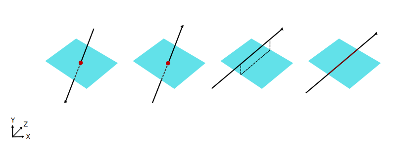
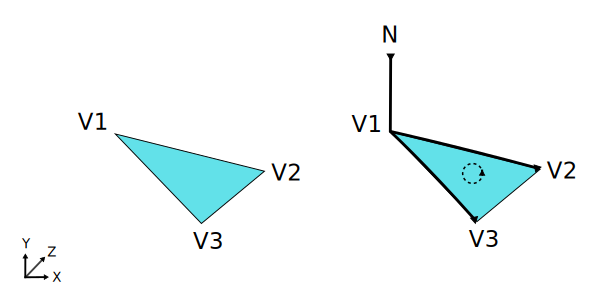
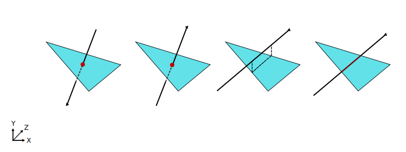
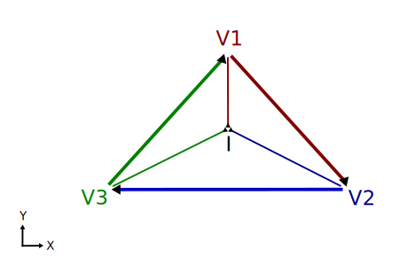
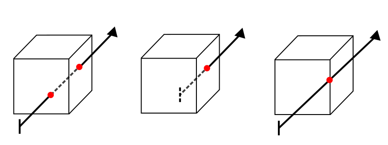

# 5. Plano, Triángulo y Cubo

_03-11-2005_  _Juan Mellado_

Este artículo presenta el cálculo de intersecciones, y obtención de normales, de un rayo con un plano, un triángulo, y un cubo.

Estos tres objetos se estudian a un mismo tiempo porque todos se basan en el primero de ellos, es decir, el plano. Un triángulo es una región finita dentro de un plano infinito, y un cubo es un conjunto de seis planos enfrentados dos a dos.

## 5.1. Intersección con un Plano

Un plano se define por un vector normalizado perpendicular a la superficie del mismo $N = (n_x, n_y, n_z)$, y la distancia $d$ que le separa del origen de coordenadas, de forma que los puntos $(x, y, z)$ sobre su superficie son aquellos que verifican la siguiente ecuación:

$n_x x + n_y y + n_z z + d = 0$

En este caso particular no ha lugar hablar de expresión canónica. Las optimizaciones vendrían si se consideraran planos paralelos a cada uno de los ejes, en los que una de las coordenadas de la normal es $1$ y las otras dos $0$, pero son casos particulares, no soluciones generales. Es más, para el cálculo de la intersección del rayo con el plano se considerará el rayo sin transformar, esto es, expresado en las coordenadas globales de la escena.

Un rayo puede intersectar con un plano en un único punto de su superficie, ya sea en su cara anterior o posterior. O puede ser paralelo, o estar completamente incluido dentro del mismo, en cuyo caso no se considera que se produzca intersección alguna.

El punto de intersección entre un plano cualquiera y un rayo $R(t) = O + D t$, con su origen $O = (ox, oy, oz)$ y vector dirección normalizado $D = (d_x, d_y, d_z)$, es aquel punto $(x, y, z)$ sobre la superficie del plano que verifica la ecuación del rayo:

$n_x (o_x + d_x t) + n_y (o_y + d_y t) + n_z (o_z + d_z t) + d = 0$

Resolviendo por $t$:

$n_x o_x + n_x d_x t + n_y o_y + n_y d_y t + n_z o_z + n_z d_z t + d = 0$

$(n_x d_x + n_y d_y + n_z d_z) t + n_x o_x + n_y o_y + n_z o_z + d = 0$

$t = \cfrac{- (n_x o_x + n_y o_y + n_z o_z + d)}{(n_x d_x + n_y d_y + n_z d_z)}$

El punto de intersección $I$ sería simplemente el resultado de evaluar el valor $t$ calculado en la ecuación del rayo:

$I = R(t)$

Notar que el denominador de la ecuación de cálculo de $t$ es el producto escalar del vector normal al plano y el vector dirección del rayo:

$n_x d_x + n_y d_y + n_z d_z = N \cdot D$

El producto escalar de dos vectores es cero si los vectores son perpendiculares, por lo que si el denominador de la expresión de $t$ vale cero, querrá decir que el rayo es paralelo al plano, o está contenido completamente en el mismo, y no existe intersección.

Por otra parte, el signo del producto escalar indica si los dos vectores apuntan hacia un mismo lado, signo positivo, o hacia lados contrarios, signo negativo. Por lo que el signo será negativo si el rayo incide en la cara anterior del plano (apunta en dirección contraria a la normal), y positivo si incide sobre la cara posterior (apunta en la misma dirección que la normal).

## 5.2. Normal al Punto de Intersección con un Plano

Si el rayo incide en la cara anterior se tomará la normal en el punto de intersección como la normal al plano:

$N_i = N$

Si el rayo incide en la cara posterior se tomará la normal al plano con el signo cambiado:

$N_i = -N$

## 5.3. Intersección con un Triángulo

El cálculo de la intersección con un triángulo es un caso particular de la intersección con un plano. La única diferencia es que el área de intersección es finita y con una forma definida, y no infinita como en el plano. El algoritmo que se aplica para este objeto consiste básicamente en estudiar primero si se produce una intersección con el plano que lo contiene, y a continuación determinar si el punto de intersección encontrado está dentro del área del triángulo.

Un triángulo es un polígono definido por tres vértices (puntos), $V_1 = (x_1, y_1, z_1)$, $V_2 = (x_2, y_2, z_2)$, y $V_3 = (x_3, y_3, z_3)$, no co-lineales, es decir, que no se encuentran alineados sobre una línea recta.

El vector unitario normal a la superficie del plano que contiene al triángulo, $N = (n_x, n_y, n_z)$, se obtiene mediante el producto vectorial de dos vectores construidos con los vértices del polígono:

$N = \cfrac{(V_2 - V_1) \times (V_3 - V_1)}{|(V_2 - V_1) \times (V_3 - V_1)|}$

El orden en que se definen los vértices es importante, ya que la dirección de la normal varía en función de ello. Para nuestros propósitos consideraremos los vértices ordenados, sobre el plano, en el mismo sentido del avance de las agujas del reloj.

La distancia $d$ del origen de coordenadas al plano que contiene el triángulo se obtiene despejándola de la ecuación del plano:

$n_x x + n_y y + n_z z + d = 0$

$d = - (n_x x + n_y y + n_z z)$

Y evaluando para algún vértice del triángulo, por ejemplo $V_1$:

$d = - (n_x x_1 + n_y y_1 + n_z z_1)$

Un rayo puede intersectar con un triángulo en un único punto de su superficie, ya sea en su cara anterior o posterior. O puede ser paralelo, o estar completamente incluido dentro del mismo, en cuyo caso no se considera que se produzca intersección alguna.

El cálculo de $t$ para hallar el punto de intersección con un triángulo se realiza de igual forma que para el plano. La única diferencia consiste en que se debe realizar un paso posterior al cálculo de $t$, para determinar si el punto $I$, resultante de aplicar el valor $t$ encontrado en la ecuación del rayo, se encuentra dentro del área del triángulo.

El problema se resuelve en dos dimensiones proyectando los vértices del triángulo y el punto $I$ encontrado en el plano _X-Z_, _Z-Y_, o _Y-X_. Para ello se comprueba cual es la componente de mayor valor de la normal, y se elimina esa componente de todos los puntos. Esta operación tiene como resultado la proyección de todos los puntos en un mismo plano. Y además, con la particularidad de que dicho plano contiene la proyección del triángulo de mayor área de las tres posibles, con lo que se reducen los problemas de precisión en el cálculo.

Una vez proyectados todos los puntos sobre un mismo plano, se procede a comprobar el punto $I$ con cada una de los lados (aristas) del triángulo. Lo que se hace es ver si el punto se encuentra a un mismo lado respecto a cada una de las aristas. Es decir, si se encuentra a la izquierda o derecha de las mismas, ya que los puntos interiores a un triángulo se encuentran siempre todos a un mismo lado con respecto a sus aristas.

Para hacer esto se calcula el producto vectorial de los vectores que forman los vértices de cada arista y cada vértice con el punto, y se realiza el producto escalar con la normal al triángulo. Si el signo de todos los productos escalares es el mismo, entonces el punto $I$ se encuentra dentro del triángulo. O sea, se comprueba si los vectores que se obtienen del producto cruzado entre cada arista, y cada vértice con el punto, tienen la misma orientación que la normal al triángulo.

$s1 = \Big((V_2 - V_1) \times (I - V_1)\Big) \cdot N$

$s2 = \Big((V_3 - V_2) \times (I - V_2)\Big) \cdot N$

$s3 = \Big((V_1 - V_3) \times (I - V_3)\Big) \cdot N$

Si $s_1$, $s_2$ y $s_3$ tienen el mismo signo entonces $I$ está dentro del triángulo.

En todo caso ha de tenerse en cuenta que el algoritmo de intersección para triángulos descrito en este artículo no es el único que puede utilizarse, ni tampoco el más eficiente, existen otros que pueden encontrarse en los textos de referencia.

## 5.4. Normal al Punto de Intersección con un Triángulo

De igual forma que se vió anteriormente para el plano, si el rayo incide en la cara anterior se tomará como normal en el punto de intersección la normal al triángulo:

$N_i = N$

Y si el rayo incide en la cara posterior se tomará la normal al triángulo con el signo cambiado:

$N_i = -N$

## 5.5. Intersección con un Cubo

Un cubo puede definirse mediante dos puntos $P_1 = (x_1, y_1, z_1)$ y $P_2 = (x2, y2, z2)$, los correspondientes a las coordenadas de dos esquinas del cubo enfrentadas diagonalmente. Estas coordenadas definen seis planos, paralelos dos a dos, donde se encuentran las caras del cubo.

Un rayo puede intersectar con un cubo en dos puntos de su superficie, cuando atraviesa dos de sus caras. O en un único punto, cuando su origen está en el interior del cubo o es tangente al mismo. O puede ser paralelo, o estar completamente incluido dentro de una de las caras, en cuyo caso no se considera que se produzca intersección alguna.

Una forma de calcular las posibles intersecciones sería comprobar si se produce alguna intersección con cada uno de los planos del cubo, y ver a continuación si el punto de intersección encontrado está dentro de la cara de los planos intersectados. Sin embargo, para evitar todo este cálculo, se suele utilizar una definición simplificada del cubo basada en seis planos alineados dos a dos con los ejes de coordenadas. Esta disposición permite utilizar un algoritmo, propuesto por Kay y Kajiya, que minimiza el número y complejidad de los cálculos a realizar.

Para aplicar este algoritmo es mejor considerar un cubo canónico centrado en el origen y radio la unidad, $P_1 = (-1, -1, -1)$ y $P_2 = (1, 1, 1)$, y el rayo transformado $R'(t) = O' + D' * t$, con punto origen $O' = (o_x', o_y', o_z')$ y vector dirección unitario $D' = (d_x', d_y', d_z')$.

El algoritmo comienza declarando e inicializando dos variables, con valores límites, que contendrán los valores de t para las posibles intersecciones:

$t_{near} = -\infty$

$t_{far} = \infty$

A continuación estudia los planos del cubo de dos en dos, considerando dos planos paralelos cada vez, y comparando los puntos de intersección de los planos y el rayo con los ejes. Veamos el caso para el eje $X$ (igual sería para los otros ejes):

- SI $d_x'$ = $0$ ENTONCES el rayo es paralelo a los planos estudiados:

  - SI $o_x'$ < $x_1$ ó $o_x'$ > $x_2$ ENTONCES el rayo no intersecta el cubo y se retorna FALSE

- SI NO, el rayo no es paralelo, y se calculan dos posibles intersecciones, una por plano:

  - $t_1' = (x_1 - o_x') / d_x'$

  - $t_2' = (x_2 - o_x') / d_x'$

  - SI $t_1'$ > $t_2'$ ENTONCES se intercambian $t_1'$ y $t_2'$

  - SI $t_1'$ > $t_{near}$ ENTONCES $t_{near} = t_1'$

  - SI $t_2'$ < $t_{far}$ ENTONCES $t_{far} = t_2'$

- SI $t_{near}$ > $t_{far}$ ENTONCES el rayo no intersecta el cubo y se retorna FALSE

- SI $t_{far}$ < $0$ ENTONCES el cubo está por detrás del rayo y se retorna FALSE

Si el rayo supera todas las comprobaciones con las tres parejas de planos, entonces el algoritmo retorna TRUE, y $t_{near}$ y $t_{far}$ contienen los valores de $t$ para los que se producen las intersecciones. Si el rayo tiene su origen dentro del cubo, el valor de $t_{near}$ se corresponderá con una intersección que se encuentra por detrás del origen del rayo y deberá rechazarse.

De la forma acostumbrada, los valores resultantes deberán corregirse para llevarlos de vuelta al espacio de coordenadas globales de la escena.

## 5.6. Normal al Punto de Intersección con un Cubo

La normal $N_i'$ en el punto de intersección es un vector unitario perpendicular a la cara intersectada:

- Cara anterior: $N_i' = (0, 0, -1)$

- Cara posterior: $N_i' = (0, 0, 1)$

- Cara superior: $N_i' = (0, 1, 0)$

- Cara inferior: $N_i' = (0, -1, 0)$

- Cara izquierda: $N_i' = (-1, 0, 0)$

- Cara derecha: $N_i' = (1, 0, 0)$

De igual forma que en casos anteriores, la normal se corregirá para devolverla al espacio global de coordenadas de la escena, y si el rayo incide en alguna cara interior se tomará con el signo cambiado.
