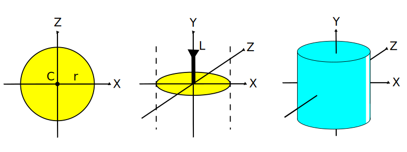
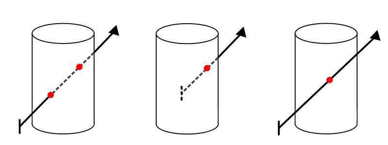
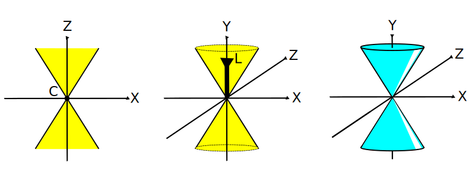

# 6. Ray Tracing: Cilindro y Cono

_10-11-2005_ _Juan Mellado_

Este artículo muestra las ecuaciones que permiten obtener los puntos de intersección entre un rayo y un cilindro, y entre un rayo y un cono. Adicionalmente, después del estudio de la intersección, se indica como obtener las normales en dichos puntos de intersección.

Cilindro y cono se definen de una forma muy similar, motivo por el que se estudian a un mismo tiempo.

Para definir un cilindro se necesitan tres parámetros: ubicación, orientación y ancho. La ubicación la determina un punto en el espacio, la orientación un eje (vector) que pasa por el punto de ubicación, y el ancho un radio tomado alrededor del eje.

Por su parte, para definir un cono se necesitan también tres parámetros: ubicación, orientación y apertura. La ubicación la determina un punto en el espacio, la orientación un eje que pasa por el punto de ubicación, y la apertura un ángulo tomado en el punto de ubicación alrededor del eje.

Tal y como se han definido, estas primitivas tienen una extensión ilimitada, pero en la práctica se suelen acotar superior e inferiormente para dar lugar a objetos finitos cerrados. En este artículo se verá también como tratar estos casos.

## 6.1. Intersección con un Cilindro

Los puntos sobre la superficie de un cilindro, con un eje central definido por el vector unitario $L = (l_x, l_y, l_z)$ que pasa por el punto $C = (c_x, c_y, c_z)$, son aquellos que se encuentran a una distancia $r$ de dicho eje:

$(x-c_x)^2 + (y-c_y)^2 + (z-c_z)^2 = r^2 + \Big(l_x (x-c_x) + l_y (y-c_y) + l_z (z-c_z)\Big)^2$

La expresión canónica se obtiene considerando un cilindro definido por un eje vertical con vector $(0, 1, 0)$ que pasa por el origen de coordenadas $(0, 0, 0)$, y que tiene radio $1$:

$(x-0)^2 + (y-0)^2 + (z-0)^2 = 1^2 + \Big(0 * (x-0) + 1 * (y-0) + 0 * (z-0) \Big)^2$

$x^2 + y^2 + z^2 = 1 + y^2$

$x^2 + z^2 = 1$

Un rayo puede intersectar con un cilindro en uno o dos puntos de la superficie del mismo. En dos puntos cuando el rayo atraviesa el cilindro, con una intersección de entrada y otra de salida. Y en un único punto cuando el rayo tiene su origen en el interior del cilindro y sólo presenta una intersección de salida, o cuando el rayo es tangente al cilindro, es decir, que lo toca en un único punto de su superficie.

Los puntos de intersección entre un cilindro canónico y un rayo transformado $R'(t) = O' + D' t$, de origen $O' = (o_x', o_y', o_z')$ y vector dirección normalizado $D' = (d_x', d_y', d_z')$, son aquellos puntos $(x, y, z)$ sobre la superficie del cilindro que verifican la ecuación del rayo:

$(o_x' + d_x' t)^2 + (o_z' + d_z' t)^2 = 1$

Resolviendo por $t$:

$o_x'^2 + (d_x' t)^2 + 2 o_x' d_x' t + o_z'^2 + (d_z' t)^2 + 2 o_z' d_z' t = 1$

$(d_x'^2 + d_z'^2) t^2 + 2 (o_x' d_x' + o_z' d_z') t +
o_x'^2 + o_z'^2 - 1 = 0$

La expresión resultante es una ecuación de segundo grado de la forma:

$a t^2 + b t + c = 0$

Donde:

$a = d_x'^2 + d_z'^2$

$b = 2 (o_x' d_x' + o_z' d_z')$

$c = o_x'^2 + o_z'^2 - 1$

Y con dos posibles soluciones para $t$:

$t_0' = \cfrac{-b + \sqrt{b^2 - 4 a c}}{2 a}$

$t_1' = \cfrac{-b - \sqrt{b^2 - 4 a c}}{2 a}$

Expresiones que pueden simplificarse de igual forma que se hizo con la ecuación de la esfera en un artículo anterior:

$b = 2 k$, con $k = o_x' d_x' + o_z' d_z'$

$t_0' = \cfrac{-k + \sqrt{k^2 - a c}}{a}$

$t_1' = \cfrac{-k - \sqrt{k^2 - a c}}{a}$

Si $a$ es cero, o el discriminante (la expresión dentro de la raíz cuadrada) es menor que cero, no puede resolverse la ecuación, no existen soluciones reales, por lo que no se produce intersección.

Si el discriminante es cero, entonces sólo existe una solución, el rayo es tangente al cilindro, y puede tomarse $t_0'$ ó $t_1'$ indistintamente.

Y si el discriminante es mayor que cero entonces hay dos posibles soluciones, siendo la positiva de menor valor la más cercana al origen del rayo.

El valor $t_i'$ encontrado se corregiría y se aplicaría en la ecuación del rayo para obtener el punto $I$ intersectado:

$t_i = \cfrac{t_i'}{|D M^{-1}|}$

$I = R(t_i)$

## 6.2. Intersección con un Cilindro Acotado

Es práctica habitual limitar la naturaleza infinita de la longitud de los cilindros, acotando superior e inferiormente los mismos mediante dos "tapas".

Las tapas son dos planos horizontales que acotan la extensión del cilindro, y cuyas normales coinciden con el vector dirección del mismo, una con el mismo sentido $(0, 1, 0)$, y otra con sentido contrario $(0, -1, 0)$.

Para tener en cuenta estos dos planos se añaden nuevas condiciones a la definición de cilindro canónico, limitando la extensión (altura) del cilindro a una unidad. De forma que sólo se produce una intersección si la componente vertical $i_y'$ del punto de intersección $I'$ es mayor o igual que cero y menor o igual que uno:

- Si $0$ <= $i_y'$ <= $1$ se produce intersección

Las posibles intersecciones con cada una de las tapas se calculan como intersecciones entre el rayo y los planos horizontales que contienen las tapas, utilizando la ecuación de intersección entre rayo y plano que se explicó en un artículo anterior:

$t = - \cfrac{n_x o_x' + n_y o_y' + n_z o_z' + d}{n_x d_x' + n_y d_y' + n_z d_z'}$

El plano que contiene a la tapa superior tiene por normal $(n_x, n_y, n_z) = (0, 1, 0)$, y se encuentra a una distancia $d = 1$ del origen de coordenadas. Sustituyendo:

$t = - \cfrac{0 * o_x' + 1 * o_y' + 0 * o_z' + 1}{0 * d_x' + 1 * d_y' + 0 * d_z'}$

$t = - \cfrac{o_y' + 1} {d_y'}$

Debe ser claro que si $dy' = 0$ entonces no se produce intersección. El rayo es paralelo al plano, o se encuentra contenido en el mismo.

Si el rayo intersecta con el plano, entonces se debe comprobar si el nuevo punto de intersección $I'$, resultante de aplicar $t$ en la ecuación del rayo ($I' = O' + D' t$), se encuentra dentro del área circular delimitada por la tapa. Para ello basta con comprobar si el punto se encuentra sobre el plano horizontal separado del centro del cilindro $C = (0, 0, 0)$ una distancia menor o igual a la del radio $r = 1$:

- Si $i_x'^2 + i_z'^2$ <= $1$ se produce intersección

Una vez terminada con la tapa superior, se operaría de igual forma con la tapa inferior, teniendo en cuenta que tiene por normal $(nx, ny, nz) = (0, -1, 0)$, y se encuentra a una distancia $d = 0$ del origen de coordenadas:

$t = - (0 * o_x' - 1 * o_y' + 0 * o_z' + 0) / (0 * d_x' - 1 * d_y' + 0 * d_z')$

$t = \cfrac{o_y'}{d_y'}$

## 6.3. Normal al Punto de Intersección con un Cilindro

La normal al punto de intersección dependerá de la parte concreta del cilindro en la que se produzca la intersección.

Si la intersección se produce con las tapas, la normal será un vector vertical, orientado hacia arriba o hacia abajo, dependiendo de la tapa. Si la intersección se produce en el lateral, la normal será igual al vector que une el punto de intersección con el punto más cercano al mismo situado sobre el eje que atraviesa el cilindro.

Si se mira el cilindro desde arriba, sobre su vertical, es fácil comprobar que cuando la intersección se produce en el lateral, la normal se corresponde siempre con la proyección del punto de intersección $I'$ sobre el plano horizontal _X-Z_. Es decir, se puede prescindir de la componente vertical y resolver el problema en dos dimensiones.

- Tapa superior: $N_i' = (0, 1, 0)$

- Tapa inferior: $N_i' = (0, -1, 0)$

- Lateral: $N_i' = (i_x', 0, i_z')$

De igual forma que en casos anteriores, la normal se corregirá para devolverla al espacio global de coordenadas de la escena, y si el rayo incide en alguna cara interior se tomará con el signo cambiado.

## 6.4. Intersección con un Cono

Los puntos sobre la superficie de un cono, con un eje central definido por el vector unitario $L = (l_x, l_y, l_z)$, son aquellos que forman un ángulo _alfa_ con un punto concreto $C = (c_x, c_y, c_z)$ situado sobre su eje:

$\cfrac{(x - c_x) l_x + (y - c_y) l_y + (z-c_z) l_z}{\sqrt{(x - x_c)^2 + (y - y_c)^2 + (z - z_c)^2}} = \cos(alfa)$

La expresión canónica se obtiene considerando un cono definido por un eje vertical con vector $(0, 1, 0)$, el punto $(0, 0, 0)$, y un ángulo de $45$ grados:

$\cfrac{(x - 0) * 0 + (y - 0) * 1 + (z - 0) *0 }{\sqrt{(x - 0)^2 + (y - 0)^2 + (z - 0)^2}} = \cos(\cfrac{\pi}{4})$

$\cfrac{y}{\sqrt{x^2 + y^2 + z^2}} = \cfrac{1}{\sqrt{2}}$

$\cfrac{y^2}{x^2 + y^2 + z^2} = \cfrac{1}{2}$

$2 y^2 = x^2 + y^2 + z^2$

$x^2 - y^2 + z^2 = 0$

Los puntos de intersección entre un rayo tranformado y un cono canónico, son aquellos puntos $(x, y, z)$ sobre la superficie del cono que verifican la ecuación del rayo:

$(o_x' + d_x' t)^2 - (o_y' + d_y' t)^2 + (o_z' + d_z' t)^2 = 0$

Resolviendo por $t$:

$o_x'^2 + (d_x' t)^2 + 2 o_x' d_x' t - o_y'^2 - (d_y' t)^2 - 2 o_y' d_y' t + o_z'^2 + (d_z' t)^2 + 2 o_z' d_z' t = 0$

$(d_x'^2 - d_y'^2 + d_z'^2) t^2 + 2 (o_x' d_x' - o_y' d_y' + o_z' d_z') t + o_x'^2 - o_y'^2 + o_z'^2 = 0$

La expresión resultante es una ecuación de segundo grado de la forma:

$a t^2 + b t + c = 0$

Donde:

$a = d_x'^2 - d_y'^2 + d_z'^2$

$b = 2 (o_x' d_x' - o_y' d_y' + o_z' d_z')$

$c = o_x'^2 - o_y'^2 + o_z'^2$

Y con dos posibles soluciones para $t$:

$t_0′ = \cfrac{-b + \sqrt{b^2 - 4 a c}}{2 a}$

$t_1′ = \cfrac{-b - \sqrt{b^2 - 4 a c}}{2 a}$

Expresiones que pueden simplificarse de igual forma que se hizo con la ecuación de la esfera en un artículo anterior:

$b = 2 k$, con $k = o_x' d_x' - o_y' d_y' + o_z' d_z'$

$t_0′ = \cfrac{-k + \sqrt{k^2 - a c}}{a}$

$t_1′ = \cfrac{-k - \sqrt{k^2 - a c}}{a}$

Si $a$ es cero, o el discriminante (la expresión dentro de la raíz cuadrada) es menor que cero, no puede resolverse la ecuación, no existen soluciones reales, por lo que no se produce intersección. Si el discriminante es cero, entonces sólo existe una solución, el rayo es tangente al cono, y puede tomarse $t_0'$ ó $t_1'$ indistintamente. Y por último, si el discriminante es mayor que cero, entonces hay dos posibles soluciones, siendo la positiva de menor valor la más cercana al origen del rayo.

El valor $t_i'$ encontrado se corregiría y se aplicaría en la ecuación del rayo para obtener el punto $I$ intersectado:

$t_i = \cfrac{t_i'}{|D M^{-1}|}$

$I = R(t_i)$

## 6.5. Intersección con un Cono Acotado

Es práctica habitual eliminar la simetría vertical, y limitar la naturaleza infinita de la longitud de los conos, acotando superiormente los mismos, mediante una "tapa".

La tapa es un plano horizontal que acota la extensión del cono, y cuya normal coincide con el vector dirección del mismo, $(0, 1, 0)$.

Para contemplar estas dos acotaciones, se añaden nuevas condiciones a la definición de cono canónico, limitando la extensión (altura) del cono a una unidad. De forma que sólo se produce intersección si la componente vertical, $i_y'$, del punto de intersección $I'$, es mayor o igual que cero y menor o igual que uno:

- Si $0$ <= $i_y'$ <= $1$ se produce intersección

La posible intersección con la tapa se calcula como una intersección entre el rayo y el plano horizontal que contiene la tapa, utilizando la ecuación de intersección entre rayo y plano que se explicó en un artículo anterior:

$t = - \cfrac{n_x o_x' + n_y o_y' + n_z o_z' + d}{n_x d_x' + n_y d_y' + n_z d_z'}$

El plano que contiene a la tapa tiene por normal $(n_x, n_y, n_z) = (0, 1, 0)$, y se encuentra a una distancia $d = 1$ del origen de coordenadas. Sustituyendo:

$t = - \cfrac{0 * o_x' + 1 * o_y' + 0 * o_z' + 1}{0 * d_x' + 1 * d_y' + 0 * d_z'}$

$t = - \cfrac{o_y' + 1}{d_y'}$

Debe ser claro que si $dy' = 0$ entonces no se produce intersección. El rayo es paralelo al plano, o se encuentra contenido en el mismo.

Si el rayo intersecta con el plano, entonces se debe comprobar si el nuevo punto de intersección $I'$, resultante de aplicar $t$ en la ecuación del rayo ($I' = O' + D' t$), se encuentra dentro del área circular delimitada por la tapa. Para ello basta con comprobar si el punto se encuentra sobre el plano horizontal separado del centro del cono $C = (0, 0, 0)$ una distancia menor o igual a uno, longitud del radio de la tapa:

- Si $(i_x'^2 + i_z'^2)$ <= $1$ se produce intersección

## 6.6. Normal al Punto de Intersección con un Cono

La normal al punto de intersección dependerá de la parte concreta del cono en la que se produzca la intersección.

Si la intersección se produce con la tapa, la normal será un vector vertical, orientado hacia arriba. Si la intersección se produce en el lateral, la normal es muy sencilla de obtener, aunque requiere una explicación un poco detallada. La clave consiste en notar que el vector que une el punto de intersección con el origen de coordenadas está sobre la superficie del cono. Y como la normal no es más que un vector perpendicular a la superficie, basta girar $90$ grados dicho vector con respecto al eje vertical para obtener la normal. Girar un vector $90$ grados en uno de los ejes es tan simple como invertir el signo del componente correspondiente a ese eje:

- Tapa: $N_i' = (0, 1, 0)$

- Lateral: $N_i' = (i_x', -i_y', i_z')$

De igual forma que en casos anteriores, la normal se corregirá para devolverla al espacio global de coordenadas de la escena, y si el rayo incide en alguna cara interior se tomará con el signo cambiado.
