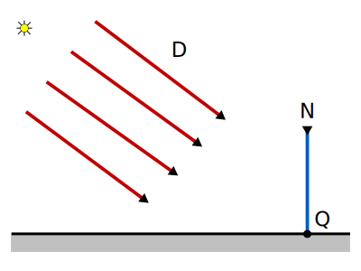
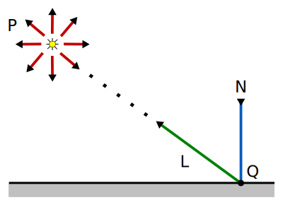
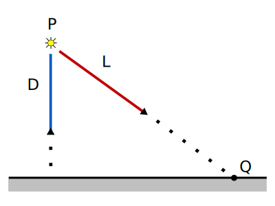

# 7. Ray Tracing: Fuentes de Luz

_17-11-2005_ _Juan Mellado_

Para que una escena pueda ser contemplada por un observador debe de existir algún tipo de iluminación, y esta iluminación la proporcionan generalmente las fuentes emisoras de luz distribuidas por la escena. Sin embargo, no todas las fuentes de luz son iguales, en este artículo se describirán los siguientes tipos de fuentes de luz:

- Luz ambiente

- Fuentes de Luz Direccionales

- Fuentes de Luz Puntuales

- Fuentes de Luz Puntuales Tipo _Spot_

## 7.1. RGBA

En lo sucesivo, cuando se hable del color o intensidad, de una fuente o de un objeto, se entenderá que es un vector de cuatro elementos, donde cada elemento será un valor entre $0$ y $1$. Los tres primeros indicarán el porcentaje de rojo (_R_), verde (_G_) y azul (_B_), definiendo el color, y el cuarto un factor de transparencia, denominado normalmente alpha (_A_):

$Color = (R, G, B, A)$

- _R_ : _Red_ = Rojo

- _G_ : _Green_ = Verde

- _B_ : _Blue_ = Azul

- _A_ : _Alpha_ = Transparencia

## 7.2. Luz Ambiente

A diferencia de una fuente de luz ordinaria, como una vela o una bombilla, la luz ambiente no tiene un foco emisor localizado en un lugar específico del espacio, sino que se encuentra presente uniformemente en todos los puntos del mismo, presenta una intensidad constante en todas las direcciones, iluminando todos los puntos de todos los objetos de igual forma.

Lo que se pretende al introducir el concepto de luz ambiente en una escena es representar la luz de baja intensidad resultante del conjunto de todas las reflexiones que se producen sobre la superficie de todos los objetos. En la práctica, el cálculo de esta luz en todos los puntos del espacio es muy costoso de realizar, por lo que la luz ambiente se introduce en muchos sistemas de _Ray Tracing_ simplemente como un parámetro, por lo general constante:

- _Ia_ : Intensidad de la luz ambiente

## 7.3. Fuentes de Luz Direccionales

Las fuentes de luz direccionales se caracterizan porque emiten en una dirección determinada, aunque no tienen un foco emisor localizado. Se consideran ubicadas en el infinito, de forma que todos los rayos emitidos pueden verse como si fueran paralelos a la dirección de emisión. Estas fuentes son normalmente usadas para modelar emisores tales como el sol.

Una fuente de este tipo se define por su dirección de emisión y la intensidad de la luz emitida, que se considera constante en todos los puntos del espacio:

- $D$ : Dirección de Emisión normalizada

- $I$ : Intensidad de la luz

Al ser fuentes con una dirección de emisión determinada, no todos los puntos se verán iluminados directamente por ellas. Sólo serán iluminados de forma directa los puntos que se encuentren en el mismo lado del plano al que apunta la dirección de emisión.

Y como ya se ha visto anteriormente en otros artículos de esta serie, dos vectores apuntan a un mismo lado de un plano si el producto escalar de ambos vectores es mayor que cero. Por lo que una fuente de luz de este tipo, con un vector dirección $D$, iluminará un punto $Q$ de una superficie, con normal $N$ en dicho punto, sólo si el producto escalar $(-D) \cdot N$ es mayor que cero.

Como los vectores se suponen normalizados, es fácil demostrar que el producto escalar $(-D) \cdot N$ es igual al coseno del ángulo que forman ambos vectores. Por lo tanto, sólo si el coseno del ángulo entre la dirección de emisión y la normal al punto es positivo, la fuente iluminará directamente el punto.

## 7.4. Fuentes de Luz Puntuales

Las fuentes de luz puntuales se ubican en un lugar determinado, es decir, uno de los parámetros con los que las describimos es su posición en el espacio. Y al igual que la luz ambiental, emiten en todas direcciones, pero a diferencia de esta, la intensidad de la luz emitida decrece con la distancia. Es decir, a medida que los rayos de luz se separan del emisor pierden intensidad, se debilitan.

Una fuente de luz puntual se define por los siguientes parámetros:

- $P$ : Posición de la fuente

- $I$ : Intensidad de la luz

- $k_n$ : Factor de atenuación normal

- $k_l$ : Factor de atenuación lineal

- $k_c$ : Factor de atenuación cuadrático

La pérdida de intensidad de estas fuentes de luz se modela mediante los llamados factores de atenuación. Los factores son simplemente valores constantes asociados a cada fuente concreta. Normalmente se consideran tres tipos de factores, a los que se denominan: normal, lineal y cuadrático. Cada factor controla de una forma distinta la manera en que se debilita la intensidad de la luz. Y por lo general todos los factores se reúnen en una única función, que se hace depender de la distancia $d$ que separa la posición de la fuente del punto $Q$ estudiado.

$d = |P - Q|$

$L = \cfrac{Q - P}{d}$

$f_{aten}(d) = \cfrac{1}{k_n + k_l d + k_c d^2}$

A partir de esta expresión, debería quedar claro el origen del nombre de cada factor. El factor de atenuación normal es simplemente una constante que escala inversamente la intensidad de la luz. El factor de atenuación lineal escala inversa y linealmente la intensidad en función de la distancia. Y el cuadrático lo hace en función del cuadrado de la distancia.

El factor normal suele tomar valor $1$ por defecto, para evitar dividir por cero, y permitir que los factores lineal y cuadrático puedan tomar $0$ por defecto.

Al igual que con las direccionales, las puntuales no iluminan todos los puntos directamente. Sólo a aquellos para los que el producto escalar $N \cdot L$ sea mayor que cero, considerando que ambos vectores se encuentran normalizados. Es decir, aquellos para los que el coseno del ángulo entre la normal $N$ y el vector $L$, que une el punto con la posición de la fuente, sea mayor que cero.

## 7.5. Fuentes de Luz Puntuales Tipo Spot

La palabra "_Spot_" es un sinónimo de punto, se ha conservado el nombre inglés original para distinguir estas fuentes de luz de las vistas en el apartado anterior. Además, es la forma habitual con la que se denominan, y con ese nombre es como se encuentran en los textos de referencia.

Al igual que las puntuales, la intensidad de la luz emitida decrece con la distancia. Pero a diferencia de estas, no emiten luz en todas direcciones, sino en una dirección determinada. Es decir, uno de los parámetros con los que se definen es un vector que indica la dirección en la que emiten.

Los rayos parten de la fuente y se extienden formando un cono de luz, de forma que la superficie de los objetos iluminados directamente por este tipo de fuentes presentan un área circular iluminada. La intensidad en dicha área no es constante, sino que es mayor en el centro y decrece gradualmente a medida que se acerca a los extremos.

Una fuente de luz puntual tipo _Spot_ se define por los siguientes parámetros:

- $P$ : Posición de la fuente

- $D$ : Dirección de Emisión normalizada

- $I$ : Intensidad de la luz

- $k_n$ : Factor de atenuación normal

- $k_l$ : Factor de atenuación lineal

- $k_c$ : Factor de atenuación cuadrático

- $k_s$ : Factor de atenuación _spot_

Al igual que las puntuales, la intensidad se regula por una función de atenuación que depende de la distancia a la fuente, a la que se añade un nuevo factor que da a este tipo de fuente su característico aspecto en forma de cono.

La atenuación en un punto $Q$, que se encuentra una distancia $d$ de la fuente, es:

$f_{aten}(d) = \cfrac{(D \cdot L)^{k_s}}{k_n + k_l d + k_c d^2}$

Siendo:

$d = |Q - P|$

$L = \cfrac{Q - P}{d}$

El producto escalar $D \cdot L$ controla como se ve afectada la intensidad en función de la posición relativa de los puntos con respecto a la ubicación de la fuente. Así, la intensidad será mayor para los rayos emitidos en una dirección muy similar a la dirección de emisión principal del foco, y menor a medida que se separen de dicha dirección de emisión.

Por otra parte, debe ser claro que si el producto escalar es menor que cero los vectores tienen sentido contrario, lo que quiere decir que el punto $Q$ no es alcanzado por la luz de la fuente, se encuentra detrás del foco. Es por ello que se suele escribir la función como:

$f_{aten}(d) = \cfrac{\max\{D \cdot L, 0\}^{k_s}}{k_n + k_l d + k_c d^2}$

El exponente con el factor $k_s$ es el que controla el tamaño del cono de luz. Cuanto mayor es el valor de $k_s$ menor es su tamaño (mayor atenuación).
