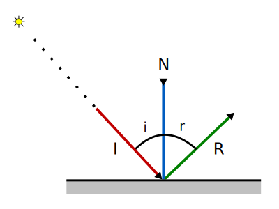
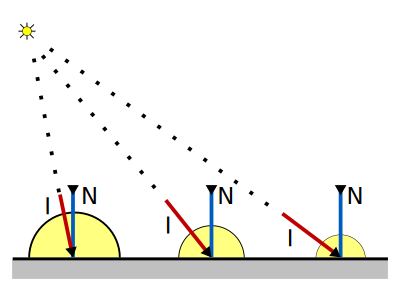
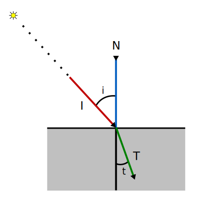

# 8. Ray Tracing: Mecanismos de Transporte de la Luz

_24-11-2005_ _Juan Mellado_

Este artículo presenta los mecanismos de transporte de la luz, que describen como se comporta un rayo de luz cuando colisiona con un objeto.

Se considerarán cuatro mecanismos de transporte básicos para todo sistema de _Ray Tracing_:

- Reflexión Difusa Perfecta

- Reflexión Especular Perfecta

- Transmisión Difusa Perfecta

- Transmisión Especular Perfecta

Todos estos fenómenos se considerarán desde un punto de vista idealizado, de ahí el calificativo de perfectos en los nombres de cada uno de ellos, y se estudiarán en base a consideraciones puramente geométricas, para determinar el ángulo y dirección con los que los rayos "rebotan" o son "absorbidos" por los objetos.

## 8.1. Reflexión Especular Perfecta

El fenómeno de reflexión se produce cuando un rayo de luz rebota contra la superficie de un objeto. Y la reflexión especular no es más que un caso particular de este fenómeno, que se produce cuando el ángulo de salida del rayo es igual al ángulo de llegada, tomando como referencia la normal a la superficie en el punto de incidencia. Es decir, cuando el rayo sale rebotado con el mismo ángulo con el que incide sobre la superficie. Lo particular de este tipo de reflexión es que al conservarse los ángulos también se conserva la disposición original de los rayos, y esto hace que se impresionen imágenes nítidas de los objetos que se encuentran alrededor de la superficie sobre la que incide la luz, tal y como ocurre en los espejos o en los metales muy pulidos.

$I$ es el vector unitario que representa la dirección con la que incide el rayo de luz sobre la superficie, $N$ la normal al punto de incidencia, y $R$ la dirección en la que sale rebotado el rayo.

El problema a resolver consiste en encontrar $R$, y para resolverlo basta con tener en cuenta que el ángulo de incidencia $i$ es igual que el de reflexión $r$:

$i = r$

Como los ángulos son iguales, sus cosenos son iguales:

$\cos{(i)} = \cos{(r)}$

Y como todos los vectores se consideran normalizados, se puede utilizar el producto escalar para obtener dichos cosenos:

$-I \cdot N = |-I| |N| \cos{(i)} = 1 * 1 * \cos{(i)} = \cos{(i)}$

$N \cdot R = |N| |R| \cos{(r)} = 1 * 1 * \cos{(r)} = \cos{(r)}$

$-I \cdot N = N \cdot R$

Por otra parte, considerando que el rayo incidente, la normal, y el rayo reflejado caen todos en un mismo plano, entonces $R$ puede expresarse como una combinación lineal de $I$ y $N$:

$R = a I + b N$

Con lo que el problema se reduce a encontrar los valores de $a$ y $b$. Sustituyendo y resolviendo en la igualdad de cosenos anterior:

$-I \cdot N = N \cdot R$

$-I \cdot N = N \cdot (a I + b N)$

$-I \cdot N = a (I \cdot N) + b (N \cdot N)$

$-I \cdot N = a (I \cdot N) + b (1)$

$-I \cdot N = a (I \cdot N) + b$

$b = (-I \cdot N) - a (I \cdot N)$

Expresión que puede simplificarse mediante la introducción de una variable auxiliar:

$k = I \cdot N$

$b = -k - a k$

Para encontrar el valor de las dos variables, $a$ y $b$, hace falta al menos dos ecuaciones, y de momento sólo hay una. Para encontrar la segunda ecuación se tiene en cuenta que se quiere obtener el vector $R$ normalizado y que por lo tanto debe cumplirse lo siguiente:

$1 = R \cdot R$

$1 = (a I + b N) \cdot (a I + b N)$

$1 = a^2 (I \cdot I) + b^2 (N \cdot N) + 2 a b (I \cdot N)$

$1 = a^2 (1) + b^2 (1) + 2 a b k$

$1 = a^2 + b^2 + 2 a b k$

Sustituyendo el valor de $b$ en esta expresión se obtiene el valor de $a$:

$0 = a^2 + (-k - a k)^2 + 2 a (-k - a k) k - 1$

$0 = a^2 + k^2 + a^2 k^2 + 2 a k^2 - 2 a k^2 - 2 a^2 k^2 - 1$

$0 = a^2 + (a^2 k^2 - 2 a^2 k^2) + (2 a k^2 - 2 a k^2) + k^2 - 1$

$0 = a^2 - a^2 k^2 + k^2 - 1$

$0 = a^2 (1 - k^2) + k^2 - 1$

$a = \sqrt{\cfrac{1 - k^2}{1 - k^2}}$

$a = \sqrt{1}$

$a = 1$

Y así, el valor de $b$ es:

$b = -k - a k$

$b = -k - (1) k$

$b = -2 k$

$b = -2 (I \cdot N)$

Con lo que, finalmente, se obtiene la expresión del vector unitario $R$ que representa la dirección en la que sale reflejado un rayo debido al fenómeno de reflexión especular:

$R = a I + b N$

$R = I - 2 (I · N) N$

## 8.2. Reflexión Difusa Perfecta

El fenómeno de reflexión especular expuesto en el anterior apartado no suele ocurrir en la práctica en todos los objetos. Sólo en superficies como los espejos o metales muy pulidos. Lo que si suele ocurrir para casi todos los objetos es el fenómeno de reflexión difusa.

La reflexión difusa se produce cuando los rayos de luz se reflejan con un ángulo distinto al de incidencia. Este fenómeno se produce debido a que, a nivel microscópico, las superficies no son perfectamente lisas, sino que presentan multitud de irregularidades, denominadas microfacetas, que impiden que se produzca la reflexión especular. Las microfacetas adoptan todo tipo de formas, conformando huecos, aristas, llanos, depresiones, etc, y desencadenando una secuencia de reflexiones que hacen que la luz se esparza por toda la superficie.

Resolver de forma exacta el problema de encontrar la intensidad de la luz resultante de todas esas reflexiones es imposible, ya que habría que describir los objetos con un nivel de detalle microscópico, por lo que los sistemas de _Ray Tracing_ suelen considerar un modelo muy simplificado en el que la luz reflejada difusamente se esparce de manera uniforme por toda la superficie.

El estudio geométrico de la reflexión difusa se limita a considerar el valor del ángulo de incidencia. A mayor ángulo, menor reflexión. Es decir, cuanto mayor sea la diferencia que exista entre la dirección del rayo y la dirección de la normal, menor reflexión. Este modelo lo que viene a decir es que un rayo tiene más probabilidad de reflejarse especularmente si incide en la dirección de la normal, porque saldrá reflejado limpiamente en dicha dirección. Y que por el contrario, si lo hace en una dirección muy distinta de la normal, tiene mayor probabilidad de reflejarse difusamente, debido a múltiples rebotes sobre las microfacetas.

A diferencia con la reflexión especular, en este caso no ha lugar ningún cálculo de vectores. Lo único que debe considerarse es el ángulo que forman la normal y el rayo incidente. O equivalentemente, el coseno del ángulo que forman, que puede obtenerse del producto escalar entre ambos vectores. La intensidad de la luz reflejada difusamente por la superficie será directamente proporcional a dicho coseno. A menor ángulo, mayor coseno, mayor reflexión. A mayor ángulo, menor coseno, menor reflexión.

## 8.3. Transmisión Especular Perfecta

El fenómeno de transmisión, también llamado de refracción, se produce cuando un rayo de luz atraviesa la superficie de un objeto, continuando su camino a través del objeto en vez de rebotar contra él.

El paso de un rayo de luz de un medio a otro provoca un cambio en la dirección del rayo. Estando condicionada la magnitud de dicho cambio por los índices de refracción de los dos medios. Siendo el índice de refracción una propiedad intrínseca de los medios. Por ejemplo, el del aire con respecto al vacío es prácticamente $1$, por lo que los objetos se ven con total claridad a su través, y el del agua con respecto al vacío es $1,33$, lo que explica la distorsión con la que vemos los objetos introducidos en ella.

$I$ esel vector unitario que representa la dirección con la que incide el rayo de luz sobre la superficie, $N$ la normal al punto de incidencia, y $T$ la dirección en la que se transmite el rayo a través del objeto.

En la transmisión, al igual que en la reflexión especular, el ángulo de incidencia $i$ y el de transmisión $t$ se encuentran relacionados. Sólo que esta vez, por la llamada _Ley de Snell_:

$\cfrac{\sin{(i)}}{\sin{(t)}} = \cfrac{n_2}{n_1} = n_{21}$

Donde $n_1$ es el índice de refracción respecto al vacío del medio 1 (de donde procede el rayo), $n_2$ el índice respecto al vacío del medio 2 (por donde se transmite el rayo), y $n_{21}$ el del medio 2 respecto al medio 1.

También ocurre, al igual que en la reflexión especular, que el rayo incidente, la normal, y el rayo transmitido, recaen todos en un mismo plano, por lo que el vector $T$ puede expresarse como una combinación lineal de $I$ y $N$:

$T = a I + b N$

Hallar el valor de $T$ requiere la realización de un número mayor de pasos que los realizados en el caso de la reflexión especular. Y como punto de partida se toma la _Ley de Snell_ reescrita elevando al cuadrado todos sus miembros:

$\cfrac{\sin^2{(i)}}{n_{21}^2} = \sin^2{(t)}$

A continuación se tienen en cuenta las siguientes relaciones geométricas elementales:

$\cos{(i)} = -I \cdot N$

$\cos{(t)} = -N \cdot T$

$\sin^2{(i)} + \cos^2{(i)} = 1$

$\sin^2{(t)} + \cos^2{(t)} = 1$

Y en base a ellas se desarrolla la _Ley de Snell_:

$\cfrac{\sin^2{(i)}}{n_{21}^2} = \sin^2{(t)}$

$\cfrac{1 - \cos^2(i)}{n_{21}^2} = 1 - \cos^2{(t)}$

$\cfrac{1 - (-I \cdot N)^2}{n_{21}^2} - 1 = - \cos^2{(t)}$

Resolviendo:

$- \cos^2{(t)} =$

$- (-N \cdot T)^2 =$

$- (-N \cdot (a I + b N))^2 =$

$- (a (-N \cdot I) + b (-N \cdot N))^2 =$

$- (a (-N \cdot I) + b (-1))^2 =$

$- (a (-N \cdot I) - b)^2$

Finalmente:

$\cfrac{1 - (-I \cdot N)^2}{n_{21}^2} - 1 = - (a (-N \cdot I) - b)^2$ [1]

Una segunda ecuación, que permitirá encontrar el valor de $a$ y $b$, se construye partiendo del hecho de que se quiere obtener el vector $T$ normalizado:

$1 = T \cdot T$

$1 = (a I + b N) · (a I + b N)$

$1 = a^2 * (I \cdot I) + b^2 (N \cdot N) + 2 a b (I \cdot N)$

$1 = a^2 (1) + b^2 (1) + 2 a b (I \cdot N)$

$1 = a^2 + b^2 + 2 a b (I \cdot N)$ [2]

Las dos ecuaciones obtenidas sólo dependen de $a$ y $b$ y pueden resolverse por cualquier método de resolución de ecuaciones. Por ejemplo, despejando el valor de $b$ de la ecuación [1]:

$1 + \cfrac{(-I \cdot N)^2 - 1}{n_{21}^2} = (a (-N \cdot I) - b)^2$

$\sqrt{1 + \cfrac{(-I · N)^2 - 1}{n_{21}^2}} = a (-N \cdot I) - b$

$\sqrt{1 + \cfrac{(-I · N)^2 - 1}{n_{21}^2}} - a (-N \cdot I) = - b$

$b = a (-I \cdot N) - \sqrt{1 + \cfrac{(-I · N)^2 - 1}{n_{21}^2}} - $

Cuya expresión se puede simplificar mediante la ayuda de dos variables auxiliares:

$j = -I \cdot N$

$k = \sqrt{1 + \cfrac{j^2 - 1}{n_{21}^2}}$

$b = a j - k$

Y a continuación, sustituyendo el valor de $b$ en la ecuación [2], se obtiene el valor de $a$:

$0 = a^2 + (a j - k)^2 + 2 a (a j - k) (-j) - 1$

$0 = a^2 + a^2 j^2 + k^2 - 2 a j k - 2 a^2 j^2 + 2 a j k - 1$

$0 = a^2 + (a^2 j^2 - 2 a^2 j^2) + (2 a j k - 2 a j k) + k^2 - 1$

$0 = a^2 - a^2 j^2 + k^2 - 1$

$0 = a^2 (1 - j^2) + k^2 - 1$

$a = \sqrt{\cfrac{1 - k^2}{1 - j^2}}$

$a = \sqrt{\cfrac{1 - \Bigg(\sqrt{1 + \cfrac{j^2 - 1}{n_{21}^2}}\Bigg)^2}{1 - j^2}}$

$a = \sqrt{\cfrac{1 - 1 - \cfrac{j^2 - 1}{n_{21}^2}}{1 - j^2}}$

$a = \sqrt{\cfrac{\cfrac{1 - j^2}{n_{21}^2}}{1 - j^2}}$

$a = \sqrt{\cfrac{1}{n_{21}}}$

$a = \cfrac{1}{n_{21}}$

Y así, el valor de $b$ es:

$b = \cfrac{-I \cdot N}{n_{21}} - \sqrt{1 + \cfrac{(-I · N)^2 - 1}{n_{21}^2}}$

Con lo que, finalmente, se obtiene la expresión del vector unitario $T$, que representa la dirección por la que se propaga un rayo a través de un objeto debido al fenómeno de transmisión especular:

$T = \cfrac{I}{n_{21}} + \Bigg(\cfrac{-I \cdot N}{n_{21}} - \sqrt{1 + \cfrac{(-I · N)^2 - 1}{n_{21}^2}}\Bigg) N$

Lógicamente, si el discriminante (la expresión dentro de la raíz cuadrada) es negativo, no se puede calcular $T$. Este caso se corresponde con el fenómeno denominado reflexión total interna. El rayo no es capaz de cambiar de medio, porque el ángulo con el que intenta atravesar la superficie es mayor que el llamado "ángulo crítico", que depende de las características particulares de los medios involucrados.

## 8.4. Transmisión Difusa Perfecta

El fenómeno de transmisión difusa es similar al de reflexión difusa. Es debido a que no todas las superficies, de hecho prácticamente ninguna, permiten que los rayos las atraviesen perfectamente sin sufrir desviaciones, por lo que los rayos se difuminan a través del objeto.

Al igual que con la reflexión difusa, los sistemas de _Ray Tracing_ simplifican el problema no teniendo en cuenta consideraciones geométricas, sino simplemente considerando el valor del coseno del ángulo de incidencia.
