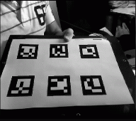
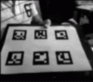

# 2. Realidad Aumentada (2/7)

_24-05-2011_ _Juan Mellado_

Los dos primeros pasos para localizar cuadriláteros candidatos que puedan contener marcadores son: convertir la imagen original a escala de grises, y crear una nueva imagen desenfocada. El primer paso tiene la finalidad de simplificar la cantidad de información a procesar, ya que en realidad los colores no son significativos para el proceso. El segundo paso se realiza con el objetivo de eliminar ruidos, aunque en realidad es sólo una parte de un proceso posterior que se explicará más adelante.

## 2.1. Escala de grises (_Grayscale_)

El proceso de conversión de una imagen en color a otra en escala de grises es bastante conocido, todo un clásico dentro del mundillo del procesamiento de imágenes por ordenador. Consiste en recorrer todos los _pixels_ de la imagen, y para cada _pixel_ de forma individual multiplicar sus componente RGB (rojo, verde y azul), cuyos valores oscilan entre ```0``` y ```255```, por unos coeficientes y sumarlos.



Los componentes RGB originales del _pixel_ se sustituyen por el valor resultante de esa suma. Los tres componentes con el mismo valor, para lograr así el efecto de escala de grises, ya que cuando los tres componentes tienen un mismo valor lo que se obtiene es un tono gris, excepto en los extremos, donde (0, 0, 0) es negro y (255, 255, 255) es blanco.

Los coeficientes que se utilizan normalmente son ```0.299``` para el rojo (R), ```0.587``` para el verde (G), y ```0.114``` para el azul (B). Si se suman los tres coeficientes se observa que el total vale 1 (= 0.299 + 0.587 + 0.114), lo que garantiza que el valor resultante de la suma de los productos por los componentes originales del pixel será un valor comprendido también entre ```0``` y ```255```.

En JavaScript se puede acceder a las imágenes a través del canvas 2D introducido con HTML5. La función ```getImageData``` devuelve un objeto ```ImageData``` que contiene un _array_ que proporciona acceso directo a los _pixels_. Es un _array_ plano que empieza con los componentes RGBA del primer _pixel_ en las posiciones 0, 1, 2 y 3, continúa con los componentes RGBA del segundo _pixel_ en las posiciones 4, 5, 6 y 7, y así sucesivamente. En nuestro caso concreto el componente A (_alpha_), utilizado para las transparencias, puede ignorarse tranquilamente, ya que no tiene sentido considerarlo para las imágenes típicas obtenidas de una webcam.

En la práctica, el proceso de conversión suele adquirir un aspecto similar al siguiente:

```javascript
dst[j] = src[i] * 0.299 + src[i + 1] * 0.587 + src[i + 2] * 0.114;
```

Aunque es muy sencillo, hay un par de cosas a considerar. El primero es que no necesitamos realmente generar una nueva imagen con todos sus componentes RGBA, ya que no es algo que se vaya a mostrar por pantalla, excepto quizás para labores de depuración. Sólo necesitamos un componente de los cuatro, por lo que la cantidad de información a procesar se reduce al 25% de su tamaño original. El segundo punto a considerar es que este proceso hay que realizarlo para cada imagen, y que será más lento cuanto mayor sea la imagen. Una posible solución es utilizar imágenes más pequeñas a las originales proporcionadas por la _webcam_. Otras soluciones a estudiar son tratar de optimizar el cálculo precalculando los productos en una tabla, o incluso ejecutarlo mediante un _shader_ utilizando WebGL. Pero hablar de estas cosas en este punto es cometer un error de "_optimización temprana_".

## 2.2. Desenfoque (_Gaussian Blur_)

Este segundo proceso, el de desenfoque utilizando un filtro _gaussiano_, es otro clásico. Buscando información me encontré una página que me gustó mucho por la gran cantidad de técnicas y efectos que aborda, y lo bien que están expuestos. Con un particular sentido del humor además.

- [http://www.jhlabs.com/ip/blurring.html](http://www.jhlabs.com/ip/blurring.html)

Aplicar un filtro sobre una imagen normalmente consiste en recorrer todos los _pixels_ de la imagen, y para cada _pixel_ de forma individual aplicar una operación que genere un nuevo valor para el _pixel_. En nuestro caso concreto, para conseguir difuminar la imagen de forma coherente, lo que se utiliza como base para calcular el nuevo valor para cada _pixel_ son los _pixels_ más cercanos que tiene a su alrededor. Es decir, si tenemos un _pixel_ negro rodeado de _pixels_ blancos, lo que se quiere obtener es un nuevo _pixel_ gris que difumine la imagen, eliminando ese "ruido" que representa el _pixel_ negro aislado.



El proceso consiste es definir un tamaño de ventana, por ejemplo de 3x3 pixels, a cada celda de esta ventana asignarle un coeficiente numérico, y mover la ventana por encima de cada _pixel_ de la imagen original de forma individual, multiplicando los coeficientes de la ventana por los valores de los _pixels_ que cubre cada una de las celdas.

Lógicamente la gracia de todo esto está en los coeficientes que se utilicen. Para una ventana de 3x3 (= 9 celdas), si se utilizara un valor de ```1/9``` en cada celda se obtendría una nueva imagen donde cada _pixel_ sería la media ponderada de todos sus _pixels_ vecinos inmediatos (incluido el mismo). No obstante, parece lógico pensar que unos mejores coeficientes serían aquellos que dieran más importancia al _pixel_ original, y fueran decrementado la importancia a medida que se fueran alejando de él. Y eso es precisamente lo que persigue el _Gaussian Blur_, lo que consigue usando unos coeficientes que se calculan con la siguiente fórmula:

$ G(x,y) = \cfrac{1}{2 \pi \sigma^2} e^{-\cfrac{x^2 + y^2}{2 \sigma^2}}$

Donde $x$ e $y$ son la distancia al _pixel_ original, y $\sigma$ la desviación típica de la distribución _gaussiana_.

¿Asustado? ¡Bienvenido al club! No obstante, en la práctica resulta que no hay por que preocuparse por entender nada de esto. Como ya comenté en el artículo anterior, estoy siguiendo el código de ArUco para tratar de portarlo a JavaScript, y para obtener los coeficientes de la ventana, que técnicamente recibe el nombre de "_kernel_", se utiliza la función ```getGaussianKernel``` de OpenCV. Mirando en la documentación y el código fuente se ve que en realidad implementa una fórmula un poco distinta a la original, y que además, para ventanas de tamaño 3x3, 5x5 y 7x7 tiene unos valores precalculados.

Como ArUco utiliza una ventana fija de 7x7, entonces siempre utiliza los mismos coeficientes:

```javascript
[0.03125, 0.109375, 0.21875, 0.28125, 0.21875, 0.109375, 0.03125]
```

De igual forma que en el proceso de conversión a escala de grises, se verifica que la suma de los coeficientes es igual a $1$. Y como se observa, los coeficientes centrales tienen mucho más peso que los de los extremos. Y aunque sólo he puesto una fila, en la práctica ha de verse como una matriz de 7x7 con los coeficientes distribuidos de manera uniforme alrededor del elemento central. Pero como se verá inmediatamente, el resto de coeficientes no son importantes.

Implementar el filtro resulta sencillo, pero muy lento, ya que por cada _pixel_ hay que realizar 49 (= 7x7) multiplicaciones. No obstante, el filtro tiene una característica particular. Es un filtro "_separable_", lo que quiere decir que se puede aplicar en un primer paso en horizontal, multiplicando cada pixel sólo por la fila central de la ventana, y al resultado de ese primer paso aplicarle el filtro en vertical, multiplicando cada pixel nuevamente sólo por la fila central. De esta forma se reduce a 14 (= 7x2) multiplicaciones por _pixel_. Lo que de todas formas sigue siendo bastante trabajo para JavaScript dependiendo del tamaño de la imagen que se utilice. Sería interesante en un futuro probar con otro tipo de filtros, e incluso tratar de implementarlo en un _shader_ mediante WebGL.

Por último, comentar que el filtro plantea un problema de implementación en los bordes, donde la ventana abarca _pixels_ que no existen, y que se ha resuelto duplicando los _pixels_ de los bordes para cubrir la ventana. Aunque existen otras estrategias posibles.
