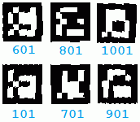

# 7. Realidad Aumentada (7/7)

_29-05-2011_ _Juan Mellado_

El último paso del proceso es tratar de identificar marcadores. Es decir, analizar una a una las imágenes que se han obtenido en el paso anterior, y comprobar si realmente su contenido se corresponde con una matriz reconocible y válida de cuadrados blancos y negros que identifican de forma inequívoca a un marcador.

ArUco utiliza una matriz de cuadrados de dimensiones 7x7 para los marcadores, aunque en realidad sólo utiliza la matriz central de 5x5 para codificarlos, ya que impone que el borde exterior se componga sólo y exclusivamente de cuadrados negros. De igual forma, impone una serie de restricciones sobre las combinaciones válidas de cuadrados por fila mediante el uso de un código Hamming modificado. Lo que básicamente quiere decir que los cuadrados negros se identifican como 0, los cuadrados blancos como 1, y que se tratan como si fueran dígitos binarios (_bits_).

Los _bits_ se numeran de izquierda a derecha, siendo 0 la primera posición. Los _bits_ 1 y 3 se utilizan para almacenar datos, y los _bits_ 0, 2 y 4 para control de errores. Como sólo hay dos _bits_ para datos, entonces sólo hay 4 (= 2^2) combinaciones válidas por fila. Y como hay cinco filas por marcador, entonces hay un máximo de 1024 (= 4^5) marcadores distintos.

Las combinaciones válidas por fila están prefijadas, y son las siguientes:

```javascript
[ [1,0,0,0,0], [1,0,1,1,1], [0,1,0,0,1], [0,1,1,1,0] ]
```

El algoritmo de detección funciona tratando la imagen como si estuviera dividida en una matriz de 7x7, contando el número de _pixels_ con valor 1 en cada una de las celdas de la matriz. Si el número de _pixels_ con valor 1 es mayor que el 50% del tamaño de la celda entonces se considera que la celda representa un _bit_ con valor 1, y con valor 0 en caso contrario.



Una vez obtenida la secuencia de _bits_ que representa cada fila se comprueba si es correcta. Pero debido a que no se conoce la posición que ocupa la cámara con respecto al marcador, en realidad la comprobación se realiza 4 veces, rotando 90 grados cada vez la matriz de _bits_ encontrados. Si la secuencia de _bits_ es correcta entonces se considera que se ha detectado un marcador, por lo que se obtiene su valor identificador a partir de los _bits_ de datos, y se rotan las esquinas del cuadrilátero para que casen con las rotaciones realizadas a la matriz. En la imagen puede verse los marcadores identificados, rotados para mostrar su orientación real, y con su identificador justo debajo de ellos. Se puede comprobar que el primero de ellos, por ejemplo, tiene un valor 601 en decimal, que se corresponde con el valor 1001011001 en binario, obtenido tomando los _bits_ de datos de las posiciones 1 y 3.

ArUco realiza un paso más después de este, que yo de momento he omitido, consistente en comprobar si se ha identificado más de una vez un mismo marcador, y eliminando el de menor perímetro en ese caso. Con esto trata de resolver un problema que presenta la detección inicial de contornos, que retorna contornos exteriores e interiores, lo que puede provocar que un mismo cuadrilátero se detecte dos veces.

¡Y eso es prácticamente todo! Una vez identificados los marcadores sólo resta aplicar un poco de imaginación para "_aumentar la realidad_".
