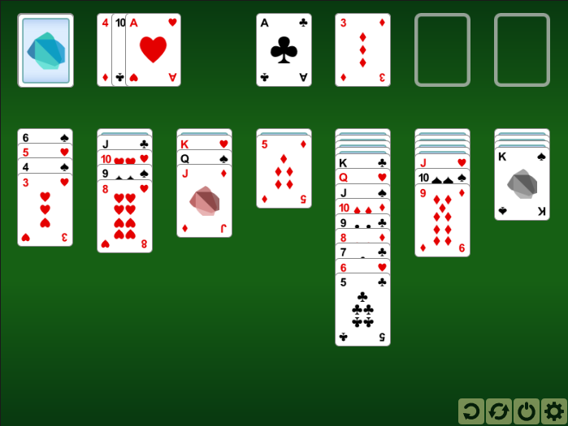

# 3. dart-solitaire

_02-02-2013_ _Juan Mellado_

Ayer liberé los fuentes de dart-solitaire, una versión escrita en Dart del clásico juego de cartas del solitario. No es un juego demasiado complejo, así que lo usé como excusa para empezar un nuevo proyecto y seguir probando este nuevo lenguaje de programación aún en desarrollo. En mi caso además tenía el aliciente añadido de que hace siete años escribí una versión del mismo juego directamente en JavaScript, en un época donde nadie apenas hacía desarrollos en JavaScript, y me venía estupendamente para comparar las formas de desarrollar en uno y otro lenguaje.

- [https://github.com/jcmellado/dart-solitaire](https://github.com/jcmellado/dart-solitaire)

Cuando me planteé volver a escribir este juego, además de implementar la mecánica básica, me propuse añadir algunas opciones que siempre había querido desarrollar, como por ejemplo la opción de "_undo_" para deshacer las jugadas. La manera tradicional de codificar esta opción es utilizando un patrón de diseño llamado "_Command_", y así es como lo he acabado implementando para no andar reinventando la rueda. Es curioso, casi podría decir que empecé el proyecto para implementar este tipo de cosas en vez del juego en si mismo.

El código puedo decir que prácticamente lo he escrito dos veces. La primera vez usé una solución basada en elementos HTML y CSS, donde las cartas por ejemplo eran elementos HTML de tipo DIV. Pero después de tener una versión funcionando empecé a pensar que me gustaría probar una solución basada en el uso de un _canvas_. Y dicho y hecho, empecé a cambiar todo el código que ya tenía escrito hasta conseguir una nueva versión basada en el manejo de _sprites_ esta vez. Es ese tipo de cosas que uno sólo se plantea hacer en proyectos personales, donde no hay restricciones de tiempo, en los del trabajo no suele haber tanta libertad.

Una ventaja añadida de usar un _canvas_ es que me permitía implementar de una forma sencilla el famoso efecto de la versión para Windows, donde al finalizar una partida las cartas salían disparadas una a una rebotando y dejando un rastro de si mismas. Recordaba haberlo visto hace poco en una demo tecnológica llamada _Winning Solitaire_ de Ricardo Cabello, así que estudié el código, muy sencillo, y lo adapté para incorporarlo al juego. Da igual en que lenguaje esté implementado, sigue siendo un buen efecto de fin de partida.

El tener el efecto de las cartas rebotando implementado a menos me compensa de algunas carencias obvias, como no tener una música de fondo, algún efecto sonoro, o incluso alguna que otra animación al manejar las cartas. Suelo trabajar solo en estos proyectos, así que tengo mis limitaciones a la hora de añadir determinadas características "creativas". En algunas de ellas simplemente no me apetece trabajar, y para otras carezco del talento necesario. Al menos puedo sentirme orgulloso de haber podido hacer los gráficos, que aunque sean sencillos me han llevado bastante tiempo.

Aunque el juego utiliza imágenes en formato PNG, las originales son gráficos vectoriales en formato SVG hechos con Inkscape. Inicialmente utilizaba directamente las imágenes en formato SVG, pero me encontré con algunos problemas de incompatibilidad entre los dos o tres navegadores más populares con los que estuve probando, ya que cada cual dibujaba las imágenes según su propio criterio, y lo que es peor, en algunos casos el rendimiento era absolutamente pésimo. He liberado los gráficos vectoriales originales por si alguien puede reutilizarlos para algún desarrollo propio.

He añadido además un par de opciones al juego para poder cambiar el diseño del tablero y del frontal de las cartas. Así como el número de cartas que se sacan del mazo cada vez. Aunque esto último lo dejo hacer incluso en medio de una partida sin reiniciarla, lo que no es del todo correcto. Otras opciones que podrían añadirse serían por ejemplo cambiar el diseño del reverso de las cartas, jugar contra el tiempo, añadir un sistema de puntuación, o un histórico de partidas jugadas.

Los mensajes y cuadros de diálogo están hechos con un poco de CSS, con el que parece que jamás llegaré a sentirme totalmente cómodo. Inicialmente pensé en utilizar _bootstrap_, con el que incluso llegué a hacer unas pruebas que me gustaron mucho, ya que el resultado es muy profesional, y resulta muy fácil añadir animaciones y otros efectos con JavaScript. No obstante, al final quité la dependencia y todo el código, ya que me dió la impresión de que el proyecto acabaría teniendo más CSS y código en JavaScript que en Dart.

Un detalle que me gustaría incorporar en el futuro, ya que ahora mismo no estoy en condiciones de probar como a mi me gustaría, es la gestión de eventos de tipo "_touch_" para que el juego funcione en los móviles con pantalla táctil en vez de sólo con el ratón. El problema es del "_drag and drop_", que los móviles interpretan como un "_gesto_", en vez de como un "_click y arrastrar sin soltar el botón_" de un ratón tradicional.

Respecto a las pruebas, decir que apenas he probado en el PC de casa con las últimas versiones de Chrome (_dev channel_), Firefox (_ga_) e Internet Explorer (_10 rc_). Y como de costumbre, Internet Explorer es el que más lata ha dado, incluso la nueva versión.

Por último, comentar que actualmente prefiero desarrollar en Dart que JavaScript. Me siento más cómodo con el lenguaje, lo encuentro más productivo. Poder trabajar con una sintaxis y estructura de clases e interfaces como la que ofrecen los lenguajes orientados a objetos tradiciones es mucho mejor para mi que trabajar con los prototipos de JavaScript. Para ser un lenguaje que está aún en desarrollo, con muchas cosas que limar, y muchas librerías que desarrollar aún, tiene el plus de ofrecer una "experiencia de codificación" muy gratificante, algo que me resulta difícil de explicar con palabras o cuantificar de una manera más concreta.
