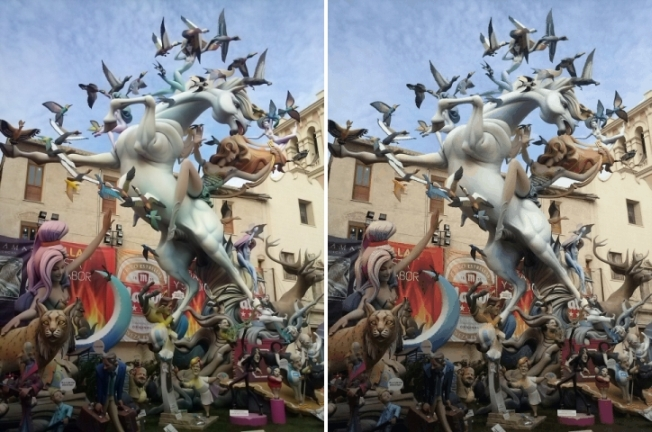

# 5. dart-neuquant

_09-06-2013_ _Juan Mellado_

dart-neuquant es un _port_ a Dart del clásico algoritmo Neuquant de Anthony Dekker (1994), que utiliza una red neuronal para convertir una imagen RGBA de 32 _bits_ a otra equivalente de 8 _bits_. Es decir, que analiza la paleta con los distintos colores presentes en una imagen, que en el caso de 32 bits pueden ser millones, y genera una nueva paleta equivalente a la original, pero de tan sólo 256 colores.

- [https://github.com/jcmellado/dart-neuquant](https://github.com/jcmellado/dart-neuquant)

Aunque a priori pueda parecer que el resultado no debería ser bueno, por la diferencia de colores y tonalidades que se pierden, en realidad es todo lo contrario. Por ejemplo, la imagen de la izquierda tiene 68.289 colores distintos, mientras que la de derecha sólo 256, y sin embargo ambas lucen muy similares.

Naturalmente hay que tener en cuenta que he reunido las dos imágenes en un única en formato JPG, lo que desvirtúa un tanto el resultado real. Aún así, se puede observar como algunas regiones de la imagen de la derecha presentan ciertos problemas de _banding_, es decir, que hay un salto brusco de colores en vez de un degradado suave. Esto se observa más en las regiones curvadas, como en algunas partes del caballo por ejemplo. La forma habitual de arreglar esto es aplicando _dithering_, que consiste en juntar _pixeles_ de distintos colores para que parezca otro color, aunque el autor del algoritmo comenta que esto hace que la medida del error entre la imagen original y la generada crezca.

El algoritmo da más importancia a la componente verde (la G de RGB), ya que el ojo humano es capaz de detectar un rango más amplio de este tipo de tonalidades que del resto. Lo que no es de extrañar ya que es el color que más abunda en la naturaleza. Por lo que el resultado resulta más "agradable" en este sentido.

El proyecto ha ido bastante rápido, ya que el código C original a portar no era muy extenso. La principal dificultad ha estado en que utiliza aritmética entera, con rotaciones en vez multiplicaciones por ejemplo, por lo que he tenido que estar muy atento para que el resultado en cada paso fuera el mismo tanto en Dart como en JavaScript. En la actualidad, casi una década después de cuando se implementó el código original, creo que sería más práctico utilizar aritmética decimal, e incluso puede que más eficiente.

Lo que resulta curioso es que no tenía en mente hacer este proyecto, ha sido un poco de rebote, empecé resolviendo un error en una librería JavaScript que ni siquiera conocía, y he acabado implementando una versión en Dart.
