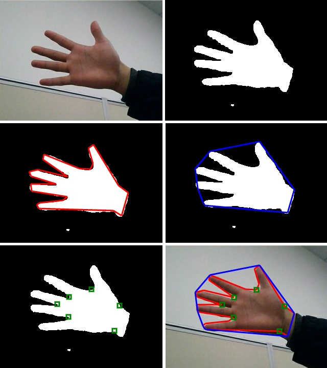

# 4. js-handtracking

_12-05-2012_ _Juan Mellado_

He liberado los fuentes de js-handtracking, una librería escrita en JavaScript que captura la imagen de una _webcam_ y la procesa con el objetivo de detectar la presencia de piel humana, preferentemente una mano, y extraer sus características estructurales más importantes.

- [https://github.com/jcmellado/js-handtracking](https://github.com/jcmellado/js-handtracking)

La librería realiza las siguientes operaciones:

- Detección de las áreas de la imagen que contienen piel
- Extracción de los contornos de las áreas
- Determinación del contorno de mayor área
- Optimización del contorno
- Cálculo de la envolvente convexa del contorno
- Cálculo de los defectos de convexidad

Para probar la demo es necesario utilizar un navegador moderno con soporte para WebRTC, que es la tecnología que permite a JavaScript acceder a la _webcam_ directamente desde el navegador. Por ejemplo, Chrome 18 o superior, con el flag ```--enable-media-stream```.



Para la detección de piel al final he optado por convertir los colores desde RGB hasta HSV y comprobar los valores de los canales H y V para determinar si están dentro del rango de la piel humana:

```javascript
v >= 15 and v <= 250 h >= 3 and h <= 33
```

Las condiciones de iluminación son muy importantes y hacen que los colores sean detectados de forma muy distinta por la _webcam_. He tenido bastantes problemas ajustando los parámetros. Al final eliminando el equilibrado automático de blancos he conseguido una detección bastante estable.

Lo realmente importante es darse cuenta que hace sólo unos pocos meses era impensable pensar en realizar este tipo de aplicaciones sencillas de visión artificial en JavaScript.
