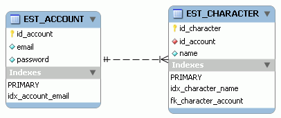

# 2. MMORPG DB: Nomenclatura

_19-04-2008_ _Juan Mellado_

Llega el momento de esbozar las primeras tablas. Pero antes de saltar directamente a explicar detalles del modelo de la imagen, indicar que el diseño ha sido creado utilizando MySQL Workbench, un editor gráfico gratuito de código abierto que desarrolla la propia MySQL. Es el primero que he encontrado, y simplemente lo he escogido porque tiene la típica opción de generar los _scripts_ SQL a partir del modelo diseñado gráficamente.



El diseño inicial es muy simple, apenas un par de tablas con los campos básicos. Aunque tengo que confesar que en realidad no es el primero que hice. El anterior era más grande y soportaba muchas más características. El problema de este tipo de proyectos personales, en los que se trabaja sin presupuesto ni calendario, es que es muy fácil hacer un diseño monstruosamente grande sólo por el placer de ver si se es capaz de meter en él todo un sin fin de _features_. Al final decidí quitar todo los añadidos superfluos y dejar lo mínimo imprescindible para resaltar un hecho: las miles de pequeñas decisiones que se tienen que tomar cada vez que se realiza un diseño.

Me imagino que más de uno que esté viendo el modelo estará bastante decepcionado con él, ¿tanta palabrería para esto?. Pero aunque parezca un diseño ridículo, que lo es, en realidad hay muchos pequeños detalles que hay que tener en cuenta.

- **Prefijo (1)**: Tengo la costumbre de poner las iniciales del proyecto al que pertenecen todas las tablas de una base de datos, y resulta que hasta ahora he estado hablando todo el rato de un diseño de MMORPG, con temática, pero sin nombre. Para salir del paso he decidido llamarle "Estirpes" (_codename_), de ahí el prefijo ```EST``` que se observa en los nombres. En lo sucesivo, si hablo de la tabla ```ACCOUNT``` se sobreentenderá que me refiero a ```EST_ACCOUNT```, a menos que indique expresamente lo contrario.

- **Prefijo (2)**: Para el resto de objetos de la base de datos que no sean tablas utilizaré un prefijo que indique su naturaleza. Por ejemplo, en el diseño se puede ver que he utilizado ```IDX``` para los índices, y ```FK``` para las _foreign keys_. Aunque en algunos casos la nomenclatura de los objetos vendrá determinado por las características propias de cada gestor, MySQL por ejemplo obliga a llamar ```PRIMARY``` a la clave primaria de cada tabla.

Puede parecer que añadir prefijos no tiene mucha utilidad, y es más, puede parecer que es un incordio tener que escribirlos cada vez, pero en la práctica pueden ser de bastante utilidad en función de cómo se diseñe la capa de abstracción para el acceso a base de datos. Si se separan correctamente las capas, haciendo que los nombres de los objetos en base de datos sean independientes de los nombres con los que se referencian realmente en el _software_, entonces se pueden tener hasta varias versiones de una misma tabla en una misma instancia de base de datos. Por ejemplo, las versiones ```EST_1_2_07``` y ```EST_1_2_09```. Aunque en algunos RDBMS esto mismo se puede conseguir con una buena gestión de permisos, la creación de sinónimos, o una combinación de ambos.

- **Inglés**: He decidido poner los nombres en inglés. Esto es más una decisión personal que otra cosa. Da igual que una tabla se llame "cuenta" o "account". El problema es que después de pasarme un montón de años trabajando en proyectos con una plantilla de desarrolladores de varios países, algunos de los cuales no hablaban español, utilizar el inglés para este tipo de cosas me parece de lo más natural.

- **Singular**: El nombre de todas la tablas y columnas irá en singular. Añadir ```s``` o ```es``` al final de un nombre no aporta nada. Además, a veces ocurre que el plural de las palabras en inglés obliga a cambiar la forma en que se escriben. Por ejemplo, "_query_" se convierte en "_queries_". Esta regla no es siempre conocida por todo el mundo, y al final no es extraño encontrar "_querys_", o "_queryes_", lo que dificulta un poco la compresión.

- **Prefijo (3)**: Para las columnas que denoten identificadores (IDs) utilizaré el prefijo ```id``` seguido de un nombre significativo. Para el resto de tipos de columnas no utilizaré ningún prefijo en particular, aunque es probable que a las fechas les añada el sufijo ```date```.

Curiosamente, la nomenclatura de los campos, aunque pueda parecer algo de lo más sencillo de decidir, tiene un montón de variantes que cada cual adopta como si de su propia religión se tratara. ¿O pensabais que eso sólo se daba con los lenguajes de programación? Hay una corriente por ejemplo que dice que los nombres de los campos tienen que tener el menor número de letras posible, por el hecho de que se van a estar utilizando constantemente. Por ejemplo, en vez de ```id_character```, se sugiere ```idc```. A mi me parece que para modelos muy pequeños puede ser una opción, pero para modelos medios y grandes no resulta práctico. De igual forma hay quienes se empeñan en poner una abreviatura del tipo de los campos como prefijos en los nombres de las columnas. A mi eso me recuerda a la "notación húngara", una forma de nomenclatura que con el paso del tiempo ha demostrado no ser muy acertada, al arrastrar detalles de implementación a las interfaces.

- **Foreign keys**: Para las _foreign keys_ utilizaré una convención bastante común, y que consiste en utilizar el mismo nombre para las columnas en la tabla origen y la destino.

- **Campos de Auditoria**: Los campos de auditoria son columnas que se añaden a las tablas para dejar constancia a nivel de registro de cuando se produjo la última modificación del mismo. Nombres típicos de estas columnas son ```create_date```, ```last_update_date```, ```create_user```, ```create_program```, etc. Para este diseño voy a prescindir de ellas para no cargar en exceso el modelo.
