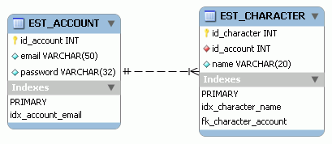

# 3. MMORPG DB: Tipos

_25-04-2008_ _Juan Mellado_

En el esquema que puse en el artículo anterior se echaba en falta los tipos de cada columna. Esta omisión fue intencionada. Decidir el tipo, tamaño, y opciones que ha de tener cada columna es otra de las cuestiones para las que, una vez más, hay que tomar muchos pequeños detalles en consideración.



Para los IDs que conforman la clave primaria de cada tabla, un tipo numérico entero sin signo auto-incremental es la elección que resulta más natural. Y si se quiere portabilidad entre varias base de datos lo mejor es ceñirse a los tipos que define el estándar SQL. Para este diseño en concreto tomaré ```INTEGER```, que es soportado tanto por MySQL como PostgreSQL.

Ambos gestores requieren 4 _bytes_ de almacenamiento para las columnas definidas con este tipo, ofreciendo un rango de valores que va desde -2147483648 hasta 2147483647. MySQL utiliza ```INT``` como sinónimo de ```INTEGER```, y permite además definir la columna como ```UNSIGNED```, características no soportadas por PostgreSQL.

Definir la columna como auto-incremental es un poco más problemático en la medida que cada gestor implementa esta característica de una forma distinta. A mi me resulta de lo más natural utilizar objetos de tipo secuencia (```SEQUENCE```), ya que trabajo habitualmente con Oracle, pero desgraciadamente este tipo de objetos no es soportado por MySQL. En MySQL se debe utilizar el atributo ```AUTO_INCREMENT```, mientras que en PostgreSQL hay que utilizar ```SERIAL```, que a la postre deriva en la creación automática de una secuencia asociada a la columna. Para acabar de complicar aún más el asunto, MySQL también soporta ```SERIAL```, pero como sinónimo de ```BIGINT UNSIGNED NOT NULL AUTO_INCREMENT UNIQUE```, lo que en PostgreSQL es equivalente a ```BIGSERIAL```. ¿Quién dijo "estándares"?

La única forma de salvar todos estos obstáculos parece ser tener que mantener dos _scripts_ separados, definiendo las ```PRIMARY KEY``` en MySQL como ```INT UNSIGNED NOT NULL AUTO_INCREMENT```, y como ```SERIAL``` en PostgreSQL. Otra opción sería implementar un método propio para la generación de claves primarias, algo que normalmente no se aconseja hacer en la medida que implica duplicar funcionalidad ya ofrecida por el gestor de base de datos.

Para el resto de columnas de tipo numérico que sea necesario ir añadiendo a partir de aquí habrá que ir viendo una a una cual es la mejor opción, aunque por lo general con ```INTEGER```, y tal vez ```SMALLINT``` (2 _bytes_ y rango de -32768 a 32767), sea suficiente. No acabo de imaginar en este momento un atributo para el que se necesite una precisión mayor, o el uso de valores en coma flotante dentro del contexto en el que estoy trabajando.

Por su parte, para los campos alfanuméricos, voy a utilizar el tipo estándar ```VARCHAR``` que es soportado tanto por MySQL como PostgreSQL.

Al usar este tipo se debe indicar la longitud máxima permitida para la cadena, produciéndose un error si se supera dicho tamaño en una inserción o actualización, y con la peculiaridad de que los posible espacios en blanco existentes al final de las cadenas son automáticamente eliminados por el gestor. En MySQL el tamaño de una columna con este tipo depende del tamaño máximo permitido para las filas (65.536 _bytes_ normalmente) y del juego de caracteres utilizado, teniendo un sobrecoste de 1 _byte_ si la cadena no requiere más de 255 _bytes_, y de 2 _bytes_ en caso contrario. En PostgreSQL el tamaño de la columna depende del tamaño de la cadena, teniendo un sobrecoste de 1 _byte_ para cadenas de hasta _126_ bytes y de 4 _bytes_ en caso contrario.

La longitud de una columna de tipo texto debe darse en función de su objetivo. Por ejemplo, para almacenar los nombres de los personajes (columna ```NAME``` de la tabla ```CHARACTER```) se puede poner un tamaño arbitrario que sepamos que cubra un gran rango de posibilidades, 20 caracteres por ejemplo. Ahora bien, hay que tener en cuenta que el espacio real que necesite la columna puede ser distinto de la longitud de la cadena almacenada, sobre todo en función del juego de caracteres que se utilice: ASCII, UNICODE, UTF-8, etc. El soporte para i18n ("internacionalización") merece un artículo entero para él solo.

Columnas como ```EMAIL``` y ```PASSWORD``` en la tabla ```ACCOUNT```, a pesar de que uso sea obvio, requieren también pensárselo un poco. Por ejemplo, la longitud máxima permitida para una cuenta de correo según el estándar (RFC 2822 y RFC 2821) es de 320 caracteres, algo que casi nunca se tiene en cuenta, ya que no resultaría práctico para ningún usuario tener que recordar una cuenta con un nombre de ese tamaño. De igual forma que no se tiene en cuenta que la parte local de una dirección de correo (lo que viene antes de la arroba) debería tratarse de forma estricta en función de sus minúsculas y mayúsculas, algo que casi ningún servidor de correo ha llegado a implementar nunca jamás. Por su parte, para el campo ```PASSWORD```, he utilizado una longitud de 32 caracteres pensando que la clave de los usuarios se almacenará en la forma de un _hash_ calculado utilizando algún tipo de mecanismo de encriptación.

Para el resto de columnas de tipo alfanumérico que sea necesario ir añadiendo a partir de aquí habrá que ir viendo una a una cual es la mejor opción. Para columnas que sólo precisen almacenar un carácter bastará con un ```CHAR(1)```. Y en caso de necesitar almacenar una enorme cantidad de texto, tal vez una solución sea utilizar el tipo ```TEXT```, que es soportado tanto por MySQL como PostgreSQL, a pesar de no ser estándar.

Para finalizar, indicar que sobre los campos ```EMAIL``` y ```NAME``` hay definidos índices únicos, para que el propio gestor impida físicamente que puedan existir dos registros con una misma cuenta de correo, o con un mismo nombre de personaje.
