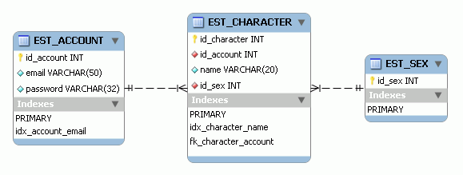

# 4. MMORPG DB: Sexo

_02-05-2008_ _Juan Mellado_

Este artículo podría llevar perfectamente por título "Listas de valores, y otras alternativas", pero creo que el que le he puesto es más divertido. Incluso habrá hecho que alguno lea hasta aquí.

Es algo bastante común que a la hora de crear un personaje se pueda elegir el género del mismo, pudiendo seleccionar normalmente entre femenino y masculino. Una elección sencilla. Sin embargo, para almacenar ese valor en una base de datos existen muchas posibles alternativas que merecen la pena ser estudiadas.

En un diseño relacional tradicional, siguiendo el libro al pie de la letra, crearíamos una tabla de géneros y una relación (_foreign key_) con la tabla de personajes. Esta elección, que parece de lo más natural, en realidad pocas veces es la escogida. Aunque este es uno de los pilares básicos sobre los que se apoyan las base de datos relacionales, la normalización, raramente acaba de asimilarse para conceptos tan sencillos como el "género", en el que sólo se permite elegir entre dos valores posibles prefijados de antemano.



Una alternativa bastante común a la creación de una nueva tabla es utilizar una columna de tipo texto, en la propia tabla de personajes en este caso, que almacene un carácter para distinguir géneros. En castellano podría ser ```H``` y ```M```, aunque más de uno podría distinguir la ```H``` como inicial de "hembra" (algo políticamente incorrecto, al parecer). De igual forma que una persona de habla inglesa podría asumir que la ```M``` es una abreviatura de "male" (masculino), sobre todo recordando el hecho de que se están utilizando nombres en inglés para las tablas y columnas. Pero esta elección no sólo plantea el problema de elegir que letras utilizar, sino que obliga a que la decisión que se tome esté bien documentada. Por que, ¿qué ocurre cuando la tabla está vacía?, ¿sabría alguien ajeno al proceso de diseño decir qué valores debería contener esa columna? No.

Para evitar las confusiones que plantea la solución anterior, puede escogerse un enfoque algo distinto basándose en el hecho que sólo hay dos posibles valores donde elegir, tomándose el tipo de la columna como ```Boolean```. De esta forma, una columna de nombre ```IS_MALE``` eliminaría toda ambigüedad. Desgraciadamente ```Boolean``` no es un tipo estándar, y no debería utilizarse aunque se encuentre soportado. A modo de anécdota, comentar que a veces se toma un camino intermedio entre esta solución y la anterior, definiendo una columna ```IS_MALE``` de tipo texto que puede tomar el valor ```T``` o ```F```, o sea, "_true_" o "_false_". El mismo perro con distinto collar.

Algunos gestores de base de datos permiten definir reglas de validación (_check constraints_) sobre los valores que puede contener una columna concreta, de forma que sólo pueda almacenarse en ella valores que se encuentren dentro de un rango dado. De esta forma, cualquier intento de insertar o actualizar un registro con un valor fuera de dicho rango hace que el gestor retorne un error. Esto presenta la ventaja además de que el modelo queda auto-documentado, al formar parte la propia validación de la definición de la tabla. El inconveniente es que no todos los gestores soportan este tipo de validaciones. Algunos, como MySQL, simplemente las parsean correctamente, pero no fuerzan su cumplimiento, y sugieren métodos alternativos como tipos "enumerados" (_enums_).

Otro tema que se plantea a la hora de utilizar una solución u otra es la ocupación, el tamaño de almacenamiento requerido para la columna, ya sea en memoria o disco. Si se utiliza una tabla propia con una _foreign key_ entonces hay que sumar 4 _bytes_ por personaje. Para un juego con cien cuentas registradas, con 4 personajes por cuenta, no debería suponer mayor problema con los estándares de almacenamiento actuales. E incluso para un millón de cuentas la cifra sigue siendo ridícula, sobre todo porque nunca se instanciarán todos los jugadores a un mismo tiempo en un mismo servidor. No obstante, si se detecta que la ocupación es un factor crítico, entonces se puede disminuir a 1 _byte_ por registro utilizando la solución de la columna de texto. E incluso más, se puede reducir a 1 _bit_ por registro almacenando el género del personaje en una columna cuyo contenido se trate como un colección de _flags_, en donde cada _bit_, o conjunto de ellos, tenga un significado concreto.

A mi particularmente me parece que empezar diseñando un modelo relacional con _flags_ es un claro ejemplo de "optimización temprana". Hay mucha gente que tiene una especie de fijación en la cantidad de _bits_ desaprovechados a priori. Está bien pensar en ello, conocer al enemigo, pero siempre con una perspectiva del contexto y del dominio. Si las pruebas de volumen aconsejan optimizar la ocupación de la información, entonces se deberían plantear otra clase de alternativas, como por ejemplo tener dos tipos distintos para las claves primarias. Un tipo estándar de 4 _bytes_ para las tablas con un gran número de registros, y otro tipo con menos requerimientos de ocupación, incluso de 1 _byte_, para las tablas con un número pequeño de registros. Lo que no se puede hacer de entrada es renunciar a diseñar un modelo normalizado.

La idea de crear una tabla para contener sólo dos registros estáticos es algo que parece molestar a mucha gente. Pero lo que hay que ver es las posibilidades que ofrece, sobre todo porque los requerimientos siempre cambian. Por ejemplo, puede decidirse que las características intrínsecas de cada personaje, como su fuerza inicial, vengan determinadas por su género, lo que se solventaría añadiendo atributos a la nueva tabla de una forma bastante natural. O puede decidirse que algunos tipos de clases (razas) tengan otro género (hermafrodita), o carecer completamente de él (asexuado), lo que se solventaría simplemente incluyendo nuevos registros en la tabla.

Aún así, hay bastantes expertos que recomiendan juntar todas las tablas con escasos registros y atributos comunes en una única tabla a modo de "listas de valores", con un ID, un tipo, y una descripción, aunque representen conceptos distintos. El problema surge en el momento que es necesario añadir un atributo específico para un concepto concreto, momento en que se rompe el esquema, y es necesario crear una tabla nueva para esa lista concreta que necesita dicho atributo y cambiar todas las referencias que pudieran existir. Tarea que normalmente es bastante tediosa de realizar cuando el sistema se encuentra ya en producción, y que puede llegar a suponer tener que realizar una parada del mismo.
