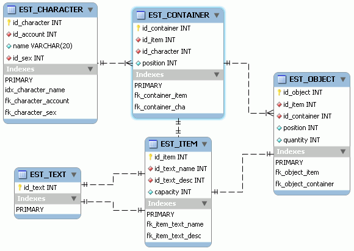

# 8. MMORPG DB: Contenedores

_05-07-2008_ _Juan Mellado_

Bolsillos, bolsos, bolsas, mochilas, maletas, sacos, sacas, alforjas, faltriqueras, baúles, arcones, etc, casi cualquier cosa le sirve al intrépido aventurero a la hora de acarrear los preciados objetos obtenidos como fruto de sus correrías.

Los contenedores son un tipo especial de objetos que tienen la particularidad de poder almacenar otros objetos dentro de sí. Con ellos es como se gestiona normalmente el inventario de un personaje. Técnicamente pueden describirse mediante una jerarquía todo-parte, donde el todo (contenedor) se trata también como una parte (objeto). Hay un bonito patrón de diseño llamado _Composite_ (GOF) que cubre perfectamente este tipo de estructuras. El ejemplo más clásico de este patrón es del un sistema de ficheros (_filesystem_), que permite almacenar ficheros (_files_) que pueden ser archivos (_archives_) o directorios (_directories_), siendo un directorio un contenedor de ficheros.

Por razones técnicas, y de conveniencia, lo normal es limitar el número de objetos que un personaje puede llevar consigo a un mismo tiempo. Lo más habitual es simplemente asignar a cada contenedor el número máximo de objetos que puede acarrear, aunque el tema queda abierto siempre a otro tipo de soluciones, como por ejemplo la de asignar un peso a cada objeto y limitar el peso total que puede llevarse. Incluso se puede limitar el número máximo de contenedores que pueden llevarse a un mismo tiempo, o no dejar almacenar un contenedor dentro de otro si tiene objetos dentro. Otro tipo de restricciones a este respecto es limitar el tipo de objetos que puede almacenar un contenedor concreto, como los limitados sólo al transporte de munición, por ejemplo, un carcaj en el que sólo puede incluirse flechas. E incluso es posible impedir que se lleven al mismo tiempo objetos incompatibles, como en el famoso problema del lobo, la oveja y la col, donde no puede dejarse al lobo con la oveja ni a la oveja con la col.

Otro aspecto interesante de los contenedores es el de poder almacenar varios objetos de un mismo tipo juntos, de forma que realmente ocupen sólo un único hueco dentro del contenedor. Un ejemplo típico de esto son los consumibles que se almacenan agrupados por lotes en vez de individualmente. Por ejemplo, en vez de tener dos botellas de agua individuales en el inventario es preferible tener una única botella con dos consumiciones. De esta forma, cuando se adquiere un nueva botella se añade una nueva consumición a la botella ya existente en vez de añadir una botella nueva. Obviamente esta disposición de las cosas hace necesario introducir una nueva limitación, la del número máximo de objetos de un determinado tipo que pueden agruparse juntos en un único hueco dentro de un contenedor. O dicho de otra forma, el número máximo de "consumiciones" que puede tener un determinado tipo de objetos.

La gestión del inventario en si misma puede ampliarse todo lo que se quiera, o sea necesario. Por ejemplo, se puede permitir añadir contenedores extras a las monturas o mascotas de los personajes, aunque ahí sería necesario tener en cuenta que ocurre cuando estas mueren. O se puede permitir tener contenedores compartidos con otros personajes, ya sea dentro de algún tipo de mecanismo de bandas, o quizás durante la realización de una instancia (mazmorra), a modo de "fondo común". Y hablando de "fondos", ¿qué mejor sitio para guardar objetos que los populares bancos?

Para la realización del modelo en base de datos de este tipo especial de objetos hay como siempre un montón de alternativas. La adopción de una u otra solución dependerá enteramente del diseño concreto que se quiera implementar. Para mis propósitos voy a considerar que un jugador puede llevar varios contenedores a un mismo tiempo (bolsos, alforjas, etc), que cada contenedor sólo puede llevar un número máximo de objetos a un mismo tiempo, y que no se puede incluir un contenedor con objetos dentro de otro. Cada contenedor ocupará un lugar dentro del inventario, y cada objeto una posición dentro de un contenedor, pudiéndose agrupar varios objetos de un mismo tipo en una misma posición (consumiciones).



En la imagen puede verse que he optado por una tabla aparte para los contenedores. En un principio iba a utilizar la propia tabla de objetos instanciados, con una _foreign key_ sobre ella misma, pero al final he implementado la especialización con dos tablas separadas para distinguir más fácilmente cuales son los contenedores. Cada contenedor es una instancia de un _item_ concreto del juego y pertenece a un único jugador. La columna de posición indica el lugar que ocupa el contenedor dentro del inventario del jugador, aunque esto es realidad un problema más de diseño de la interface de usuario que del modelo físico, lo he puesto como ejemplo de atributo de contenedor.

Por su parte los objetos son también instancias de un _item_ concreto, y se encuentran siempre dentro de un único contenedor, ocupando un hueco determinado dentro del mismo, aunque esto nuevamente es más de diseño de interface de usuario. La columna de cantidad indica el número de "consumiciones" actuales disponibles por objeto. Notar que de esta forma, para saber a que personaje pertenece la instancia de un objeto, hay que seguir la _foreign key_ hacia la tabla de contenedores y de ahí acceder a la de personajes para ver el detalle del mismo, aunque a priori creo que esta no es una consulta que deba realizarse normalmente. Lo que si será interesante es obtener los contenedores de un personaje, o los objetos de un contenedor, por lo que será necesario añadir los índices adecuados sobre las columnas ```id_character``` e ```id_container``` de cada una de las tablas pertinentes.

La tabla de _items_ contendría todas las clases de objetos instanciables en el mundo virtual. A modo de ejemplo he puesto las columnas con las referencias a la tabla de textos para nombre y descripción. El atributo de capacidad es ambivalente, y debería interpretarse dentro del contexto. Para los contenedores indicaría el número de objetos máximos que pueden contener, mientras que para el resto de objetos sería el número máximo de "consumiciones" acumulables. Evidentemente faltaría una columna en la tabla que indicara de que tipo concreto es cada objeto, pero la he obviado a propósito dejando ese tema para un artículo posterior.
