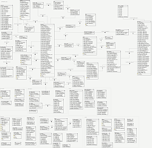

# 15. PlaneShift (1/10)

_04-10-2008_ _Juan Mellado_

PlaneShift es un MMORPG de fantasía con ambientación medieval que enfatiza la inmersión de los jugadores en el papel (rol) que adoptan sus personajes. Se puede crear una cuenta, descargar el cliente, conectar a un servidor, crear un personaje, y empezar a jugar de forma totalmente gratuita. No obstante, el juego tiene fama de ser un tanto oscuro al principio, y de no resultar quizás el más adecuado para los jugadores que se acercan por primera vez a este tipo de programas.

Lo interesante es que su código fuente y _assets_ son públicos, aunque tiene una licencia mixta que protege y limita el uso de su _artwork_. Junto a los ficheros con el código fuente se adjuntan también los _scripts_ de creación del modelo de la base de datos para MySQL. Una buena oportunidad para comparar todas las ideas que he ido desarrollando de forma teórica en esta serie de artículos con un ejemplo de un juego real que se encuentra totalmente operativo. Mi propósito es dedicar una serie de artículos a este modelo analizando algunos detalles del mismo. En este primer artículo voy a centrarme en la nomenclatura, los tipos, y el esquema de forma general.



El modelo de datos de este juego tiene del orden de un centenar de tablas, un número que es un buen indicador del grado de normalización del modelo. A ojo de buen cubero, un centenar de tablas es lo que uno puede esperar en un juego de estas características. No creo que exista ninguna fórmula mágica que permita calcular el número de tablas que deba tener una aplicación, pero una vez identificadas las entidades principales (cuentas, personajes, misiones, etc) se puede hacer una estimación orientativa.

Los nombres de las tablas por lo general los encuentro bastante descriptivos. Tablas con nombres como ```accounts```, ```characters```, o ```quests```, no dejan mucho margen a la duda. Aunque no me gusta que estén en plural, es algo que siempre he pensado que no aporta nada. De igual forma echo en falta quizás un prefijo del proyecto en los nombres, pero nuevamente no deja de ser una convención de nomenclatura para la que cada proyecto ha de adoptar la suya propia. Nada que criticar en realidad. Lo que no me ha parecido correcto en absoluto ha sido la forma en que se ha nombrado las columnas que identifican las claves primarias de las tablas. Todas se llaman ```id```, a secas, sin más. Soy de la opinión de que un nombre como ```id_account```, ```id_character```, o ```id_quest```, es más significativo, sobre todo a la hora de crear _foreign keys_. Es preferible que el nombre de una columna que hace referencia a una misma información se expanda de manera uniforme por las distintas tablas de un modelo, en vez de llamarse de forma distinta en cada tabla. De hecho, en el modelo se puede ver el uso de nombres como ```account_id```, ```character_id```, y ```quest_id``` en las tablas de relación para hacer referencia a las columnas ```id``` de las tablas principales. De igual forma, yo prefiero utilizar ```id``` como prefijo en los nombres en vez de como sufijo, para reconocerlas más rápidamente. Pero para gustos, ...

Lo realmente importante es que la nomenclatura es coherente en prácticamente todo el modelo. Eso es un punto muy importante a su favor. Quizás haya alguna ventaja significativa en nombrar todas las claves primarias con el lacónico nombre de ```id```, pero esa ventaja posiblemente esté oculta debajo de unos cuantos miles de líneas de código.

Por su parte, los tipos utilizados para definir las columnas no deparan muchas sorpresa, excepto en un caso concreto. Parece que hay un criterio a la hora de definir los tipos de las claves primarias, pero desgraciadamente no se cumple siempre. En líneas generales parece que se utiliza un numérico entero auto-incremental de tamaño 10, pero para algunas tablas se utiliza tamaño 8 u 11. Se podría pensar que es para ahorrar espacio, pero en realidad no es así. El gestor de base de datos siempre reserva 4 _bytes_ para el tipo ```INTEGER```, independientemente del tamaño que se indique en la definición de la columna. Además, un tamaño de 11 no tiene sentido, en 4 bytes no caben cantidades de 11 dígitos. De igual forma, en algunos casos se echa en falta el calificador no estándar ```UNSIGNED```, pero esto es discutible. Lo que no tiene discusión es que algunas relaciones confunden un poco, ya que las tablas maestras tienen una clave primaria de un tipo, y las columnas que hacen referencia a ellas son de otro. Otro tipo numérico utilizado para la clave primaria de las tablas es ```TINYINT``` de tamaño 3. Algo bastante útil para tablas que a priori no van a contener un gran volumen de registros, ya que sólo requieren la reserva de 1 _byte_ por parte del gestor. Desgraciadamente no es estándar.

Un tipo numérico que se utiliza y ha llamado mi atención es ```FLOAT```. No esperaba que se utilizasen valores decimales. La conversión entre los tipos de esta clase de una base de datos y los que utilizan los lenguajes de programación a veces suelen dar problemas, sobre todo de cara a una posible migración. Tampoco veo justificado su uso para muchas de las columnas en las que se ha utilizado, un tipo entero debería haber bastado para la mayoría de los casos, pero tampoco se puede decir que esté mal. Es esa clase de decisiones de diseño que se toman en un momento dado y que a la larga pueden llegar a tener tantas ventajas como inconvenientes.

Otros tipos que se utilizan en el modelo son los de carácter alfanumérico y binario. ```VARCHAR``` de tamaño variable para las columnas de nombres principalmente, ```TEXT``` para las descripciones o textos más extensos, y ```BLOB``` para el almacenamiento de información de mayor tamaño. Ninguna sorpresa en este punto. Como tampoco en los tipos de las columnas que almacenan fechas. Todas son ```DATETIME```, excepto algunas columnas que utilizan ```TIMESTAMP```. La principal diferencia es que el primero permite un rango bastante amplio que abarca desde el año 1000 hasta el 9999, y el segundo un rango más pequeño que abarca desde 1970 hasta 2038. Este último tipo almacena las fechas en un ```long```, y es bastante común en muchas librerías consideradas como estándar en bastantes lenguajes de programación [y por ende en muchas aplicaciones programadas utilizando dichos lenguajes de programación, y que se espera que den mucho trabajo cuando se aproxime el año 2038, de igual forma que ocurrió con el efecto 2000].

Saltando a otro punto del análisis, comentar que el modelo utiliza las posibilidades del gestor de base de datos para garantizar la coherencia del mismo, como por ejemplo el uso de índices únicos para los nombres de las regiones, misiones y bandas. Una curiosidad de este juego es que los personajes tienen nombre y apellido, e incluso familia, existiendo un índice no único por cada una de las columnas correspondientes. El resto de índices parecen estar creados para optimizar consultas de uso frecuente, como por ejemplo la de obtener los _ítems_ de un personaje concreto. Los nombres de los índices en si mismos siguen un mismo patrón, pero en algunos casos se han utilizado abreviaturas para los nombres de las tablas, y en otros casos se han puesto completos. Esto último tiene su importancia si se prevé migrar el modelo en un futuro, ya que el tamaño máximo permitido para los nombres de los objetos varía de un gestor a otro de base de datos. En cualquier caso, el nombre de los índices no se suele considerar algo crítico, ya que no se hace referencia a ellos normalmente. La única excepción a esta regla se da en el uso de "tips" embebidos dentro de las sentencias SQL, para forzar que una consulta se realice utilizando un índice concreto por ejemplo.

Lo que no hay son _foreign keys_ definidas, aunque estas se infieren de forma natural del modelo. Posiblemente no existan porque el motor original de MySQL no las soportaba. O quizás por cierta inexplicable leyenda negra que arrastra este tipo de validaciones. Muchos proyectos deciden que son un lastre prescindible, garantizando la integridad mediante código propio, en vez de delegar en el gestor que ya lo tiene implementado. Personalmente pienso que la mejora de rendimiento resultante de prescindir de este tipo de validaciones es cuestionable y depende de cada caso concreto.

Por último, señalar que en los _scripts_ de construcción de la base de datos no hay criterios a la hora de especificar características físicas de las tablas. Para algunas se indica un _engine_ concreto a utilizar, como ```ENGINE=MyISAM``` o ```ENGINE=InnoDB```, e incluso un juego de caracteres, como ```DEFAULT CHARSET=latin1;```, pero otras no tienen ningún tipo de indicación, delegando en los valores por defecto del gestor. Si bien es cierto que todos estos parámetros pueden modificarse de forma dinámica, no estaría mal que todos los objetos se crearan con unos valores concretos, para dar una idea del volumen y utilización que se supone deberá soportar cada una.

A modo de resumen, comentar que el modelo responde a lo que podía esperarse. Parece bastante coherente y hecho con criterio. El problema de las cosas bien hechas es que a veces resulta difícil apreciar el trabajo que hay detrás, sobre todo cuando tienen una apariencia de sencillez. En cualquier caso, para facilitar la lectura y análisis, sobre todo por alguien ajeno al desarrollo del día a día del proyecto, al ser el código público, sería conveniente agregarle un poco más de "meta-información" en forma de comentarios en cada tabla y cada columna.
