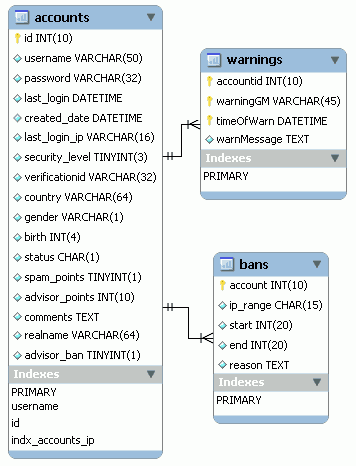

# 16. PlaneShift (2/10)

_10-10-2008_ _Juan Mellado_

Después de haber examinado el aspecto general del modelo de base de datos de PlaneShift, ahora toca centrarse en grupos de tablas concretas. Para empezar voy a fijarme en la tabla de cuentas de usuario, ya que normalmente consta de columnas cuya finalidad es bastante fácil de intuir. El análisis del resto de tablas puede ser más interesante, ya que almacenan aspectos concretos del juego, pero también menos intuitivo, ya que requiere un conocimiento mayor de su funcionamiento interno.



La tabla de cuentas almacena exactamente lo que se puede esperar de este tipo de tablas, ninguna sorpresa ahí. Por ser la primera que analizo voy a entretenerme de forma excepcional en el detalle de columna a columna, para el resto sólo comentaré los aspectos que más llamen mi atención.

- ```id```: La clave primaria de la tabla. El típico identificador numérico carente de cualquier tipo de significado funcional. Es curioso que en el _script_ de creación de la tabla, aparte de la definición de la clave primaria, exista además una definición de un índice único sobre esta columna. Por definición una clave primaria es ya de por sí un índice único, así que no le encuentro mucho sentido a esa segunda declaración. Casi me arriesgaría a decir que es un error, pero no sé si está hecho así a propósito por algún motivo técnico referido al funcionamiento de MySQL.

- ```username```: El nombre (_nickname_) con el que se identifica el propietario de la cuenta. Este el nombre con el que se identifican los usuarios para conectarse al juego, no su nombre real. Tiene un tamaño de 50, bastante amplio. Y llama la atención que tenga la cadena de texto ```0``` como valor por defecto, lo que carece totalmente de sentido. Lo que si tiene sentido es el índice único declarado sobre la columna para evitar nombres duplicados y optimizar las búsquedas.

- ```password```: El _password_ de acceso a la cuenta. En esta columna se almacena la clave codificada en formato MD5 (o similar). Es una solución bastante común. El tamaño 32 del ```VARCHAR``` siempre es un buen indicador de que se está utilizando este método. Al igual que con la columna anterior, tiene ```0``` como valor por defecto, lo que nuevamente vuelve a carecer de sentido. Otro pequeño detalle a tener en cuenta es el nombre de la columna, nombres muy genéricos como ```password```, ```country```, o ```status```, se desaconsejan, ya que pueden dar problemas con algunos gestores de cara a una posible migración al ser palabras reservadas, aparte de que son más difíciles de localizar con una simple búsqueda de texto.

- ```last_login```: Fecha y hora en la que el usuario se conectó por última vez a la cuenta. Es la típica información auxiliar que se nos muestra al conectarnos a un sistema para que podamos comprobar de forma indirecta que nadie más que nosotros accede a nuestra cuenta. Tiene una cláusula que fuerza a valor ```NULL``` por defecto, pero ese es el valor que tienen las columnas sin valor predefinido, así que se podría eliminar sin mayor problema.

- ```created_date```: Fecha y hora de creación de la cuenta. Como la anterior, y como prácticamente todas las demás columnas de esta tabla, tiene un valor ```NULL``` por defecto en el _script_ de creación. Ya no lo comentaré más, pero es importante saber que esas cláusulas existen.

- ```last_login_ip```: Última dirección IP desde la que se conectó el usuario a la cuenta. Es un ```VARCHAR``` de 16 caracteres. Este tamaño permite introducir direcciones en formato ```www.xxx.yyy.zzz```, e incluso le sobra un carácter. Como creo que ya apunté en un artículo anterior, este tamaño no es suficiente para soportar IPv6, aunque posiblemente el cambio de protocolo implique cambios más importantes en el software que la simple ampliación del tamaño de una columna de una tabla en base de datos.

- ```security_level```: Nivel de seguridad de la cuenta. El valor de esta columna debe controlar el acceso a ciertas opciones del juego o paneles de administración. Tiene valor cero por defecto, lo que me hace presuponer que corresponde al nivel más bajo, el que tendrán las cuentas correspondientes a jugadores ordinarios. Dentro del propio _script_ de creación de la tabla se insertan unos registros de ejemplo, en ellos puede verse que los GM (_Game Master_) tienen un nivel entorno al 20, los desarrolladores entorno al 30, y un usuario especial llamado "SuperClient" un nivel de 99, que debe ser el máximo permitido.

- ```verificationid```: Cadena de validación _online_. Este valor debe ser una clave autogenerada y almacenada en formato MD5 (o similar) de igual forma que la _password_ de la cuenta. La principal diferencia es que normalmente se genera cada cierto tiempo mientras el usuario está conectado, para validar que un cliente es quien dice ser durante todo el tiempo que dure una conexión. O tal vez se use para recuperar contraseñas. O cualquier otro tipo de verificación.

- ```country```: País del usuario de la cuenta. El primer dato de carácter personal que aparece en la cuenta. Los estaba echando en falta, ya que hasta ahora ni siquiera había aparecido la dirección de correo electrónico del usuario. En los registros de ejemplo que se insertan, se observa que los valores que se introducen corresponden a abreviaturas como "US" (United States), aunque el tamaño del campo es de 64. Existen listados oficiales de organizaciones, como la ISO, que publican códigos estandarizados para cada país, y que resulta conveniente utilizar.

- ```gender```: Género del usuario de la cuenta. La típica columna definida de forma ambigua. Tiene el valor ```N``` por defecto, lo que parece indicar que es un dato opcional y que no se ha introducido. En los registros de ejemplo se introduce siempre el valor ```M```, supuestamente para indicar "Male" (Hombre). Y por lógica, el tercer valor posible debería ser "F" para "Female" (Mujer).

- ```birth```: Año de nacimiento del usuario de la cuenta. Posiblemente almacenado para verificar que el usuario es mayor de edad. Es decir, se guarda lo que el usuario introdujo en el momento de crear la cuenta, para utilizarlo contra posibles reclamaciones posteriores.

- ```status```: Estado de la cuenta. Un ```CHAR``` de tamaño 1. Guiándome por los valores de ejemplo, supongo que indicará si la cuenta está activa o no. En todos los casos se introduce un valor ```A```, supuestamente para indicar "Active" (Activa). Puede que cualquier otro valor indique que la cuenta está desactivada, pero puede ocurrir también que el juego utilice más códigos para indicar estados tales como "suspendida temporalmente". Es en este tipo de casos cuando comentarios aclaratorios en las propias columnas, o el uso de una tabla auxiliar con una lista de valores, ayuda bastante a que el modelo sea auto-explicativo.

- ```spam_points```: Puntos de _spam_ recibidos por la cuenta. No había tenido en cuenta esto nunca hasta ahora, y la verdad es que, desgraciadamente, es bastante necesario. Un ```TINYINT``` de tamaño 1 con cero como valor por defecto. Útil para evitar que los jugadores abusen de los canales de _chats_. El tamaño de la columna es lo suficientemente pequeño como para suponer que a los creadores del juego les debe parecer una práctica bastante grave.

- ```advisor_points```: Puntos de advertencia recibidos por la cuenta. Similar a la anterior columna, pero más general, no sólo para el _spam_. Un ```INTEGER``` de tamaño 10 con cero como valor por defecto. Aquí deben irse acumulando los "toques" que reciban los jugadores por algún tipo de comportamiento contrario a las normas de conducta.

Al llegar a este punto me di cuenta de que echaba en falta una tabla complementaria para almacenar el histórico de advertencias recibidas, con la fecha y motivo por el que se produjo cada una de ellas. Revisando los _scripts_ ví que esa tabla existía (```warnings```), y que el problema era que la imagen con el schema que puede descargarse del CVS de PlaneShift no está actualizada. Cuidado con eso.

- ```comments```: Comentarios sobre la cuenta. Información de carácter general. Es un campo de comentario de tipo ```TEXT``` sin ninguna restricción aparente.

- ```realname```: Nombre real del usuario propietario de la cuenta. Por el orden en que aparece dentro de la tabla, casi al final, parece un añadido de última hora. Otras de las pocas columnas que almacena información de carácter personal.

- ```advisor_ban```: Exclusiones de advertencia. Número de veces que una cuenta ha sido excluida (desactivada) por recibir advertencias de comportamiento indebido.

Las otras dos tablas que he puesto en la imagen son las de advertencias (```warnings```), a la que antes hacía referencia, y la de exclusiones (```bans```). Lo único que llama la atención de la primera tabla es la clave compuesta y el cambio de nomenclatura, ya que prescinde de los guiones bajos para los nombres de las columnas. En la segunda tabla también se aprecia una violación de la nomenclatura, el uso de valores por defecto sin sentido aparente, y sobre todo la relación 1:1 (uno a uno) con la tabla de cuentas.
