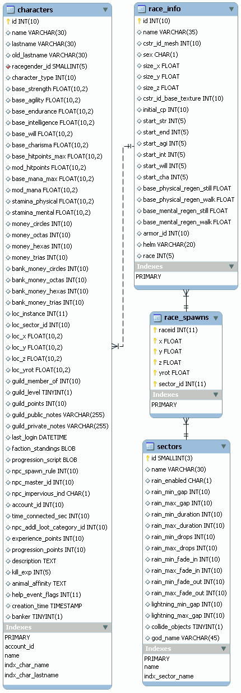

# 17. PlaneShift (3/10)

_17-10-2008_ _Juan Mellado_

Hoy me he estado fijando en las tablas de base de datos donde se almacenan los personajes en PlaneShift. Es fácil de localizar, ya que es con diferencia una de la que más columnas tiene de todo el modelo, junto con la de _ítems_. Creo que la imagen de este artículo habla por si sola. Ese número tan elevado nos dice bastante acerca de las decisiones básicas de su diseño, al preferir añadir atributos en la tabla principal en vez de crear tablas auxiliares más genéricas. Esto tiene bastante lógica, ya que cuando se está haciendo un juego con un diseño cerrado, donde los personajes han de tener características muy concretas, como agilidad, fuerza, etc, lo normal es añadir una columna en la tabla de personajes para cada una de esas características.



La tabla de personajes (```characters```) responde bastante a lo que uno puede esperar de este tipo de tablas. Lo más intuitivo, y que primero se busca, es la columnas de texto donde se almacena el nombre del personaje. De tamaño 30, por cierto. Bastante más abajo, pero no por ello menos importante, está el ID para enlazar con la tabla de cuentas. Esta columna tiene definido un índice sobre ella, algo bastante lógico, ya que una consulta básica en este tipo de juegos es la de obtener los personajes que pertenecen a una cuenta concreta. Otro enlace lógico existente en la tabla es el que relaciona el personaje con la raza a la pertenece. Lo curioso de las razas en este juego es que llevan implícitas el género. Junto a la raza existe un indicador de tipo de personaje. Al no existir una tabla de tipos de personajes es difícil saber los distintos valores que puede contener, pero a grandes rasgos se puede intuir que sirve para distinguir entre los personajes normales manejados directamente por los jugadores, de otras entidades como las mascotas, e incluso los NPCs, aunque para estos últimos parecen existir además tablas propias.

Los atributos básicos de los personajes están definidos en un conjunto amplio de columnas donde se almacenan aspectos tales como la fuerza, agilidad, resistencia, inteligencia, voluntad, carisma, y una serie de cosas más. Llama la atención que el tipo de estas columnas sea un numérico con dos decimales. Como ya he comentado otras veces, y es una opinión totalmente personal, me hubiera limitado a un numérico de tipo entero. Se me escapa un poco la necesidad de tener esa precisión extra a la hora de almacenar.

El dinero que lleva encima un personaje se encuentra repartido en cuatro columnas, una por cada tipo de moneda virtual que circula en el juego. Adicionalmente existen otras cuatro columnas para el dinero que el personaje tiene en el banco. Un detalle que merece la pena comentar es que, si el factor de conversión de un tipo de moneda a otro fuera constante, entonces bastaría con una única columna para almacenar la riqueza del personaje. El ejemplo más conocido es el oro, plata, y cobre de World Of Warcraft. Cien cobres es una plata, y cien platas es un oro. Con este sencillo ratio de conversión, decir que un personaje tiene 120857 puntos de "riqueza" es equivalente a decir que tiene 12 oros, 8 platas y 57 cobres. La ventaja de esta solución es que se pueden tratar de una forma homogénea todas las cantidades, representándolas internamente en cobres, independientemente de la forma en que se le muestren al jugador.

La posición en la que se encuentra el personaje dentro del mundo virtual se almacena en seis columnas. Me ha resultado interesante detenerme en ellas, pues es un tema en el que si bien había pensado antes, no había escrito nunca nada sobre ello. La primera columna identifica la instancia concreta en la que se encuentra un personaje. Personalmente creo todo debería tratarse como instancias, incluso el mundo principal, de forma que todos los personajes estuvieran siempre dentro de una instancia concreta, evitando de esa forma tener que tratar con excepciones. La siguiente columna identifica el sector dentro de la instancia. El sector es la zona geográfica, y existe una tabla (```sectors```) con las distintas zonas del juego que incluye, además de su nombre (sin soporte para varios idiomas), detalles sobre la meteorología del lugar. Las otras cuatro columnas almacenan las coordenadas concretas en las que se encuentra el personaje y la dirección en la que se encuentra mirando, expresada esta última como un ángulo de giro con respecto a un eje predeterminado.

La banda (_guild_) a la que pertenece el personaje está almacenada como una columna que hace referencia a la tabla de bandas. Otra información relacionada con este tema incluye el nivel (cargo) del personaje dentro de la banda, una puntuación relacionada con su autoridad dentro de la misma, y dos campos de texto para las descripciones a mostrar en los perfiles público y privado.

A partir de aquí el significado de algunos campos de la tabla de personajes se difumina un poco. Los más evidentes son los de las fecha de creación, último acceso y tiempo conectado. Después hay otros relacionados con los sistemas de puntuación para determinar el nivel del personaje, como los puntos de experiencia por ejemplo. Algunos otros parecen relacionados con NPCs, y algunos más llaman la atención por ser de tipo ```TEXT``` o ```BLOB```. Estos últimos son interesantes desde un punto de vista técnico, ya que, mirando los registros de ejemplo que vienen junto con los _scripts_ de creación de las tablas, se observa que se utilizan para guardar información en forma de texto para un procesado posterior por código. Por ejemplo, unos de los registros guarda en una de estas columnas la siguiente cadena:

```xml
<category attribute="Lifecycle" name="Daylight" value="10" />
<category attribute="Type" name="Animal" value="5" />
```

El almacenamiento de información utilizando este tipo de lenguaje de marcado permite añadir cualquier tipo de atributo a una entidad, a costa naturalmente de una pérdida de normalización del modelo. Algunos gestores de base de datos actuales permiten definir y operar con columnas de tipo XML, pero el rendimiento y utilidad de ese tipo de motores en esta clase de juegos es cuestionable.

Muy relacionada con la tabla de personajes está la tabla de definición de razas (```race_info```). Tiene un nombre poco afortunado, ya que los sufijos del tipo ```info``` no aportan ningún valor añadido. Dentro de esta tabla, la columna más fácilmente reconocible, como siempre, es la que almacena el nombre de la raza. También se puede identificar un carácter identificador del género, con el mismo funcionamiento que el existente en la tabla de cuentas. A continuación se pueden ver otras columnas con los valores iniciales predeterminados para la creación de personajes para cada raza. Es decir, los puntos iniciales de fuerza, agilidad, resistencia, etc, que se copian al registro del personaje cuando se crea. Otros detalles de cada raza, como la velocidad de regeneración de los distintos atributos por ejemplo, también se encuentran en esta tabla y son fácilmente reconocibles. El resto de columnas resultan muy interesantes en la medida que son las primeras que aparecen con el objetivo de relacionar las entidades de base de datos con los assets del juego, aunque a poco que se mire el modelo, es sencillo identificar tablas con información similar. Hay una primera referencia a lo que parece ser la malla (_mesh_) del modelo gráfico que define la apariencia física por defecto de la raza, una segunda para lo que sería la textura básica, y otra más para lo que parece ser la armadura por defecto. También hay tres tamaños base, uno para cada dimensión, que permitiría que dos razas utilizasen una misma malla, aunque cada una de ellas se visualizara con un tamaño distinto. Las dos últimas columnas de la tabla me despistan un poco, en particular la última, especulando un poco me arriesgaría a decir que su propósito es el de permitir crear razas derivadas de otras.

La última tabla que he analizado hoy es la que almacena las coordenadas concretas del mundo virtual en las que se aparecen los personajes de una raza concreta (```race_spawns```). Es muy sencilla, para cada raza se almacena el sector, la posición, y la dirección, en la que se generan los personajes. La clave primaria de la tabla es compuesta, la componen todas las columnas de la tabla, por lo que permite almacenar varios puntos de generación distintos para una misma raza. Aunque no sé si la elección de un punto u otro se hace de forma aleatoria o siguiendo algún tipo de algoritmo. Para averiguar ese tipo de cosas hay que bucear un poco en el código fuente, no se puede saber examinando sólo el modelo de datos, ya que no existe ningún comentario al respecto en la tabla.
