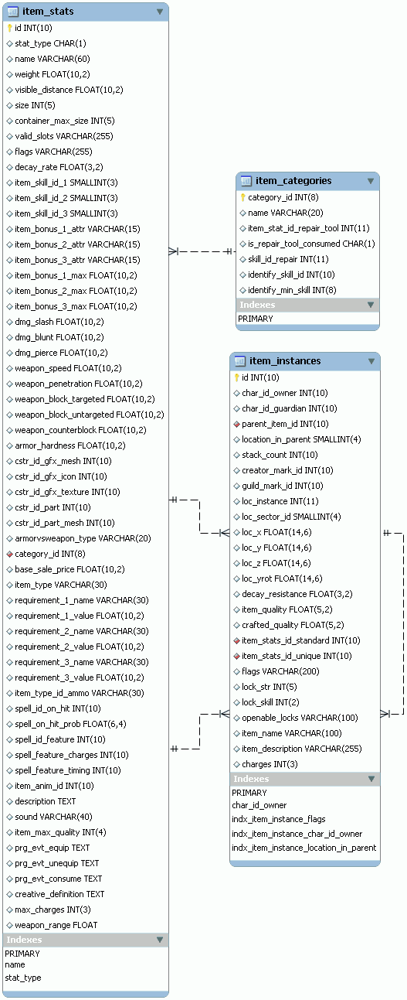

# 18. PlaneShift (4/10)

_25-10-2008_ _Juan Mellado_

La siguiente tabla que me ha llamado la atención dentro del modelo de base de datos de PlaneShift es la de objetos. Junto con la de personajes, es sin duda una de la que más columnas tiene. Aunque en realidad, más que de una tabla, hay que hablar de dos. Por una parte la que contiene la definición de cada tipo de objeto, y por otra parte la que contiene las instancias concretas de dichos objetos en el mundo virtual.



Una curiosidad de este modelo reside en el hecho de que la tabla de instancias (```item_instances```) tiene dos _foreign keys_ con la tabla de definición de objetos (```item_stats```). Una para las características estándar, y otra para las características individuales propias. Esta solución permite reaprovechar la tabla de objetos, pero en la práctica debería complicar un poco las consultas, ya que habría que ir distinguiendo cuando un registro corresponde a la definición de un objeto "normal", y cuando corresponde a la definición de un objeto concreto en particular.

La tabla principal, además de las habituales columnas para ID, nombre y descripción, tiene dos columnas para el "tipo" de los objetos. La primera es un ```CHAR``` de tamaño 1, y en todos los registros de ejemplo se almacena una ```B```. Un valor que creo se interpreta como "Bulk". La traducción literal sería "mole", y vendría a significar que representa un objeto físico, tangible. La segunda es un ```VARCHAR``` de tamaño 30, y en los registros de ejemplo se pueden ver palabras tales como ```SWORD``` (espada) o ```HAMMER``` (maza). Echo en falta una tabla con los posibles valores que podrían tener estos campos, pero esto quizás se deba a que haya que interpretarlo más como "_flags_" que como referencias a una entidad. De hecho, hay otra columna que si es un ID de entidad y hace referencia a la tabla de categorías de objetos ("item_categories"). En esta tabla pueden verse los tipos de objetos que se manejan en el juego, como armas, armaduras, comida, muebles, distintos tipos de herramientas (minería, cocina, etc), gemas, y así hasta 25 tipos distintos, incluyendo una categoría un tanto especial para distinguir los objetos utilizados para cumplir misiones.

Otras columnas de la tabla incluyen atributos como el precio, peso, tamaño, y distancia desde el que es visible el objeto. Pero las más interesantes desde mi punto de vista son algunas otras como ```valid_slots``` y ```flags```. Son de tipo ```VARCHAR``` de tamaño 255, y contienen cadenas de texto con valores separados por espacios o comas. En los registros de ejemplo se pueden ver cadenas tales como "```LEFTHAND RIGHTHAND```", o "```STACKABLE CONSUMABLE```". La primera es claramente para indicar que el objeto puede usarse con la mano izquierda o la derecha, y la segunda que el objeto es un consumible del que puede acumularse varias "consumiciones". Es decir, que las características de cada objeto se guardan en forma de texto que luego es interpretado por el código. Esta es una solución interesante, ya que permite añadir características nuevas sin cambiar el modelo. La contrapartida es que se pierde algo de normalización del mismo. Este tipo de información se podría haber almacenado creando una columna para cada tipo de atributo, indicando si aplica o no, pero hubiera quedado una tabla mucho más grande de lo que ya lo es actualmente. Y evidentemente el siguiente paso hubiera sido llevar estos atributos a otra tabla, con un registro por cada atributo de cada objeto, pero a costa posiblemente de mayores requerimientos de almacenamiento, y posiblemente peores tiempos de acceso. Otra forma de almacenar estos valores sería mediante una mezcla de las dos soluciones anteriores, con una tabla nueva con una columna por cada atributo, que sólo contuviera un registro por cada combinación válida de atributos, y que cada objeto apuntara al registro correspondiente a través de su ID.

Merece la pena detenerse un momento más en la solución del apartado anterior, basada en almacenar cadenas de texto con los atributos. Realizar un procesamiento del texto por código debería ser bastante sencillo y poco costoso desde un punto de vista computacional. Aunque eso de estar buscando unas cadenas dentro del contenido de las columnas se me antoja un poco extraño a priori. Lo importante es recordar que este modelo corresponde a un juego que es completamente operativo, por lo que es una solución totalmente válida. Pero ya puestos, yo no habría permitido que se utilizasen espacios o comas para separar los valores. Hubiera utilizado uno u otro, no ambos. Parece lógico pensar que estos valores se introducirán a través de herramientas propias para la creación de objetos del juego, así que esa flexibilidad no tiene sentido. Parece una tontería, pero a veces esos pequeños detalles son los que marcan la diferencia. Recuerdo un libro de optimización que ponía como ejemplo un servidor _web_ que tenía que procesar peticiones HTTP, y la mejora de rendimiento que podía obtenerse si el protocolo se hubiera definido para que los comandos se expresasen siempre en mayúsculas o minúsculas sólo, en vez de permitir combinaciones arbitrarias de ambas. De igual forma, pensar en que los valores tengan que ser palabras entendibles es discutible. "```LEFTHAND RIGHTHAND```" puede almacenarse perfectamente como "```LH RH```". Esto quitaría legibilidad a un observador humano, pero hay que recordar nuevamente que lo normal será usar herramientas a medida para la gestión de los objetos del juego. Aunque quizás esa nomenclatura sea de ayuda en las fases tempranas del desarrollo, cuando aún no se disponga de dichas herramientas. Pero aun hay más, ya que si se utilizan abreviaturas de dos letras fijas, entonces los separadores no tienen sentido, sólo habría que ir extrayendo cadenas de dos en dos caracteres, como de "```LHRH```" por ejemplo. La última vuelta de tuerca al respecto sería considerar el número total de atributos que se tiene, y almacenar cada uno de ellos en un _bit_ distinto dentro de un valor numérico. De esta forma en un simple campo de tipo ```INT``` (4 _bytes_) se podría almacenar hasta 32 atributos distintos.

Volviendo al análisis de las columnas de la tabla principal, se observan claramente varios grupos de columnas relacionados entre sí. Por ejemplo, el grupo ```item_skill``` parece hacer referencia a las habilidades concretas que son necesarias para el uso de un objeto. Lo que llama la atención es que sean tres columnas fijas, lo que limita las posibilidades, y obliga a usar un valor concreto, el ```-1``` en este caso, para indicar que alguna columna realmente no aplica. Otro tanto ocurre con los grupos ```item_bonus```, que parecen hacer referencia a las bonificaciones que aporta el uso del objeto. Hay dos grupos, uno para indicar el nombre de la habilidad bonificada, y otro para indicar el valor de la bonificación. En los registros de ejemplo se ve que se utilizan cadenas de texto tales como "```AGI```" y "```STR```" para identificar habilidades tales como agilidad (Agility) y fuerza (Strength). Después siguen una serie de columnas que sólo aplican a objetos que sean armas, armaduras o hechizos, con el detalle su durabilidad, velocidad, penetración y bloqueo, por citar sólo algunos.

La relación entre los objetos y el _artwork_ del juego se encuentra en el grupo de columnas ```cstr```. En ellas se hace referencia al icono, malla, y textura de cada objeto. Aunque también entrarían dentro de este apartado las columnas que hacen referencia a una secuencia de animación, un sonido, o los nombres de los eventos predefinidos que se deben lanzar cuando un personaje se lo equipe, quite o consuma. Estos tres últimos se almacenan como cadenas de texto, y en los ejemplos se pueden ver algunos ejemplos tales "```drink_speed_potion```" (beber poción de celeridad) o "```equip_ring_strength```" (equipar anillo de fuerza).

Para terminar, comentar rápidamente que la finalidad de las columnas de la tabla ```item_instances``` es fácilmente reconocible en la mayoría de los casos. Tiene dos referencias a la tabla de personajes, una para identificar al propietario, y otra para identificar a su guardián, en el caso de tenerlo, claro. También existe otra referencia a un posible objeto padre, supongo que para la gestión de contenedores (bolsas), junto con la posición concreta en que se encuentra dentro del mismo, y el número de consumiciones disponibles. Un par de referencias más parecen identificar al creador del objeto, y la banda a la que pertenece, para el caso de objetos compartidos. Después siguen otra serie de columnas con el detalle de la posición del objeto dentro del mundo, con referencias a la instancia, sector, posición, y dirección concreta en la que mira. Las siguientes columnas contienen información propia del funcionamiento del juego, como el valor de la "calidad" de los objetos, el número de "cargas" disponible, si se encuentran bloqueados con llaves, y el nivel de destreza que es necesario tener para poder abrirlos. También existe una columna con _flags_ que guarda cadenas como "```NOPICKUP NPCOWNED```". Y curiosamente, casi al final de la tabla, existen columnas para el nombre y descripción que no parecen estar usándose.

En el modelo existe otra tabla relacionada, de nombre ```armor_vs_weapon``` (arma contra armadura), cuyo uso resulta imposible de descifrar fijándonos sólo en el nombre de sus columnas (```1a```, ```1b```, ```1c```, ...).
