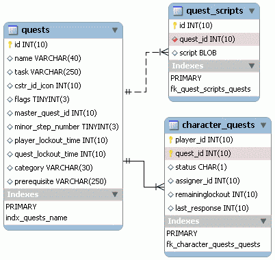

# 19. PlaneShift (5/10)

_08-11-2008_ _Juan Mellado_

Otro pilar importante sobre el que se fundamentan los MMORPGS hoy en día son las misiones. En el caso concreto de PlaneShift llama la atención que en su base de datos estas se guarden como _scripts_ escritos en un lenguaje propio en columnas de tipo ```BLOB```, en vez de haber optado por crear las relaciones correspondientes entre las tablas del modelo, tarea posiblemente más compleja.



La tabla principal de misiones (```quests```) destaca por su simpleza. Además del ID para la clave primaria, cada registro tiene el nombre de la misión, una descripción breve del objetivo de la misma, una referencia al icono con la que se representa en el cliente, un campo de _flags_, el ID del personaje que otorga la misión, una columna sobre el número de pasos a dar y que no acabo de entender del todo, un par de contadores de tiempo, el grado de dificultad, y los pre-requisitos. El contenido de esta última columna es importante, ya que dentro de la misma se almacena un texto en formato similar a XML que permite especificar cualquier tipo de requerimiento. Por ejemplo, para indicar que el personaje debe tener una habilidad de entre 10 y 20 puntos en el manejo de la espada se almacena la siguiente cadena:

```xml
<pre><skill name="Sword" min="10" max="20"/></pre>
```

Y si se quiere indicar que el personaje ha de tener completada una misión concreta entonces se almacena un texto como el siguiente:

```xml
<pre><completed quest="Male Enki Gold"/></pre>
```

Esta solución da un margen bastante amplio para la incorporación de cualquier tipo de pre-requisito que se quiera diseñar, aunque evidentemente impide cualquier tipo de normalización sobre el modelo, pasando a considerarse la base de datos como un simple almacén de información. Es bastante discutible lo acertado de esta implementación, que si bien es tremendamente flexible, genera muchas dudas al apoyarse en referencias basadas en nombres, como "```Sword```" o "```Male Enki Gold```", en vez de IDs desprovistos de cualquier tipo de interpretación o significado funcional.

Asociada a la tabla de misiones está la tabla con los _scripts_ de cada misión (```quest_scripts```). Llama la atención que estén en una tabla separada, en vez de formar parte de la tabla principal, ya que un _script_ sólo puede pertenecer a una misión. Pero por una vez, y sin que sirva de precedente, hay un comentario en la columna que indica que en la tabla también se almacenan _scripts_ no relacionados con misiones, en cuyo caso se establece ```-1``` para el ID de misión. Estos scripts que no son de misiones son lo que se conocen como "KA Scripts" (KnowledgeArea Scripts), de uso general por los NPCs del mundo.

Los _scripts_ que describen las misiones están escritos en forma de árbol, de manera que siguen una secuencia de pregunta/respuesta intercalados por acciones concretas resultantes de la rama seguida, como la entrega o recepción de objetos o dinero. En el siguiente _script_ se puede ver un ejemplo completo de una misión consistente en encontrar a la hija de un NPC que anda tonteando con el herrero. El objetivo del jugador es comprobar si sus intenciones son buenas o no.

```text
P: Greetings

MaleEnki: Hail! Would you like to earn a little money?

P: No P: Yes

M: Well ok then. Have a good day.

M: My daughter Alina ran off with the smith and I fear they are up to no good. If you can find out if he really loves her, I’ll pay you. Can you do this for me?

P: No P: Yes

M: Fair enough. I guess I’ll just try to find someone else.

M: Last time I caught them upstairs above the blacksmith shop. Please hurry up and ask her!

Assign Quest.

P: Greetings

Smith: Go away! We’re busy.{her:Alina}

P: * P: Do you love Alina

S: You are so rude! Go away!

Run script(3) kick_you

S: Of course I love her! We are going to marry in the morning.

P: Greetings

MaleEnki: Oh I’m so glad you are back. Did you find him? Does he love her?{him:Smith,her:Alina}

P: * P: Smith says Smith does. Smith love Alina.

M: That isn’t what Thalia told me 5 minutes ago. You’re just faking to get the money! Go away!

M: Ah! Thank heavens. Perhaps now they will get married! Thanks for your help!

Give 25 tria.
```

Para los que no hayan jugado nunca a este juego, de cara a una mejor compresión de este _script_, comentar que la interacción con los NPCs implica normalmente escribir la pregunta o respuesta correcta. Aunque tampoco se trata de acertar al 100% cada frase, como en las antiguas aventuras, ya que el programa maneja un diccionario de sinónimos y es bastante aceptable por lo general.

Este tipo de _scripts_ lineales es bastante fácil de componer, dando la oportunidad a cualquier persona de crear contenido para el juego con un simple editor de texto. El personaje tiene dos opciones por cada pregunta de un NPC, y en función de su decisión se ejecuta una acción u otra del _script_. Lo único que debe estar bien documentado son las acciones disponibles (```Assign Quest```, ```Run script```, ```Give```, etc) y las variables que pueden utilizarse, como ```$playername```, que puede verse en otro de los _scripts_ que vienen de ejemplo con la base de datos.

La última tabla del modelo de hoy es la que relaciona a los personajes con las misiones (```character_quests```). Destaca la clave primaria compuesta por el ID de personaje y el ID de misión, que evita que un mismo personaje pueda repetir más de una vez una misma misión. El resto de columnas incluyen el estado el que se encuentra la misión, el NPC que le otorgó la misión al personaje, lo que parece ser otro contador de tiempo, y una última columna cuya traducción literal sería "última respuesta", pero cuyo tipo es un INT(10), y que por tanto no debería poder almacenar el último texto que introdujo el jugador. Echo en falta varias columnas para guardar alguna que otra cosa, como las fechas en que se aceptó la misión, y cuando se completó, por ejemplo.
