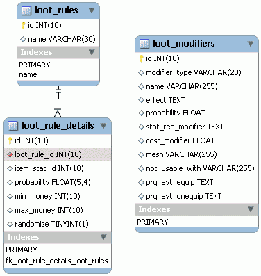

# 21. PlaneShift (7/10)

_06-12-2008_ _Juan Mellado_

Después de matar una criatura en un mundo virtual, lo normal es despojarla (_loot_) de todo lo que lleva. La recompensa que se obtiene en cada caso suele ser distinta en función de la criatura en cuestión. En el modelo de datos de PlaneShift hay una serie de tablas que definen las reglas mediante las cuales se calcula el dinero y los objetos que puede llegar a obtener el personaje. Y escribo "puede" porque las recompensas no suelen ser fijas, normalmente están sujetas a unos porcentajes de probabilidad.



La tabla principal con las reglas apenas tiene un ID y un nombre. Este último supongo que a modo de referencia para no perderse entre tanta regla. Incluso tiene definido un índice único sobre él. Lo importante del asunto es que la tabla de creación de NPCs apunta a esta tabla, de forma que cada uno de ellos tiene asociado una regla de _loot_. A su vez cada regla de _loot_ puede tener varias reglas de detalle, de forma que un mismo NPC puede soltar (_drop_) varios objetos distintos.

Toda la chicha del asunto está en la tabla de detalle, en ella se encuentra una referencia a un objeto, un porcentaje de probabilidad de aparición de dicho objeto, una cantidad mínima y máxima de dinero, y una última columna que parece indicar la aplicación o no de un factor de aleatoriedad. El tipo de la columna de la probabilidad es un ```FLOAT``` con un entero y cuatro decimales, lo que parece indicar que se almacena como un tanto por uno con un número elevado de decimales con el fin de ajustar al máximo la probabilidad de los objetos de mayor rareza. El hecho de que aparezcan columnas con referencia a objetos y dinero a la vez en esta misma tabla es un poco curioso. Supongo que estará implementado así para evitar tener la información separada en tablas distintas, una para los objetos y otra para el dinero. El problema es que a veces sólo tendrá sentido la columna que hace referencia al objeto, otras veces las que hacen referencia al dinero, y otras tendrán sentido ambas. Las referencias nulas tendrán que obviarse, y las cantidades de dinero resultante de cada registro de detalle sumarse.

La tercera tabla en juego es bastante peculiar, he de confensar que no me la esperaba, tiene un enfoque que no había considerado nunca. La idea es que almacena "modificadores" a aplicar sobre los objetos devueltos como recompensa. Estos modificadores actúan sobre los atributos básicos de los objetos, mejorándolos o empeorándolos según sea el caso de forma aleatoria. De esta forma no hace falta tener creado un objeto de cada tipo en la base de datos, sino que se tiene un único objeto base, y lo que se instancia para su entrega al personaje es un objeto modificado según los criterios que dictamina esta tabla. Mejor verlo con ejemplos. En la columna ```name``` se almacenan los nombres de los modificadores, tales como "```Platinum```", "```Steel```", "```of Strength```", u "```of Purity```". En la columna ```modifier_type``` se almacena el tipo de modificador, como "```_prefix_```", o "```suffix```", para indicar que la modificación quedará reflejada al principio o final del nombre del objeto respectivamente. Y de esta forma una espada básica (_Sword_) puede transformarse en una espada de acero (_Steel Sword_) utilizando un prefijo, o en una espada de pureza (_Sword of Purity_) utilizando un sufijo. En la columna ```effect``` se almacenan los efectos resultantes del modificador, como por ejemplo un incremento del daño causado del 30%:

```xml
<ModiferEffect operation=»mul» name=»item.damage» value=»1.30″ />
```

El resto de columnas de la tabla incluyen un factor de probabilidad (en tanto por cien al parecer esta vez), los valores de atributos requeridos para utilizar el objeto, un coste del modificador (que no sé a que se refiere), y cuatro columnas más con una referencia a la malla gráfica a mostrar, incompatibilidades con otros objetos, y los eventos que deben desencadenarse cuando el personaje se equipe o quite el objeto.
