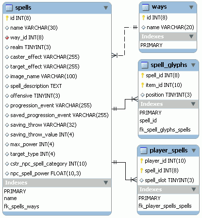

# 22. PlaneShift (8/10)

_13-12-2008_ _Juan Mellado_

Los personajes de PlaneShift pueden lanzar distintos hechizos, conjuros, efectos, y toda esa clase de magias que uno espera encontrar en este tipo de juegos. El modelo de datos es bastante sencillo, y a grandes rasgos, consta de una tabla de definición de los hechizos disponibles, asociada a sus tipos y demás, junto con una tabla que los relaciona con los personajes. La verdadera dificultad de esta parte siempre he pensado que deberá estar en el proceso de cálculo en tiempo real del resultado de todos esos efectos lanzados por varios personajes y NPCs a un mismo tiempo.



La tabla maestra de hechizos almacena el detalle de cada uno de ellos. Como de costumbre, el nombre de las columnas permite identificar el uso que se le da a cada una de ellas, aunque para alguna se requiere tener un mayor conocimiento del funcionamiento del juego. Además del habitual ID para la clave primaria, el nombre del hechizo ("```Summon Missile```", "```Defensive Wind```", etc), y su descripción ("```A wooden arrow is summoned and thrown at the target dealing 6*P damages.```") destaca una relación a la tabla de escuelas de magia (```ways```). Para entender la intención de esta columna hay que saber que en PlaneShift existen varios tipos de estas escuelas, llamadas "_Crystal_", "_Azure_", "_Red_", "_Dark_", "_Brown_", y "_Blue_". Otras columnas de esta tabla principal de hechizos indican los efectos visuales que tienen que mostrarse al lanzarse (```caster_effect```) o al alcanzarse un objetivo (```target_effect```). A partir de aquí siguen toda una serie de valores que controlan el detalle del efecto resultante.

En este punto llama la atención de que no se utilicen columnas de texto con _scripts_ al igual que para el resto de entidades del juego. Hay una columna para indicar si el hechizo es de caracter ofensivo o no, los eventos que tienen que generarse durante el lanzamiento, la potencia del hechizo, el tipo de objetivo sobre el que puede aplicarse, y alguna otra cosa más de este estilo. El detalle preciso del significado de cada uno puede irse deduciendo, pero a mi particularmente me atraería más analizar el uso específico que se hace de estos valores dentro del algoritmo de cálculo del impacto de los efectos sobre el mundo y los personajes.

Después de estar revisando el modelo encontré que los scripts para el cálculo de los efectos están en la tabla ```math_scripts```. La estructura de la tabla es muy sencilla, apenas un nombre y el cuerpo del _script_ en sí mismo. Por ejemplo, el _script_ "```Calculate Fall Damage```" tiene el siguiente cuerpo:

```text
    exit = (rnd(1) > 0.5);
    Damage = if(FallHeight>1,pow(FallHeight, 1.8) * 0.8, 0);
```

Asociada a la tabla de hechizos existe una tabla de relación con los "_glyphs_" (¡menuda palabreja!), que son objetos de caracter mágico que se deben combinar para poder lanzar los hechizos. En la práctica simplemente relaciona la tabla de hechizos con la tabla de objetos, incluyendo una columna para indicar la posición concreta dentro del inventario correspondiente donde se encuentra cada objeto.

La última tabla de este sencillo modelo es prácticamente igual a la anterior, sólo que esta vez sirve para relacionar la tabla de hechizos con la tabla de personajes, incluyendo igualmente una columna para indicar la posición que ocupa dentro del inventario correspondiente.
