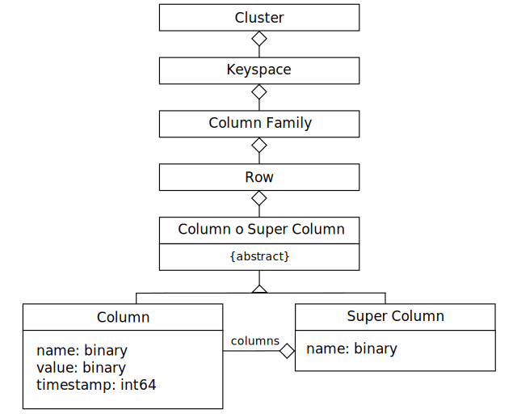

# 2. Desmitificando a Cassandra

_27-03-2010_ _Juan Mellado_

Cassandra es una de las piezas de _software_ clave dentro de las complejas infraestructuras de una red social de tanto éxito hoy en día como es Facebook. De hecho, es un desarrollo original de la propia Facebook que ha liberado como código abierto. Otros sitios tan populares como Twitter o Digg también están apostando por este _software_.

Cassandra se define a si misma como una base de datos distribuida de segunda generación altamente escalable. Sin embargo, el término "base de datos" resulta engañoso para los que estamos acostumbrados a trabajar con las tradicionales base de datos relacionales. Cassandra no sigue el modelo relacional. No es un "RDBMS". Es una base de datos "NoSQL".

¿Pero cómo son las bases de datos "NoSQL"? Pues una de sus principales características es que carecen de una estructura fija de tablas. Es decir, se componen de un conjunto de entidades básicas, pero estas carecen de una definición fija de atributos. Es como si cada fila de cada tabla, en un modelo relacional, pudiera tener el número de columnas que quisiera. Algo que de entrada resulta bastante extraño para los que estamos acostumbrados a trabajar con modelos relacionales. Y motivo por el que la mayor parte de los artículos que pueden encontrarse por Internet tratan de explicar como trabajar con estos nuevos modelos comparándolos con los antiguos relacionales.

El ejemplo comparativo más clásico es el propuesto por Jonathan Ellis, desarrollador principal de Cassandra, y que consiste en definir una base de datos para un servicio _web_, llamémoslo "_Multiblogs_", similar al popular Blogger, que permite a sus usuarios crearse sus propios _blogs_ y dejar comentarios. En Cassandra esta tarea es tan sencilla como editar un fichero de configuración llamado ```storage-conf.xml``` y añadir las siguientes líneas:

```xml
<Keyspace Name="Multiblogs">
  <ColumnFamily CompareWith="TimeUUIDType" Name="Blogs"/>
  <ColumnFamily CompareWith="TimeUUIDType" Name="Comments"/>
</Keyspace>
```

Y no hay más. En serio. ¿Y dónde están los nombres de los atributos? ¿Dónde están los clásicos ```title```, ```author```, ...? ¿Y los tipos de cada atributo? ¿Y se permiten ```NUMBER```, ```VARCHAR```, ```DATE```, ...? ¿Y cómo se definen las claves primarias? ¿Y qué ocurre con las _foreign keys_? ¿Y ...? A mi particularmente la definición del modelo me resultó tan poco natural la primera vez que la ví, que creo que intentar explicarla en base al modelo relacional es un error que desvirtúa su verdadera naturaleza. Mejor ver primero como se estructura, y luego hacer las comparaciones.



El modelo de datos de Cassandra se compone de los siguientes elementos:

- **Column**: Es el elemento de menor granularidad al que se puede hacer referencia por un nombre. Como un _pixel_ dentro de una imagen. Lo interesante es que no es un valor escalar, sino un estructura compuesta por tres atributos: ```name: binary```, ```value: binary``` y ```timestamp: int64```.

  Un ejemplo de una instancia de este tipo de estructura en notación JSON:

  ```json
  { name: "address", value: "Baker Street", timestamp: 123456789 }
  ```

  No hay restricciones con respecto a lo que pueden contener los atributos. Todos los valores los deben suministrar los clientes de la base de datos, incluido el ```timestamp```. Como una "variable" definida dentro de un programa en cualquier lenguaje de programación. Y ahí reside precisamente la diferencia con los modelos relaciones tradicionales. El modelo apenas proporciona al gestor información acerca del dominio de la aplicación. No se define hasta el último detalle lo que puede insertarse o no en la base de datos. De hecho, en la práctica puede insertarse cualquier tupla de la forma (_nombre_, _valor_, _fecha_) que se quiera. Cassandra, a lo que se dedica en realidad, es a gestionar de forma muy eficiente colecciones distribuidas verdaderamente enormes de este tipo de tuplas, del orden de billones, de una manera altamente escalable.

  El resto de elementos del modelo de datos de Cassandra sirven para agrupar estas simples tuplas.

- **Super Column**: Es una agregación de columns que puede referenciarse por un nombre. Se implementa como una estructura que se compone de dos atributos: ```name: binary``` y ```columns: list<Column>```. En la práctica se la considera igual que una _column_, sólo que en vez de almacenar un valor almacena una lista de _columns_. Es un recurso bastante útil, ya que permite tener una colección de valores anidados asociados a otro valor.

  Un ejemplo de una instancia de este tipo de estructura:

  ```json
  { 
    name: "profile",
    columns: {
      firstName: { name: "firstName", value: "Arthur", timestamp: 1 },
      lastName: { name: "lastName", value: "Doyle", timestamp: 2 },
      city: { name: "city", value: "London", timestamp: 3 }
    }
  }
  ```

  De igual forma que antes, no hay restricción acerca de lo que deben contener. Nada impediría insertar en el ejemplo una nueva _column_ con cualquier tipo de información en tiempo de ejecución por parte del cliente.

  Repito. El contenido de estas agrupaciones se define en tiempo de ejecución, en función del uso que las aplicaciones clientes hagan de ellas. Como una "estructura" definida dentro de un programa en cualquier lenguaje de lenguaje de programación. Evidentemente aportan una flexibilidad enorme a los modelos que ya se encuentran en producción, pero también un descontrol enorme si no se documenta exhaustivamente el uso que se quiere hacer de ellos.

- **Row**: Es una agregación de _columns_ o _super columns_ que se referencian con un nombre. No hay más, sólo un nombre contenido dentro de un vulgar _String_. Ese nombre es la "clave" (_key_) que identifica de forma unívoca a un registro.

  En el siguiente ejemplo puede verse una row que agrupa tres _columns_, o lo que es lo mismo, tres columns almacenadas bajo una misma clave:

  ```json
  { 
    baskerville: {
      title: { name: "title", value: "Baskerville", timestamp: 0 },
      year: { name: "year", value: "1902", timestamp: 0 },
      publisher: { name: "publisher", value: "George", timestamp: 0 }
    }
  }
  ```

  En este punto es importante no confundir una _row_ con una _super column_. La _row_ es sólo una palabra "clave", no es una estructura, carece de atributos.

  La mayoría de la gente parece sentirse cómoda pensando en las _rows_ como el equivalente a la **clave primaria** de cada registro en las tablas del modelo relacional.

- **Column Family**: Es una agregación de _rows_ que se referencia con un nombre. Y tampoco hay más, sólo un nombre contenido dentro de un vulgar _String_.

  En el siguiente ejemplo puede verse una instancia de este tipo de colección que consta de dos _rows_ de _super columns_ que a su vez contienen _columns_ (he añadido comentarios por claridad):

  ```json
  {
    friends: {  <-- Column Family
      watson: {  <-- Row
        profile: {  <-- Super Column
          name: "profile",
          columns: {  <-- Columns
            firstName: { name: "firstName", value: "John", timestamp: 0 },
            lastName: { name: "lastName", value: "Watson", timestamp: 0 }
          }
        },
        statistics: {  <-- Super Column
          name: "statistics",
          columns: {  <-- Columns
            marriages: { name: "marriages", value: "3", timestamp: 0 }
          }
        }
      },
      lestrade: {  <-- Row
        profile: {  <-- Super Column
          name: "profile",
          columns: {  <-- Columns
            lastName: { name: "lastName", value: "Lestrade", timestamp: 0 },
            phone: { name: "phone", value: "555-123", timestamp: 0 }
          }
        }
      }
    }
  }
  ```

  Insisto. No hay estructura predefinida. Cassandra lo gestiona todo como _arrays_ asociativos. Como las propiedades de los objetos en JavaScript. O como las clases ```HashMap``` en Java. Cassandra mantiene colecciones ordenadas de objetos a los que se accede por un nombre (clave), que en la terminología de Cassandra se llama _row_ (_key_). El modelo en realidad es un _hash_ de varias dimensiones, donde las _columns_ se sitúan en el nivel más bajo, las _super columns_ son un _hash_ de _columns_, las _rows_ son un _hash_ de _columns_ o _super columns_, y las _column families_ son un _hash_ de _rows_. Teniendo la cadena de nombres (claves) se puede acceder a todos los elementos que la componen.

  Es importante destacar que los nombres de las _column families_ que quieran utilizarse en Cassandra han de definirse en su fichero de configuración ```storage-conf.xml```. Y cuando se añade o elimina una _column family_ en este fichero es necesario reiniciar el servidor. Además, para cada _column family_ se debe especificar un método de ordenación de sus columns. O dos, si se compone de _super columns_, para indicar como se ordenan por defecto en primer lugar las _super columns_, y luego las _columns_ que contienen cada una de ellas.

  Eso de las ordenaciones es algo bastante importante, ya que Cassandra almacena físicamente cada _column family_ en un fichero distinto ordenado por los criterios dados. En consecuencia, se debe tratar de almacenar la información relacionada en una misma _column family_, y ordenada de la forma en la que más habitualmente se vaya a acceder a ella.

  La mayoría de la gente parece sentirse cómoda pensando en las _column families_ como el equivalente a las **tablas** en el modelo relacional.

- **Keyspace**: Es una agregación de _column families_ que puede referenciarse por un nombre. No es una estructura con atributos, es tan sólo otro contenedor al que se accede por un _String_ con su nombre.

  La mayoría de la gente parece sentirse cómoda pensando en las _keyspaces_ como el equivalente a los **esquemas** (conjunto de tablas) en el modelo relacional.

- **Cluster**: Es el elemento de más alto nivel que puede referenciarse por un nombre. Es de naturaleza más física que los anteriores, más relacionado con el _hardware_, ya que agrupa los nodos (máquinas) sobre los que se ejecuta Cassandra. Puede contener uno o más _keyspaces_.

Y esa es a muy grandes rasgos toda la estructura del modelo. Que no es poco. Y espero que haya quedado claro a estas alturas que Cassandra almacena pares de datos compuestos por una clave y un valor (más un _timestamp_), que no asegura ningún tipo de integridad referencial, que no permite hacer _joins_, y es más, que no permite ejecutar ningún tipo de sentencia SQL. Todos los pares de valores que almacena se insertan/modifican/borran/recuperan con una cadena de la forma ```keyspace.columnfamily[row][column]```, o ```keyspace.columnfamily[row][supercolumn][column]```, aunque se permite operar de una sola vez con todas las _columns_ de una clave, o de una _supercolumn_, y con rangos de claves.

No obstante, utilizar este esquema no significa renunciar a las buenas prácticas aprendidas a lo largo de años de uso de los tradicionales modelos relacionales. Por ejemplo, para las _rows_ (claves) nada nos impide seguir utilizando por comodidad algún tipo de secuencial o UUID generado automáticamente, como se hace en la actualidad para las claves primarias con las columnas ```AUTOINCREMENT``` o las ```SEQUENCE```s:

```json
{ 
  users: {  <-- Column Family
    359701f8-a75b-b801-05e7-86a970002701: {  <-- Row
      userName: { name: "userName", value: "jsmith", timestamp: 0 },
      firstName: { name: "firstName", value: "John", timestamp: 0 },
      lastName: { name: "lastName", value: "Smith", timestamp: 0 }
    },
    7805640e-e92c-52d7-a836-352755992000: {  <-- Row
      userName: { name: "userName", value: "ssmith", timestamp: 0 },
      firstName: { name: "firstName", value: "Sarah", timestamp: 0 },
      lastName: { name: "lastName", value: "Smith", timestamp: 0 }
    }
  }
}
```

De igual forma, el concepto de **_foreign key_** se debe seguir utilizando (aunque en ningún caso se garantice su integridad). Cassandra no pone ninguna restricción a la hora de que una misma clave que identifica una _row_ aparezca en varias _column families_ distintas. Es más, los desarrolladores enfatizan este hecho, ya que teniendo la clave de un objeto se pueden obtener todos los objetos relacionados en cualquier otra _column family_:

```json
{ 
  friends: {  <-- Column Family
    359701f8-a75b-b801-05e7-86a970002701: {  <-- Row
      7805640e-e92c-52d7-a836-352755992000: {  <-- Column
        name: "7805640e-e92c-52d7-a836-352755992000", value: "Girlfriend", ...},
      a9780021-4b91-786a-ee02-458a23761202: {  <-- Column
        name: "a9780021-4b91-786a-ee02-458a23761202", value: "Old chap", ...}
    },
    7805640e-e92c-52d7-a836-352755992000: {  <-- Row
      359701f8-a75b-b801-05e7-86a970002701: {  <-- Column
        name: "359701f8-a75b-b801-05e7-86a970002701", value: "Boyfriend", ...},
    }
  }
}
```

Y la necesidad de **índices** la podemos satisfacer creando _column families_ específicas a nuestras necesidades. Para, por ejemplo, dado un "nombre de usuario" averiguar cual es su "clave":

```json
{ 
  usersIndex: {  <-- Column Family
    jsmith: {  <-- Row
      rowid: { name: "rowid", value: "359701f8-a75b-b801-05e7-86a970002701", ...}
    },
    ssmith: {  <-- Row
      rowid: { name: "rowid", value: "7805640e-e92c-52d7-a836-352755992000", ...}
    }
  }
}
```

Pero, ¿por qué las _webs_ más grandes de Internet no utilizan base de datos tradicionales? ¿Acaso no tienen "_usuarios_", "_artículos_", "_comentarios_", ... y todo ese tipo de entidades que tan bien casan tabla por tabla con el modelo relacional? ¿MySQL y Oracle se están quedando obsoletos? ¿Por qué se necesita otro paradigma? No creo que se pueda responder con una sola palabra a todas estas preguntas. De hecho, si tuviera que hacerlo yo, no me decidiría por una única palabra, sino por dos: "rendimiento" y "escalabilidad".

Las base de datos relacionales no están respondiendo de forma adecuada a los retos que los grandes sitios _webs_ actuales les plantean. Y por tanto se supone que tampoco lo harán a las necesidades de los futuros desarrollos que seguirán la línea marcada por estos. El problema no es que los modelos relacionales no puedan almacenar de forma ordenada la ingente cantidad de información que gestionan estos sitios. El problema es que sus tiempos de respuesta no son los más adecuados para lo que los usuarios demandan, y sus requerimientos de _hardware_ no son lo suficientemente flexibles como para poder adecuarlos de forma óptima a las cambiantes necesidades del negocio. Las grandes _webs_ se hartaron de desnormalizar sus modelos de datos e invertir dinero en mejorar el _hardware_ de sus ordenadores, así que optaron por utilizar directamente modelos desnormalizados y altamente escalables horizontalmente (añadir más ordenadores a la red para aumentar el rendimiento).

Sin embargo, el párrafo anterior no viene a significar que haya que desechar todo el conocimiento adquirido hasta la fecha y rehacer los desarrollos actuales sobre modelos relacionales. No es eso. Lo que trata de resaltar es que a los grandes sitios de Internet las soluciones tradicionales no les valen. No hay ningún inconveniente en que las pequeñas, medianas y grandes empresas, que no tengan que manejar _Petabytes_ de datos en tiempo real, puedan seguir trabajando con sus base de datos actuales. Lo importante es saber que esas propuestas alternativas están ahí, y conocer un mínimo acerca de la filosofía de funcionamiento de las mismas. Dentro un tiempo puede llegar a ser tan natural trabajar en una base de datos "NoSQL" como lo es hoy en día trabajar con un "RDBMS".
