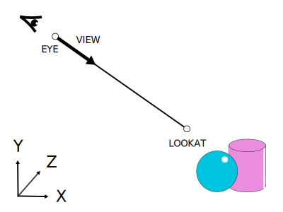
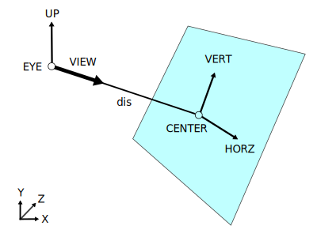
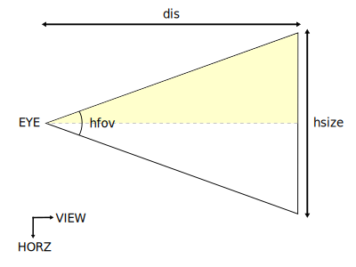
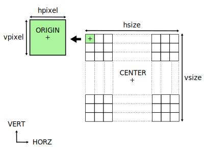

# 2. Ray Tracing: Barrido del Plano de Proyección

_14-10-2005_ _Juan Mellado_

El plano de proyección es la superficie sobre la que representa la imagen bidimensional generada a partir de una escena definida tridimensionalmente. En la práctica el plano tiene una extensión continua infinita, pero de él sólo se toma una pequeña región, normalmente rectángular, a modo de ventana. Esta ventana se divide a su vez en una cuadrícula rectángular de filas y columnas en la que cada celda representa un pixel al que puede asignársele un color de manera individual.

Este artículo trata de cómo se define dicho plano de proyección, de cómo se calcula la posición de cada pixel dentro del mismo, y de cómo se pueden construir rayos que partan de la posición del observador y recorran ("barran") todos los píxeles.

## 2.1. Sistema de Referencia

En lo sucesivo consideraremos un sistema de referencia en el que el eje horizontal X crece de izquierda a derecha, el vertical Y de abajo hacia arriba, y los valores sobre el eje de profundidad Z aumentan a medida que se penetra en el plano XY (adentrándose en la pantalla del monitor).

## 2.2. Dirección en la que mira el Observador

Los primeros parámetros de entrada al sistema a considerar son la posición que ocupa el observador y el punto concreto al que mira. Normalmente el observador de la escena recibe el nombre de "cámara", pero por el momento seguiré llamándolo observador. Creo que el término cámara tiene unas connotaciones técnicas implícitas, como puede ser el uso de lentes, que no resultan adecuadas introducir aún. Me parece más natural considerar un observador humano.

Denotaremos con $\text{EYE}$ a la posición del observador, y $\text{LOOKAT}$ al punto concreto que mira.



El primer valor calculado será la dirección $\text{VIEW}$ en la que mira el observador, que es la dirección del vector que une $\text{EYE}$ con $\text{LOOKAT}$:

$\text{LOOKAT} - \text{EYE}$

No obstante, la mayoría de los vectores que se calculen se normalizarán para simplificar cálculos posteriores. Es decir, se dividirán por su módulo (longitud) para convertirlos en vectores unitarios. Los vectores unitarios tienen módulo unidad, lo que interesa de ellos es su dirección y sentido:

$VIEW = \cfrac{\text{LOOKAT} - \text{EYE}} {|\text{LOOKAT} - \text{EYE}|}$

Los parámetros $\text{EYE}$ y $\text{LOOKAT}$ se pueden inicializar con valores por defecto. Por ejemplo, $\text{EYE} = (0, 0, 0)$ y $\text{LOOKAT} = (1, 1, 1)$ sitúan al observador en el origen de coordenadas mirando a un punto situado arriba a su derecha. Aunque lo normal es que se obligue a introducir al menos uno de estos dos valores.

En ningún caso $\text{EYE}$ y $\text{LOOKAT}$ deben ser iguales, ya que ello equivaldría a decir que el observador observa la misma posición que ocupa, lo que es físicamente imposible. Y matemáticamente equivaldría a que la longitud de $\text{VIEW}$ fuese cero, no se podría realizar la división para normalizarlo.

## 2.3. Arriba y Abajo

El siguiente parámetro de entrada requiere una explicación un poco más detallada. Se trata de indicar cual es el plano vertical que considera el observador.

Intentaré explicarlo con un ejemplo. Supongamos que se quiere hacer una fotografía. El fotógrafo se ubica, apunta al objetivo, y retrocede o avanza para captar mejor el motivo a fotografiar. Sin embargo, a veces no es posible incluir todo lo observable en la fotografía, no cabe. Como cuando se retrata a una persona de pie. Si se apunta con la cámara en su postura natural las piernas salen "cortadas". Por lo que se utiliza el truco de girar la cámara y ponerla en posición vertical para que la persona salga completa, a lo ancho de la fotografía en vez de a lo alto. Lo que estaba "arriba" ahora está en un lateral.

El observador de una escena, al igual que un fotógrafo, debe especificar que parte de la escena debe quedar "arriba", para que no exista ningún tipo de ambigüedad con respecto al resultado buscado. Para ello se define otro parámetro de entrada al sistema, el vector unitario $\text{UP}$ que apunta hacia "arriba".

El vector $\text{UP}$ suele tomar el valor $(0, 1, 0)$ por defecto, es decir, apuntando hacia el "cielo". Y como se verá en el siguiente apartado, su dirección no tiene porque ser perpendicular (formar un ángulo recto) a la dirección en la que mira el observador.

## 2.4. Ejes sobre el Plano de Proyección

El plano de proyección contiene la ventana sobre la que se representa la escena. Y para definir un plano matemáticamente se necesita al menos un punto sobre el mismo y un vector normal a la superficie. En la práctica existen más formas de definir un plano, pero esta forma es la más conveniente para este caso, ya que se dispone del vector $\text{VIEW}$, normal (perpendicular) al mismo. El punto sobre el plano se calcula muy fácilmente introduciendo la distancia $\text{dis}$ que separa al observador del plano.

La distancia $\text{dis}$ es un parámetro de entrada al sistema. Suele asignársele el valor $1$ por defecto. Y en todo caso debe ser un valor positivo mayor que cero, ya que un valor de cero querría decir que el observador se encuentra contenido dentro del propio plano de proyección, y un valor negativo que el plano de proyección se encuentra por detrás de la dirección en la que mira.



El punto sobre el plano, $\text{CENTER}$, se obtiene partiendo del observador y siguiendo la dirección de visión una distancia $\text{dis}$:

$\text{CENTER} = \text{EYE} + (\text{dis} * \text{VIEW})$

Este punto $\text{CENTER}$ se utiliza como origen de un eje de coordenadas locales sobre la ventana en la que se proyecta la escena. Es decir, como un eje de coordenadas centrado en la ventana, lo que a la postre permitirá moverse por ella recorriendo todos los píxeles que la forman.

Los ejes de coordenadas se definen matemáticamente con un punto origen, que ya se tiene ($\text{CENTER}$), y tres vectores, del que también se tiene uno ($\text{VIEW}$). El vector $\text{VIEW}$ permite moverse en profundidad con respecto al plano de proyección, y el eje de coordenadas se completa añadiendo dos nuevos vectores, $\text{HORZ}$ y $\text{VERT}$, que permitan moverse horizontal y verticalmente.

El vector $\text{HORZ}$ es normal al plano que contiene a los vectores unitarios $\text{UP}$ y $\text{VIEW}$, por lo que su cálculo es sencillo. Se obtiene del producto cruzado (vectorial) de $\text{UP}$ por $\text{VIEW}$:

$\text{HORZ} = \cfrac{\text{UP} \times \text{VIEW}} {|\text{UP} \times \text{VIEW}|}$

Se tiene que tener en cuenta que $\text{UP}$ y $\text{VIEW}$ no pueden tener la misma dirección, ya que $\text{HORZ}$ no podría calcularse. Este caso ocurre cuando se indica que la dirección en la que mira el observador es la misma que la dirección indicada para "arriba". Un sistema así definido no es coherente.

Por su parte, el vector $\text{VERT}$ es normal al plano que contiene a los vectores unitarios $\text{VIEW}$ y $\text{HORZ}$. Por lo que puede obtenerse del producto cruzado de ambos vectores:

$VERT = \cfrac{\text{VIEW} \times \text{HORZ}} {|\text{VIEW} \times \text{HORZ}|}$

La explicación de qué es el producto vectorial queda fuera del alcance de este artículo, puede encontrarse en cualquier tutorial básico de cálculo de vectores. Baste decir que dados dos vectores, $A = (a_x, a_y, a_z)$ y $B = (b_x, b_y, b_z)$, el producto vectorial es el vector resultante de evaluar la siguiente expresión:

$A \times B = (a_y b_z - a_z b_y, a_z b_x - a_x b_z, a_x b_y - a_y b_x)$

## 2.5. Tamaño de la Ventana de Proyección

El tamaño de la ventana de proyección es el tamaño del rectángulo en el que se impresiona la escena observada. Para su cálculo se necesita introducir dos nuevos parámetros de entrada, dos ángulos. El ángulo de visión del observador en el plano horizontal $\text{hfov}$, y el ángulo de visión del observador en el plano vertical $\text{vfov}$. La nomenclatura de los nombres procede del inglés "Field Of View" (Campo de Visión).

Estos ángulos determinan el ancho y alto de la ventana de proyección en la medida que las partes visibles de la escena serán sólo aquellas que se encuentren dentro de estos ángulos de visión.

Para calcular el ancho de la ventana de proyección se debe notar que el observador y el centro de la ventana se encuentran ambos contenidos dentro del plano que definen $\text{VIEW}$ y $\text{HORZ}$, por lo que el cálculo se puede reducir a un problema de trigonometría 2D sobre dicho plano:



Resolviendo el triángulo superior de la imagen se obtiene el ancho del campo de visión (la tangente es igual al cateto opuesto partido por el cateto contiguo):

$\tan{\Big(\cfrac{\text{hfov}} {2}\Big)} = \cfrac{\cfrac{\text{hsize}} {2}} {\text{dis}}$

$\text{hsize} = 2 * \text{dis} * \tan{\Big(\cfrac{\text{hfov}} {2}\Big)}$

Y siguiendo el mismo razonamiento se obtiene la altura del campo de visión:

$\text{vsize} = 2 * \text{dis} * \tan{\Big(\cfrac{\text{vfov}} {2}\Big)}$

Los dos ángulos pueden tomar un mismo valor de entrada por defecto, unos 45 grados, lo que haría que se genere una ventana de proyección cuadrada. Algunos sistemas prefieren que se indique el _aspect ratio_ (cociente entre el ancho y alto) de la imagen deseada, y calcular los ángulos a partir de esta cantidad.

## 2.6. Tamaño y Posición de un Pixel

El último parámetro de entrada al sistema es la resolución (tamaño) en píxeles que se quiere que tenga la imagen resultante, $\text{width} \times \text{height}$. Con la resolución se determina el número de píxeles totales y el tamaño de cada pixel individual en la ventana de proyección.

El tamaño horizontal de un pixel en la ventana de proyección se calcula diviendo el tamaño horizontal de la ventana de proyección por el ancho en píxeles de la imagen deseada:

$\text{hpixel} = \cfrac{\text{hsize}} {\text{width}}$

Y de forma análoga se obtiene el tamaño vertical de un pixel:

$\text{vpixel} = \cfrac{\text{vsize}} {\text{height}}$

Como parámetro de entrada, la resolución puede tomar un valor por defecto, por ejemplo 100x100, o se puede obligar a introducirla obligatoriamente. En cualquier caso, tanto la resolución vertical como la horizontal deben ser mayores que cero. Sin fueran cero no se podría realizar la división para obtener el tamaño de un pixel, sería como decir que los píxeles no tienen dimensiones.



De entre todos los píxeles interesa destacar la posición del que se encuentra en la esquina superior izquierda de la ventana de proyección. Su ubicación se obtiene partiendo del centro de la ventana y desplazándose hacia la izquierda y hacia arriba una distancia equivalente a la mitad de la resolución deseada:

$\text{ORIGIN} = \text{CENTER} - \Big(\cfrac{\text{width} - 1} {2}\Big) * \text{hpixel} * \text{HORZ} + \Big(\cfrac{\text{height} - 1} {2}\Big) * \text{vpixel} * \text{VERT}$

Y este mismo criterio se puede aplicar al resto de píxeles con el objetivo de obtener una expresión más genérica que obtenga el centro de cualquier pixel $(i, j)$ dentro de la ventana de proyección:

$\text{PIXEL}(i, j) = \text{ORIGIN} + i * \text{hpixel} * \text{HORZ} - j * \text{vpixel} * \text{VERT}$

Notar que en esta última expresión la dirección de avance vertical está invertida, debido a que se parte de $\text{ORIGIN}$, y que la numeración vertical habitual de los píxeles crece de arriba hacia abajo. El pixel $(0, 0)$ está localizado en la esquina superior izquierda y el pixel $(\text{width} - 1, \text{height} - 1)$ en la esquina inferior derecha.

## 2.7. Generación de Rayos

Una vez definido completamente el sistema, se puede proceder al barrido de la ventana de proyección con rayos, mediante dos bucles que recorran los píxeles de izquierda a derecha y de arriba hacia abajo, generando para cada pixel $(i, j)$ un rayo que parta de la posición del observador y atraviese el centro del pixel:

```text
FOR j = 0 TO height - 1

  FOR i = 0 TO width - 1

    RAY (i, j, t) = EYE + ((PIXEL(i, j) - EYE) / |PIXEL (i, j) - EYE|) * t

  NEXT i

NEXT j
```

Definidos de esta forma, los rayos no son más que vectores con un origen, el punto $\text{EYE}$, y una dirección, la que une el origen con el centro del pixel.

El parámetro $t$ de la ecuación del rayo nos permite movernos sobre la línea recta imaginaria que define el mismo. Un valor cero nos sitúa en el origen, un valor negativo por detrás de este y uno positivo por delante. Este parámetro $t$ será además el que se utilice para el cálculo de intersecciones con los objetos de la escena. Tema del siguiente artículo de esta serie.

## 2.8. Resumen

Parámetros de Entrada:

- $\text{EYE}$: Posición del Observador
- $\text{LOOKAT}$: Punto concreto al que mira el Observador
- $\text{UP}$: Dirección para determinar el Plano Vertical del Observador
- $\text{dis}$: Distancia del Observador al Plano de Proyección
- $\text{hfov}$: Ángulo del Campo de Visión Horizontal
- $\text{vfov}$: Ángulo del Campo de Visión Vertical
- $\text{width}$: Resolución Horizontal en píxeles de la Imagen deseada
- $\text{height}$: Resolución Vertical en píxeles de la Imagen deseada

Valores Calculados:

- $\text{VIEW}$: Dirección en la que mira el Observador
- $\text{CENTER}$: Posición del centro de la Ventana de Proyección
- $\text{HORZ}$: Vector de desplazamiento Horizontal sobre la Ventana de Proyección
- $\text{VERT}$: Vector de desplazamiento Vertical sobre la Ventana de Proyección
- $\text{hsize}$: Tamaño Horizontal de la Ventana de Proyección
- $\text{vsize}$: Tamaño Vertical de la Ventana de Proyección
- $\text{hpixel}$: Tamaño Horizontal de un pixel en la Ventana de Proyección
- $\text{vpixel}$: Tamaño Vertical de un pixel en la Ventana de Proyección
- $\text{ORIGIN}$: Posición del centro del pixel de la esquina superior izquierda de la Ventana de Proyección
- $\text{PIXEL}(i, j)$: Posición del centro del pixel (i, j) en la Ventana de Proyección
- $\text{RAY}(i, j, t)$: Ecuación del rayo que parte del Observador y atraviesa el centro del pixel $(i, j)$

Algoritmo:

1 - Cálculo de la Dirección en la que mira el Observador:

```text
VIEW = (LOOKAT - EYE) / |LOOKAT - EYE|
```

2 - Obtención del Sistema de Referencia sobre el Plano de Proyección:

```text
CENTER = EYE + (dis * VIEW)
HORZ = (UP x VIEW) / |UP x VIEW|
VERT = (VIEW x HORZ) / |VIEW x HORZ|
```

3 - Cálculo del Tamaño de la Ventana de Proyección:

```text
hsize = 2 * dis * TAN(hfov / 2)
vsize = 2 * dis * TAN(vfov / 2)
```

4 - Cálculo del Tamaño de los píxeles en la Ventana de Proyección:

```text
hpixel = hsize / width
vpixel = vsize / height
```

5 - Obtención del centro del pixel de la esquina superior izquierda de la Ventana de Proyección:

```text
ORIGIN = CENTER - (((width - 1) / 2) * hpixel * HORZ) + (((height - 1) / 2) * vpixel * VERT)
```

6 - Iteración por cada fila:

```text
FOR j = 0 TO height - 1
```

7 - Iteración por cada columna:

```text
  FOR i = 0 TO width - 1
```

8 - Generación del rayo que atraviesa el centro del pixel (i, j):

```text
    PIXEL(i, j) = ORIGIN + (i * hpixel * HORZ) - (j * vpixel * VERT)

    RAY(i, j, t) = EYE + ((PIXEL(i, j) - EYE) / |PIXEL(i, j) - EYE|) * t

  NEXT i

NEXT j
```
