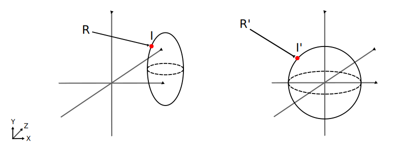
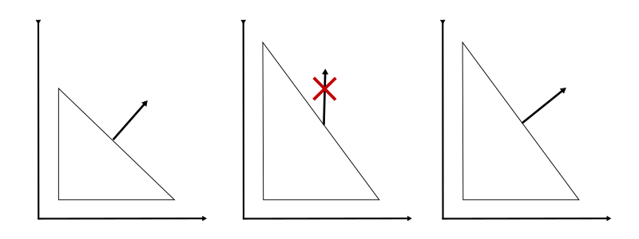

# 3. Ray Tracing: Cálculo de Intersecciones y Normales

_19-10-2005_ _Juan Mellado_

Un rayo define una línea recta imaginaria que parte de la posición del observador y atraviesa el centro de un pixel. Para determinar el color de dicho pixel se debe determinar qué objetos ve el observador mirando a lo largo de la dirección del rayo que lo atraviesa, y para ello se deben calcular las intersecciones que ocurren entre el rayo y los objetos presentes en la escena, y asignar a dicho pixel el color del objeto intersectado más cercano al observador.

Este artículo presenta fórmulas genéricas para el cálculo de las intersecciones de los rayos con los objetos, y para la obtención de las normales a los objetos en dichas intersecciones. El cálculo de normales no será de utilidad hasta que presenten los modelos de iluminación, pero resulta muy conveniente introducirlo en este momento porque las normales se calculan en los puntos de intersección.

## 3.1. Ecuación del Rayo

Tal y como se detalló en el artículo anterior, los rayos se caracterizan por su origen $O = (o_x, o_y, o_z)$, y su vector dirección normalizado $D = (d_x, d_y, d_z)$, lo que permite definirlos mediante la siguiente ecuación paramétrica:

$R(t) = O + D t$

Ecuación que puede reescribirse considerando cada componente por separado:

$x = o_x + d_x t$

$y = o_y + d_y t$

$z = o_z + d_z t$

Un valor de $t = 0$ nos sitúa en la posición que ocupa el observador, un valor negativo por detrás, y uno positivo por delante. Aunque de forma general se suele acotar los posibles valores válidos con dos límites, uno superior y otro inferior:

$t_{near} <= t <= t_{far}$

El valor $t_{near}$ se toma próximo a cero, y no exactamente cero, para intentar salvar los habituales problemas de precisión en el cálculo computacional. El valor $t_{far}$, que limita el mayor valor considerado para $t$, permite descartar objetos que se encuentran muy lejanos al observador, y cuya aportación no es significativa.

## 3.2. Intersección con un Objeto

Hasta ahora se había hablado de los objetos presentes en la escena de forma muy genérica, pero en la práctica se suelen definir mediante primitivas geométricas, como esferas, cilindros, o planos. La ventaja de este de tipo de entidades es que se pueden generalizar mediante una ecuación implícita de la siguiente forma:

$S(x, y, z) = 0$

Los puntos $(x, y, z)$ para los que se cumple la ecuación representan los puntos que se encuentran sobre la superficie del objeto, de forma que los puntos de intersección entre un rayo y dicha superficie se obtienen sustituyendo en la ecuación de la superficie la ecuación del rayo, y resolviendo por $t$:

$S(o_x + d_x t, o_y + d_y t, o_z + d_z t) = S'(t) = 0$

Los puntos que satisfacen ambas ecuaciones al unísono son puntos que se encuentran al mismo tiempo en el rayo y la superficie, o sea, son puntos de intersección entre ambos.

El cálculo de intersecciones se reduce así a encontrar todos los valores reales de $t$ que verifican la ecuación. Los valores de $t$ encontrados, y evaluados en la ecuación del rayo, proporcionarán los puntos del espacio en que se producen dichas intersecciones.

Dependiendo de la dirección del rayo, y la forma de la superficie del objeto contra la que se compruebe la intersección, se puede obtener cero, una ó más soluciones reales. La intersección con menor valor de $t$ será la más cercana al punto de partida del rayo. Los valores negativos corresponderán a puntos situados por detrás del origen del rayo, en sentido contrario a su dirección, por lo que no se tendrán en cuenta. Y las raíces imaginarias (no reales) se interpretarán como que no se produce intersección.

Así, si $t_i$ es el valor de $t$ para el que se produce una intersección, entonces el punto intersectado $I = (i_x, i_y, i_z)$ es:

$I = R(t_i) = O + D t_i$

O escribiendo cada componente por separado:

$i_x = o_x + d_x t_i$

$i_y = o_y + d_y t_i$

$i_z = o_z + d_z t_i$

## 3.3. Normal al Punto de Intersección con un Objeto

Una vez determinado el punto de intersección I con un objeto, se puede determinar la normal $N_i$ al objeto en dicho punto. Su utilidad se verá clara en un artículo posterior dedicado a iluminación.

La normal de un objeto en un punto concreto de su superficie es un vector perpendicular a la superficie en dicho punto, y realmente, cuando se habla de calcular la normal, se habla de calcular la dirección de dicho vector perpendicular. Por ejemplo, la dirección de la normal en un punto concreto de la superficie de una esfera la marca la dirección que une el centro de la esfera con dicho punto. En cambio, la normal en cualquier punto de la superficie de un plano totalmente horizontal es un vector totalmente vertical. Es decir, que la forma de obtener la normal varía significativamente en función del tipo de objeto, ya que su cálculo depende completamente de la forma del mismo, y no puede estudiarse de forma global, debe hacerse individualmente.

Otro factor a tener en cuenta a la hora de calcular la normal es saber si la intersección con el rayo se produce en la cara interior o exterior del objeto. Y aunque en principio pueda resultar bastante difícil de calcular, en realidad es bastante sencillo gracias al producto escalar, ya que si dos vectores apuntan hacia un mismo lado de un plano el signo de dicho producto es positivo, y si lo hacen hacia lados contrarios es negativo. Con lo que, si el signo del producto escalar entre la normal y el rayo es negativo entonces el rayo incide en la cara exterior del objeto (apunta en dirección contraria a la normal), y si es positivo incide sobre la cara interior (apunta en la misma dirección que la normal). El valor cero corresponde al caso en que ambos vectores son perpendiculares, es decir, el rayo es tangente al objeto.

Si el rayo incide en la cara interior del objeto (se cumple $N_i \cdot D > 0$) se cambiará la dirección de la normal, esto es, se tomará $-N_i$, para tener en cuenta tal circunstancia.

La explicación de en qué consiste el producto escalar queda fuera del alcance de este artículo, puede encontrarse en cualquier tutorial básico de cálculo de vectores. Baste decir que dados dos vectores $A = (a_x, a_y, a_z)$ y $B = (b_x, b_y, b_z)$, el producto escalar es el valor resultante de evaluar la siguiente expresión:

$A \cdot B = a_x b_x + a_y b_y + a_z b_z$

## 3.4. Intersección con una Primitiva Transformada

Como ya apuntábamos en el apartado anterior, los objetos que forman parte de una escena se definen normalmente con una primitiva geométrica, como esferas, cilindros o planos. Sin embargo, en la práctica no basta con indicar el número de objetos que se desea, sino que se debe caracterizar cada objeto con al menos una posición, y muy posiblemente con un tamaño concreto o una orientación determinada. Es decir, no basta con indicar que se quieren dibujar dos esferas, hay que indicar que una de ellas estará centrada, por ejemplo, en el punto $(-5, 2, -3)$ y la otra en $(3, 2, -1)$, y que la primera tendrá un radio $3$ y la segunda un radio $1$.

Para conseguir esto, los objetos se definen con una primitiva y un conjunto de transformaciones. Las primitivas son formas básicas, como esferas, cilindros o conos, en su forma canónica, es decir, centradas en el origen de coordenadas y con radio la unidad. Y las transformaciones consisten en escalados, rotaciones y traslaciones que se deben aplicar a las primitivas para dimensionarlas, girarlas y ubicarlas dentro de la escena.

Cada transformación en particular se representa matemáticamente mediante una matriz numérica. Y todas las matrices se combinan en una única. El orden en que se combinan las transformaciones es importante. No es lo mismo trasladar primero y rotar luego, que rotar primero y trasladar luego. El orden que consideraremos en esta serie de artículos será primero el escalado, segundo la rotación sobre el eje X, tercero la rotación sobre el eje Y, cuarto la rotación sobre el eje Z, y quinto la traslación.

Aplicar una matriz de transformación a una primitiva hace que se instancie un objeto en el mismo espacio de coordenadas en el que se encuentra definido el rayo, lo que permite estudiar las posibles intersecciones entre ambos. Sin embargo, para hallar las intersecciones con los objetos de la escena no se trabaja con la primitiva transformada, sino que se aplica la inversa de las transformaciones al rayo, y se calcula su intersección con la primitiva canónica. La principal razón por la que se realiza así es que se simplifica significativamente los cálculos, las expresiones que describen las primitivas en su forma canónica son más sencillas de calcular que las correspondientes expresiones de las primitivas transformadas.

Si aplicar la matriz de transformaciones a la primitiva canónica transporta la primitiva al espacio donde se encuentra el rayo, aplicar la inversa de dicha matriz al rayo transporta al rayo al espacio de coordenadas de la primitiva canónica.

Denotaremos con $M$ la matriz de transformaciones, y con $M^{-1}$ la inversa de $M$.

Sean $O'$ y $D'$ los componentes del rayo resultantes de multiplicar los componentes originales, $O$ y $D$, por $M^{-1}$:

$O' = (o_x', o_y', o_z') = O M^{-1}$

$D' = (d_x', d_y', d_z') = D M^{-1}$

Aunque la operación realizada a ambos componentes es la misma, el origen $O$ es un punto y la dirección $D$ es un vector, por lo que la traslación no tiene que tener efecto en el vector $D$, algo que puede resolverse fácilmente utilizando coordenadas homogéneas.

La ecuación del rayo en el espacio del objeto es igual que la original, pero reemplazando en ella sus componentes originales por sus equivalentes transformados:

$R'(t) = O' + D' t$

Y algo muy importante que ha de tenerse siempre en cuenta es el hecho de que habitualmente el vector D' es normalizado, o sea, dividido por su longitud:

$D' = \cfrac{D M^{-1}} {|D M^{-1}|}$

Esta operación se lleva a cabo para realizar ciertas optimizaciones basadas en el hecho de que dicho vector es unitario. Sin embargo, esta normalización rompe la naturaleza de las transformaciones realizadas, el escalado original se pierde. Por ello, para restaurar el orden de las cosas, se debe dividir los valores de t encontrados por dicha longitud, para que todos los elementos involucrados en el cálculo se vean igualmente afectados.

Así, si $t_i'$ es el valor de $t$ para el que se produce la intersección en el espacio del objeto, considerando el vector dirección $D'$ normalizado, entonces el valor $t_i$ en el espacio del rayo será:

$t_i = \cfrac{t_i'} {|D M^{-1}|}$

La construcción de la matriz de transformaciones, su inversa, y el uso de coordenadas homogéneas, queda fuera del alcance de este artículo, puede encontrarse en cualquier texto básico de gráficos por ordenador. A modo de referencia he añadido un apéndice a este artículo con las matrices de transformación más comunes y una breve introducción al uso de coordenadas homogéneas.

## 3.5. Normal al Punto de Intersección con una Primitiva Transformada

El escalado es una de las operaciones que se llevan a cabo al aplicar una matriz de transformación a una primitiva canónica, provocando un cambio en la forma de la misma. Por ejemplo, si se aplica un escalado uniforme a una esfera se obtiene otra esfera de distinto tamaño, pero si el escalado se aplica sólo en uno de los ejes se obtiene una elipse.

Lo realmente importante a tener en cuenta es que el escalado provoca un cambio de la posición relativa de los puntos de la superficie sobre la que se aplica, lo que conlleva una variación de los ángulos que forman los puntos entre sí, y que estos cambios afectan a los vectores característicos sobre la superficie, como son las tangentes y las normales. Por ejemplo, si se escala verticalmente un polígono triangular como el de la imagen, el ángulo que forma el vértice superior con el inferior derecho varía, haciendo que la dirección de la normal en dicho lado varíe también.

Las tangentes de las primitivas transformadas pueden construirse aplicando la matriz de transformación a las tangentes de las primitivas canónicas, porque se calculan mediante las diferencias de las posiciones de los puntos, y estas se mantienen. Las normales, por el contrario, no pueden construirse así, porque se calculan en base a los ángulos que forman entre sí las posiciones, y estos no se mantienen.

Resumiendo, dada una tangente de una primitiva canónica, podemos construir la tangente transformada aplicando la matriz de transformación. Sin embargo, dada una normal, no podemos construir la transformada aplicando la matriz de transformación. Debe aplicarse otra matriz. Y el objetivo del resto de este apartado es encontrar dicha matriz.

Lo que sigue es un desarrollo matemático un poco largo que puede saltarse si lo único que le interesa es el resultado.

Sea $T_i'$ la tangente, y $N_i'$ la normal en el espacio de coordenadas del objeto, es decir, en el espacio de la primitiva canónica. Y sea $T_i$ la tangente al punto de intersección, y $N_i$ la normal al mismo, en el espacio de coordenadas globales, es decir, en el espacio original del rayo.

La tangente $T_i$ es el resultado de aplicar la matriz de transformación a la tangente $T_i'$. Por su parte, la normal $N_i$ será el resultado de aplicar otra matriz, llamémosla $L$, la matriz buscada, a la normal $N_i'$:

$T_i = T_i' M$

$N_i = N_i' L$

La tangente y la normal a un punto son perpendiculares entre sí, y esa relación se cumple siempre. Matemáticamente se caracteriza porque el producto escalar entre ambos vectores es cero:

$T_i · N_i = T_i' · N_i' = (T_i' M) · (N_i' L) = 0$

Para desarrollar esta expresión, y encontrar el valor de $L$, hemos de tener en cuenta dos propiedades. Primera, que considerando los vectores como matrices fila, el producto escalar de dos vectores es equivalente al producto de la traspuesta de un vector por otro:

$A · B = A B^T$

Y segunda, que la traspuesta del producto de dos matrices es igual al producto de sus traspuestas cambiando el orden de los elementos:

$(A B)^T = B^T A^T$

Aplicando esas dos propiedades en la expresión a desarrollar:

$(T_i' M) · (N_i' L) = 0$

$T_i' M (N_i' L)^T = 0$

$T_i' M L^T N_i'^T = 0$

Considerando sólo el primer y último término, y aplicando la primera propiedad, podemos reescribirlos como:

$T_i' N_i'^T = T_i' · N_i' = 0$

Es decir, el producto del primer y último término es cero. Luego, la expresión que estamos desarrollando sólo será cero si el producto de los otros dos factores es igual a la matriz identidad. Aunque no sea evidente a primera vista, debe quedar claro considerando que el producto de matrices no es conmutativo, por lo que al resolver la expresión de izquierda a derecha, justo antes de multiplicar por el último término, el resultado de los tres primeros factores debe ser igual al valor del primer término, para que el resultado total sea cero:

$T_i' (M L^T) N_i'^T = T_i' I N_i'^T = T_i' N_i'^T = T_i' · N_i' = 0$

Finalmente, podemos despejar el valor de la matriz $L$ buscada:

$M L^T = I$

Teniendo en cuenta que, de forma general, $A A^{-1} = A^{-1} A = I$:

$L^T = M^{-1}$

Calculando la traspuesta en ambos lados de la expresión, sabiendo que $(A^T)^T = A$:

$(L^T)^T = (M^{-1})^T$

$L = (M^{-1})^T$

Es decir, la normal en el espacio de coordenadas globales, se obtiene multiplicando la normal en el espacio de coordenadas de la primitiva canónica por la traspuesta de la inversa de la matriz de transformación:

$N_i = N_i' L = N_i' (M^{-1})^T$

## Apéndice 1: Matrices de Transformación

Matriz de Traslación por las componentes de un vector $T = (t_x, t_y, t_z)$:

$\begin{pmatrix}
1 & 0 & 0 & 0 \\
0 & 1 & 0 & 0 \\
0 & 0 & 1 & 0 \\
t_x & t_y & t_z & 1
\end{pmatrix}$

Matriz de Escalado por las componentes de un vector $S = (s_x, s_y, s_z)$:

$\begin{pmatrix}
s_x & 0 & 0 & 0 \\
0 & s_y & 0 & 0 \\
0 & 0 & s_z & 0 \\
0 & 0 & 0 & 1
\end{pmatrix}$

Matriz de Rotación de un ángulo $a$ sobre el eje X:

$\begin{pmatrix}
1 & 0 & 0 & 0 \\
0 & \cos(a) & -\sin(a) & 0 \\
0 & \sin(a) & cos(a) & 0 \\
0 & 0 & 0 & 1
\end{pmatrix}$

Matriz de Rotación de un ángulo $b$ sobre el eje Y:

$\begin{pmatrix}
\cos(b) & 0& \sin(b) & 0 \\
0 & 1 & 0 & 0 \\
-\sin(b) & 0 & cos(b) & 0 \\
0 & 0 & 0 & 1
\end{pmatrix}$

Matriz de Rotación de un ángulo $c$ sobre el eje Z:

$\begin{pmatrix}
\cos(c) & -\sin(c) & 0 & 0 \\
\sin(c) & cos(c) & 0 & 0 \\
0 & 0 & 1 & 0 \\
0 & 0 & 0 & 1
\end{pmatrix}$

Inversa de Matriz de Traslación por las componentes de un vector $T = (t_x, t_y, t_z)$:

$\begin{pmatrix}
1 & 0 & 0 & 0 \\
0 & 1 & 0 & 0 \\
0 & 0 & 1 & 0 \\
-t_x & -t_y & -t_z & 1
\end{pmatrix}$

Inversa de Matriz de Escalado por las componente de un vector $S = (s_x, s_y, s_z)$:

$\begin{pmatrix}
\cfrac{1}{s_x} & 0 & 0 & 0 \\
0 & \cfrac{1}{s_y} & 0 & 0 \\
0 & 0 & \cfrac{1}{s_z} & 0 \\
0 & 0 & 0 & 1
\end{pmatrix}$

Inversa de Matriz de Rotación de un ángulo $a$ sobre el eje X:

$\begin{pmatrix}
1 & 0 & 0 & 0 \\
0 & \cos(a) & \sin(a) & 0 \\
0 & -\sin(a) & cos(a) & 0 \\
0 & 0 & 0 & 1
\end{pmatrix}$

Inversa de Matriz de Rotación de un ángulo $b$ sobre el eje Y:

$\begin{pmatrix}
\cos(b) & 0& -\sin(b) & 0 \\
0 & 1 & 0 & 0 \\
\sin(b) & 0 & cos(b) & 0 \\
0 & 0 & 0 & 1
\end{pmatrix}$

Inversa de Matriz de Rotación de un ángulo $c$ sobre el eje Z:

$\begin{pmatrix}
\cos(c) & \sin(c) & 0 & 0 \\
-\sin(c) & cos(c) & 0 & 0 \\
0 & 0 & 1 & 0 \\
0 & 0 & 0 & 1
\end{pmatrix}$

## Apéndice 2: Coordenadas Homogéneas

A pesar de que todos los cálculos vistos hasta ahora han operado con vectores de tres dimensiones, todas las matrices del apartado anterior son de tamaño 4×4. Esto es así para permitir el uso de coordenadas homogéneas. Las coordenadas homogéneas añaden una nueva componente a los vectores que permiten distinguir si un vector concreto representa un punto o una dirección, de forma que con este sistema de coordenadas los vectores se expresan con cuatro componentes en vez de tres: $(x, y, z, w)$. Esta cuarta componente toma valor $1$ para los vectores "punto" y valor $0$ para los vectores "dirección", aunque normalmente no se escribe, se sobreentiende su existencia.

La utilidad principal de esta nueva componente es permitir tratar de una manera homogénea todos los vectores, independientemente de lo que estos representen, siendo su mayor virtud la de lograr que las operaciones de traslación sólo se apliquen a los puntos y no a las direcciones.

Veamos esto con un ejemplo. Sea $P$ un vector "punto":

$P = (p_x, p_y, p_z, 1)$

Y sea $P'$ el resultado de aplicar la matriz de traslación $T$ al vector $P$:

$P' = P T = P \begin{pmatrix}
1 & 0 & 0 & 0 \\
0 & 1 & 0 & 0 \\
0 & 0 & 1 & 0 \\
t_x & t_y & t_z & 1
\end{pmatrix}$

$P' = (p_x', p_y', p_z', p_w')$

$p_x' = p_x*1 + p_y*0 + p_z*0 + 1*t_x = d_x + t_x$

$p_y' = p_x*1 + p_y*0 + p_z*0 + 1*t_y = d_y + t_y$

$p_z' = p_x*1 + p_y*0 + p_z*0 + 1*t_z = d_z + t_z$

$p_w' = 0*0 + 0*0 + 0*0 + 1*1 = 1$

$P' = (p_x + t_x, p_y + t_y, p_z + t_z, 1)$

Como se observa, el punto resultante se ve afectado por la traslación y se conserva el valor original de la cuarta componente.

Veamos ahora el ejemplo contrario. Sea $D$ un vector "dirección":

$D = (d_x, d_y, d_z, 0)$

Y sea $D'$ el resultado de aplicar la matriz de traslación $T$ al vector $P$:

$D' = D T = D \begin{pmatrix}
1 & 0 & 0 & 0 \\
0 & 1 & 0 & 0 \\
0 & 0 & 1 & 0 \\
t_x & t_y & t_z & 1
\end{pmatrix}$

$D' = (d_x', d_y', d_z', d_w')$

$d_x' = d_x*1 + d_y*0 + d_z*0 + 0*t_x = d_x$

$d_y' = d_x*1 + d_y*0 + d_z*0 + 0*t_y = d_y$

$d_z' = d_x*1 + d_y*0 + d_z*0 + 0*t_z = d_z$

$d_w' = 0*0 + 0*0 + 0*0 + 0*1 = 0$

$D' = (d_x, d_y, d_z, 0)$

Como se observa, la dirección resultante es la misma que la original, no se ve afectada por la traslación.
