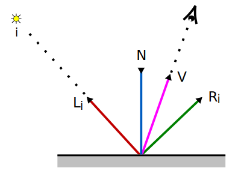

# 9. Ray Tracing: Modelo de Iluminación

_30-11-2005_ _Juan Mellado_

Un modelo de iluminación es el conjunto de cálculos que realiza un sistema de _Ray Tracing_ para obtener el color concreto que le corresponde a un punto de intersección entre un rayo y un objeto.

Un modelo de iluminación normalmente utiliza como parámetros de entrada las características físicas de los materiales de los que están hechos los objetos, las luces presentes en la escena, los mecanismos de interacción entre objetos y luces, y aplica todos estos elementos en una ecuación que genera como salida un color concreto.

Este artículo presenta un sencillo modelo de iluminación, basado en el modelo de iluminación original propuesto por Whitted, con el que se popularizó el uso de la técnica de _Ray Tracing_.

## 9.1. Modelo de Iluminación

En el modelo de iluminación propuesto, el color de un punto de un objeto se calcula en base a la luz que recibe directamente dicho objeto procedente de las fuentes, la luz que le llega indirectamente resultante de la reflexión y refracción en otros objetos de la escena, y la luz que emite el propio objeto, según la siguiente expresión:

Color = Aportación de la Reflexión Difusa de la Luz Ambiental
  
&nbsp;&nbsp;\+ Aportación de la Reflexión Difusa y Especular de las Fuentes sobre el Objeto

&nbsp;&nbsp;\+ Aportación de la Reflexión Especular en otros Objetos

&nbsp;&nbsp;\+ Aportación de la Transmisión Especular en otros Objetos

&nbsp;&nbsp;\+ Aportación de la Luz Emitida por el propio Objeto

Es decir, el color de un punto es la suma de las distintas aportaciones de color resultantes de los fenómenos que se producen sobre él. En primer lugar, la reflexión difusa de la luz ambiental, que se supone constante en todos los puntos de la escena. En segundo lugar, el resultado de calcular las aportaciones consecuencia de los fenómenos de reflexión difusa y especular sobre el propio objeto. En tercer y cuarto lugar, las aportaciones debidas a los fenómenos de reflexión y transmisión especular que se producen en otros objetos, que provocan la llegada de luz de forma indirecta. Y por último, la intensidad de la luz que emite el propio objeto.

La expresión anterior puede reescribirse como una larga ecuación algebráica, de forma que para un punto $Q$ dado, se obtenga la intensidad del color $I$ en dicho punto:

$I(Q) = k_a I_a C_a$

$+ \displaystyle\sum_{i=1}^{m} f_{aten}(Q)\{i\} \Big(k_d I_d\{i\} (N \cdot L\{i\}) C_d + k_s I_s\{i\} (V \cdot R\{i\})^n C_s\Big)$

$+ k_r I_r$

$+ k_t I_t$

$+ C_e$

Donde:

- $C_a$: Aportación de Color del Objeto a la Reflexión Difusa de Luz Ambiental

- $C_d$: Color Reflejado Difusamente por el Objeto

- $C_s$: Color Reflejado Especularmente por el Objeto

- $C_e$: Color Emitido por el Objeto

- $k_a$: Constante de Reflexión Difusa de Luz Ambiental del Objeto

- $k_d$: Constante de Reflexión Difusa del Objeto

- $k_s$: Constante de Reflexión Especular del Objeto

- $n$: Factor de Atenuación de Reflexión Especular del Objeto

- $k_r$: Constante de Reflexión Especular Global del Objeto

- $k_t$: Constante de Transmisión Especular Global del Objeto

- $I_a$: Intensidad de la Luz Ambiental

- $I_r$: Intensidad resultante de la Reflexión Especular en otros Objetos

- $I_t$: Intensidad resultante de la Transmisión Especular en otros Objetos

- $N$: Vector unitario Normal al Punto

- $V$: Vector unitario que une el Punto con la Posición del Observador

- $m$: Número de Luces presentes en la Escena

- $I_d\{i\}$: Color Difuso Emitido por la Fuente $i$

- $I_s\{i\}$: Color Especular Emitido por la Fuente $i$

- $f_{aten}(Q)\{i\}$: Factor de Atenuación de la Fuente $i$ en el punto $Q$

- $L\{i\}$: Vector unitario que une el Punto con la Posición de la Fuente $i$

- $R\{i\}$: Vector unitario Dirección de Reflexión Especular

En las definiciones dadas, los términos color e intensidad se utilizan como sinónimos. Aunque prevalece el uso de la palabra color para referirse a la tonalidad de un objeto, porque se suele considerar una característica estática, y la palabra intensidad para referirse a la tonalidad de una fuente de luz, porque se suele considerar dinámica al variar con la distancia. En cualquier caso, no es más que una cuestión de nomenclatura, son simplemente tuplas RGBA.

## 9.2. Materiales

De la forma expuesta, caracterizar el comportamiento de la superficie de un objeto con respecto a la luz requiere de al menos la introducción de 4 colores y 6 constantes. Para evitar la repetición de los mismos parámetros en objetos con las mismas propiedades, los valores se suelen agrupar en estructuras denominadas "materiales". De forma que varios objetos pueden compartir un mismo material, simplificando el sistema.

## 9.3. Aportación de la Luz Ambiental

La aportación de la luz ambiental al color de un objeto en un punto es el resultado de escalar el color reflejado difusamente de manera uniforme por el objeto por la intensidad de la luz ambiente:

$k_a I_a C_a$

La constante $k_a$ es un valor entre $0$ y $1$, que puede tomar valor $0$ por defecto. La intensidad de la luz ambiente $I_a$ y el color $C_a$ son tuplas RGBA, con valor $(0, 0, 0, 0)$ por defecto.

## 9.4. Aportación de las Fuentes de Luz

Si entre el punto y las fuentes de luz no hay objetos que se interpongan, y el punto se encuentra en la dirección de emisión de las fuentes, entonces las fuentes aportan intensidad directamente al punto.

La intensidad total aportada por las fuentes es la suma de la intensidad aportada individualmente por cada fuente, considerando los fenómenos de reflexión difusa y especular que se producen sobre la superficie del objeto como consecuencia de los rayos de luz incidentes:

$\displaystyle \sum_{i=1}^m f_{aten}(Q)\{i\} \Big(k_d I_d\{i\} (N \cdot L\{i\}) C_d + k_s I_s\{i\} (V \cdot R\{i\})^n C_s \Big)$

En la expresión se distinguen tres términos. El primero es la función de atenuación de la intensidad de la fuente $i$, $f{aten}(Q)\{i\}$, que escala a la suma de los otros dos.

El segundo término es el aporte debido a la reflexión difusa sobre el objeto del rayo de luz proveniente de la fuente $i$. Las constantes escalan los colores difusos del objeto y la fuente, y los hacen proporcionales al coseno del ángulo que forman la normal $N$ y el rayo incidente $L\{i\}$.

El tercer término es el aporte debido a la reflexión especular sobre el objeto del rayo de luz proveniente de la fuente $i$. Las constantes escalan los colores especulares del objeto y la fuente, y los hacen proporcionales al coseno del ángulo que forman la dirección $V$ en la que se encuentra el observador respecto al punto, y la dirección del rayo reflejado especularmente $R\{i\}$. La constante $n$ del exponente controla el brillo.

Nótese que la reflexión especular se hace depender de la posición del observador, por lo que los reflejos sobre las superficies, característicos de este tipo de fenómeno, dependerán de la posición desde la que se observe el objeto. Cuanto más parecidos sean $V$ y $R\{i\}$ mayor será el coseno del ángulo que formen ambos, y mayor la aportación de la componente especular al resultado final.

Las constantes $k_d$ y $k_s$ son valores entre $0$ y $1$, la suma de ambos no debería superar la unidad, y pueden tomar valor $0$ por defecto. La constante de reflexión especular $n$ puede tomar un valor positivo mayor o igual que cero, con cero por defecto. Los colores $I_d\{i\}$, $I_s\{i\}$, $C_d$ y $C_s$ son tuplas RGBA, con valor $(0, 0, 0, 0)$ por defecto.

## 9.5. Aportación de la Luz Procedente de Otros Objetos

La aportación de luz procedente de otros objetos se corresponde con el tercer y cuarto término de la ecuación de nuestro modelo de iluminación:

$k_r I_r$

$k_t I_t$

El primer término representa la aportación debida a la intensidad que llega desde la dirección de reflexión, y el segundo término la aportación debida a la intensidad que llega desde la dirección de transmisión. Es decir, cuando se estudia el color de un punto, no sólo se considera la interacción directa con las fuentes, sino que se analiza también la cantidad de luz que recibe el objeto proveniente de otros objetos. Esto es lo que permite representar superficies tales como espejos o cristales.

Para llevar a cabo el análisis de la reflexión, se parte del vector dirección que une el punto con el observador, y se traza un rayo en la dirección de reflexión especular de dicho vector. Es decir, en vez de partir de una fuente y trazar un rayo de luz para ver si al reflejarse alcanza al observador, se recorre el camino inverso. Se parte del observador y se busca la fuente.

Si el rayo reflejado alcanza un objeto se vuelve a empezar el proceso, aplicando el modelo en el nuevo punto y lanzando un nuevo rayo en la nueva dirección de reflexión especular. Y así sucesivamente, en un proceso claramente recursivo, hasta que la aportación de color no sea significativa. Esta técnica se conoce como "_traza de rayos hacia atrás_", y se dedicará un artículo posterior completo para exponerla en mayor detalle.

En la imagen puede verse como un rayo parte del observador, alcanza la esfera roja, que se supone reflectante, y se genera el rayo _R1_ en la dirección de reflexión especular. El rayo alcanza la esfera verde, que también se supone reflectante, y se genera el rayo _R2_ en la nueva dirección de reflexión especular. Como consecuencia de todo este proceso, el punto al que mira el observador no será completamente rojo, sino que estará teñido de verde.

El estudio que se realiza de la transmisión es idéntico al de reflexión, la única diferencia es que se sigue la dirección de transmisión especular en vez de la de reflexión.

Las constantes $k_r$ y $k_t$ escalan los valores de las intensidades, y pueden tomar valor 0 por defecto. En su definición reciben el calificativo de "_globales_" en la medida que al conjunto de fenómenos que rigen la intensidad aportada al objeto de forma indirecta se conoce como "_iluminación global_", mientras que la aportada directamente por las fuentes de luz se conoce como "_iluminación local_".

Las intensidades $I_r$ e $I_t$ son tuplas RGBA, y no toman valores por defecto, ya que son el resultado de evaluar la intensidad de la luz en la dirección de reflexión y transmisión.

## 9.6. Aportación de la Luz Emitida por el propio Objeto

Aunque no es frecuente, algunos objetos pueden llegar a emitir una luz propia. De forma general se considera que dicha luz es emitida de manera uniforme por toda la superficie, en todas las direcciones, con una intensidad constante. De manera que bajo tales circunstancias el cálculo de dicha aportación es simple, basta con añadir al color total resultante el color de la luz emitida por el objeto:

$C_e$

La intensidad de la luz emitida, $C_e$, es una tupla RGBA con valor $(0, 0, 0, 0)$ por defecto.
