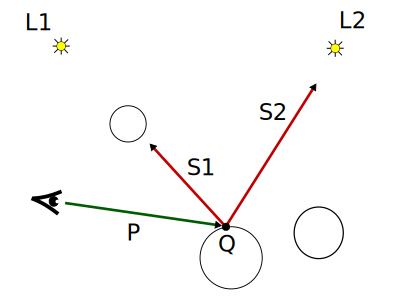
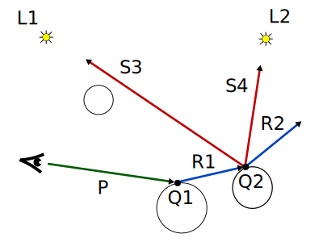

# 10. Ray Tracing: Traza de Rayos Hacia Atrás

_08-12-2005_ _Juan Mellado_

Explicación en detalle del algoritmo de "_traza de rayos hacia atrás_" utilizado por los sistemas de _Ray Tracing_ para obtener el origen de los rayos que alcanzan al observador y calcular la intensidad de la luz que transportan.

## 10.1. Traza de Rayos Hacia Atrás

Las imágenes generadas por un sistema de _Ray Tracing_ son matrices de puntos, donde cada punto representa un color, ya sea el color de un objeto intersectado por un rayo en dicho punto, o un color de fondo por defecto.

Una posible forma de calcular el color en cada punto consistiría en trazar rayos en todas las direcciones desde todas las fuentes, simular los fenómenos de reflexión y transmisión contra los objetos, y ver cual de los rayos resultantes alcanzan al observador. El problema de esta solución es el alto coste que representaría trazar todos los rayos, y su ineficiencia, ya que la mayor parte de los rayos emitidos por las fuentes no alcanzan al observador y no aportan nada a la escena observada. Por ello, la solución normalmente adoptada consiste en seguir el camino contrario, es decir, trazar rayos que parten del observador en busca de las fuentes. Este sistema se conoce como "_traza de rayos hacia atrás_". Y tiene la ventaja de que minimiza el número de rayos a trazar, pues se centra sólo en los rayos que alcanzan al observador, que son precisamente los que aportan algo a la escena observada.

El color concreto de un punto es el resultado de aplicar un modelo de iluminación a dicho punto, de forma que el color obtenido sea igual a la suma de las intensidades de todos los rayos que recaen en él y que alcanzan al observador.

## 10.2.Tipos de Rayos

En un sistema de _Ray Tracing_ que utilice traza de rayos hacia atrás pueden distinguirse cuatro tipos de rayos:

- Rayos Primarios

- Rayos de Sombra

- Rayos Reflejados

- Rayos Transmitidos

En la práctica todos estos tipos rayos son iguales, es decir, tienen un punto origen y un vector dirección normalizado. Lo que varía de un tipo a otro es la interpretación que se le da a cada uno de ellos, y la forma en la que se obtiene su origen y dirección. En las siguientes secciones se verá como determinar el origen y dirección para cada tipo de rayo.

## 10.3. Rayos Primarios

Los rayos primarios son los primeros en ser lanzados, se corresponden con los rayos que parten del observador y atraviesan el centro de los pixels del plano de proyección. Se utilizan para comprobar si se produce intersección con algún objeto de la escena. Este tipo de rayos fueron objeto de estudio en el artículo dedicado al barrido del plano de proyección.

Si para un pixel no se produce intersección el sistema asigna a dicho pixel el color de fondo por defecto y continúa con otro pixel. Por el contrario, si se produce intersección, se lanzan rayos de sombra desde el punto de intersección y se calcula el color del punto aplicando un modelo de iluminación.

## 10.4. Rayos de Sombra

Los rayos de sombra, también llamados detectores de sombra, son rayos que parten del punto de intersección de los rayos primarios con los objetos y marchan en dirección a cada una de las fuentes de luz presentes en el sistema.

Si un rayo en su camino hacia una fuente de luz se encuentra con un objeto, el punto se considera en sombra con respecto a esa fuente, y la aportación directa de esa fuente se considera nula. Por el contrario, si el rayo alcanza la fuente sin intersectar ningún objeto, entonces se calcula la aportación de dicha fuente mediante el cálculo de los fenómenos de reflexión difusa y especular sobre la superficie.

En la imagen se observa como un rayo primario _P_, que parte del observador, intersecta una esfera en el punto $Q$. A partir de dicho punto de intersección se trazan dos rayos de sombra, uno por fuente. El rayo _S1_, que se dirige a la fuente 1, es interrumpido por otra esfera, por lo que el punto se considera en sombra con respecto a la fuente 1. El otro rayo de sombra, _S2_, se dirige y alcanza sin problemas la fuente 2, por lo que es preciso calcular el aporte de color de la fuente debido a la reflexión difusa y especular.

El origen de todos los rayos de sombra es el punto de intersección $Q$, y la dirección de avance hacia una fuente $i$ es el vector normalizado $S\{i\}$ que une el punto $Q$ con el origen de la fuente $L\{i\}$:

$S\{i\} = \cfrac{L\{i\} - Q}{|L\{i\} - Q|}$

## 10.5. Rayos Reflejados

Los rayos reflejados tienen su origen en el punto de intersección de los rayos primarios con los objetos, y su dirección es la dirección de reflexión especular de los rayos primarios. Su propósito es el de obtener la aportación de color debida a otros objetos. Es decir, si el punto intersectado pertenece a una superficie reflectante entonces reflejará la luz proveniente de otros objetos en la dirección de reflexión.

Si el rayo reflejado no intersecta ningún objeto entonces no aporta intensidad. Por el contrario, los rayos que intersectan un objeto aportan la intensidad del objeto intersectado. De esta forma, los rayos reflejados se convierten en rayos primarios si intersectan un objeto, ya que es necesario volver a trazar rayos de sombra, reflejados, y transmitidos, en el objeto intersectado para obtener la intensidad aportada por dicho objeto.

La imagen muestra como un rayo primario _P_ alcanza la superficie de una esfera reflectante en el punto $Q1$. A partir de dicho punto se traza un nuevo rayo $R1$, resultado de la reflexión del rayo primario incidente. Como este nuevo rayo intersecta a otra esfera en el punto $Q2$, entonces se repite el proceso desde el principio, trazando dos nuevos rayos de sombra, _S3_ y _S4_, y un nuevo rayo reflejado, _R2_.

El origen del rayo reflejado es el punto $Q$, y su dirección de avance el vector normalizado $R$ resultante de reflejar especularmente el rayo primario incidente:

$R = I - 2 (I \cdot N) N$

Siendo $I$ el vector unitario dirección del rayo primario incidente, y $N$ la normal al objeto en el punto de intersección.

Recuérdese del artículo dedicado al estudio de los mecanismos de transporte de la luz, que el vector $R$ resultante es unitario.

## 10.6. Rayos Transmitidos

El propósito de los rayos transmitidos es, en esencia, el mismo que el de los reflejados. Tienen su origen en el punto de intersección de los rayos primarios con los objetos y su dirección es la dirección de transmisión especular de los rayos primarios.

El origen del rayo transmitido es el punto $Q$, y su dirección de avance el vector normalizado $T$ resultante de refractar especularmente el rayo primario incidente:

$T = \cfrac{I}{n_{21}} + \Bigg( \cfrac{-I \cdot N}{n_{21}} - \sqrt{1 + \cfrac{(-I \cdot N)^2 - 1} {n_{21}^2}} \Bigg) N$

$I$ el vector unitario dirección del rayo primario incidente, $N$ la normal al objeto en el punto de intersección, y $n_{21}$ el índice de refracción del medio del rayo incidente con respecto al medio del objeto.

Es interesante recordar del artículo dedicado al estudio de los mecanismos de transporte de la luz, que el vector $T$ resultante es unitario, y que si el discriminante de la raíz cuadrada es negativo entonces no se produce refracción porque el ángulo de entrada supera el ángulo crítico de la superficie.

## 10.7. Trazador de Rayos

De lo expuesto en apartados anteriores debe ser claro que el proceso de traza de rayos hacia atrás es un proceso recursivo. Se comienza trazando un rayo primario, y a partir de él un rayo reflejado (y transmitido) que se convierte a su vez en primario, y vuelta a empezar.

El resultado de todo el proceso puede verse como la construcción de un árbol de rayos, donde el nodo raíz es un rayo primario que intersecta un objeto, a partir del cual se trazan rayos de sombra, y los nodos hijos son los rayos reflejados y transmitidos. De forma que el color resultante es la suma de las intensidades calculadas en todos los nodos del árbol.

Debido a que se pueden diseñar escenas en las que el número de rayos a generar sea extremadamente elevado, se suele limitar la profundidad del árbol con dos técnicas. La primera técnica sencillamente limita la profundidad del árbol a un número determinado de niveles, que se introduce como un parámetro al sistema. La segunda técnica limita la profundidad en función de la intensidad de los rayos generados; si el aporte de un rayo no supera un umbral mínimo entonces se detiene la construcción de esa rama del árbol.

## 10.8. Pseudocódigo

Las líneas que se muestran a continuación representan un pseudocódigo bastante explicativo de los pasos a realizar para la construcción del árbol de rayos y la aplicación del modelo de iluminación:

Trazador():

- Por cada Pixel (i, j) de la Imagen a generar:

  - Calcular el Rayo que parte del Observador y atraviesa el Pixel (i, j)

  - Color = TrazarRayoPrimario(Rayo, 1)

  - Asignar Color al Pixel (i, j)

TrazarRayoPrimario(Rayo, Profundidad) retorna Color:

- Encontrar la Intersección entre el Rayo y los Objetos más cercana al Origen del Rayo

  - Si no se produce Intersección:

    - Retornar Color de Fondo por Defecto

  - en caso contrario:

    - Calcular la Normal del Objeto en el Punto de Intersección

    - Retornar TrazarRayosSecundarios(Rayo, Profundidad, Objeto, Punto, Normal)

TrazarRayosSecundarios(Rayo, Profundidad, Objeto, Punto, Normal) retorna Color:

- Color = Aportación de la Luz Ambiente

- Por cada Fuente de Luz i presente en la Escena:

  - Calcular la dirección del Rayo de Sombra a la luz i

  - Encontrar la Intersección entre el Rayo de Sombra y los Objetos más cercana al Punto

  - Si no se produce Intersección:

    Color += Aportación de la Reflexión Difusa debida a la fuente i

    Color += Aportación de la Reflexión Especular debida a la fuente i

  - en caso contrario, si la Profundidad es menor o igual que la máxima permitida:

    - Si el Objeto es reflectante:

      - Calcular la dirección del Rayo Reflejado

      - Color Reflejado = TrazarRayoPrimario(Rayo Reflejado, Profundidad + 1)

      - Color += Constante de Reflexión Global del Objeto * Color Reflejado

    - Si el Objeto es transparente:

      - Calcular la dirección del Rayo Transmitido

      - Si no se produce reflexión total interna:

        - Color Transmitido = TrazarRayoPrimario(Rayo Transmitido, Profundidad + 1)

        - Color += Constante de Transmisión Global del Objeto * Color Transmitido

  - Color += Aportación de la Luz Emitida por el Objeto

  - Retornar Color
