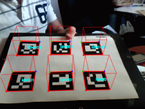

# 1. Realidad Aumentada (1/7)

_23-05-2011_ _Juan Mellado_

Las aplicaciones de _Realidad Aumentada_ se han convertido en algo corriente hoy en día, sobre todo por el hecho de que prácticamente todos los dispositivos electrónicos que salen al mercado tienen algún tipo de cámara y cierta capacidad de proceso. Las demostraciones con esta tecnología suelen ser muy llamativas, y hacía tiempo que me picaba la curiosidad por conocer el detalle de la cadena completa de pasos concretos que se habían de seguir para hacerlas funcionar.

Al final he dedicado estas últimas semanas a leer un montón de documentación, mirar bastante código, y he acabado desarrollando una pequeña librería en JavaScript que casi implementa un sistema de Realidad Aumentada completo. Y digo "casi" porque me he encontrado con dos problemas que he dejado abiertos para resolverlos más adelante, el primero por una cuestión de índole puramente técnica, y el segundo por falta de talento. Pero vayamos por partes.

Me he centrado en la idea de averiguar como funciona un sistema ya implementado, en vez de estar reinventado la rueda. Quería que no fuese un sistema muy grande, ya que a medida que las aplicaciones empiezan a crecer puede resultar difícil entender su filosofía de funcionamiento, sobre todo cuando no se ha trabajado en la elaboración de las mismas. De hecho, a mi a veces me gusta descargarme las versiones más antiguas de los repositorios públicos en vez de las más recientes.

Otro requisito que quería que cumpliese el sistema es que utilizara los clásicos "marcadores", que son esas tarjetas tan características que llevan dibujadas algún motivo en blanco y negro. Y aunque por lo que he podido leer hay bastante interés en la Realidad Aumentada sin marcadores, a mi eso de las "tarjetitas" me llamó mucho la atención en su día y era algo que antes o después sabía que acabaría abordando, y esta era mi oportunidad.



Finalmente he optado por ArUco, una librería bastante pequeña y con un código bastante fácil de seguir, ya que prácticamente todo el grueso del proceso está desarrollado en una única función. Un código con un estilo muy "académico" en realidad, y yo me entiendo cuando digo esto. Como curiosidad, comentar que es un desarrollo del grupo de investigación "_Aplicaciones de la Visión Artificial_" (AVA) de la Universidad de Córdoba (UCO). De aquí al lado, vamos. (La imagen está cogida de su _web_)

- [https://www.uco.es/investiga/grupos/ava/portfolio/aruco/](https://www.uco.es/investiga/grupos/ava/portfolio/aruco/)

La librería es de código abierto, bajo licencia BSD, y está escrita originalmente en C++ apoyándose en OpenCV, una librería esta última con mucha solera y toda una referencia dentro del mundo de los desarrollos de todo tipo de aplicaciones de visión artificial. Después de haberme pasado unas cuantas horas buceando por su código he llegado a apreciar la cantidad enorme de trabajo que han debido invertir en ella.

Lo que más me enganchó de ArUco fue que entendí bastante bien la sencilla descripción que dan en la _web_ acerca del funcionamiento de la misma. Sobre todo acerca del proceso de detección de los marcadores. Es la parte más "algorítmica", así que supongo que por eso me sentí más cómodo con ella y me animó a ir implementando paso a paso mi propia versión de la librería.

A grandes rasgos, he acabado dividiendo el proceso en cuatro bloques.

## 1.1. Captura de Vídeo

Estoy trabajando con un PC de sobremesa, y lo lógico sería capturar vídeo desde una _webcam_, pero resulta que a día de hoy eso es algo que no se puede hacer de forma nativa en un navegador utilizando única y exclusivamente JavaScript. Aunque se puede hacer desde Flash. Y de hecho, una de las librerías más populares para la creación de aplicaciones de Realidad Aumentada es una conversión a Flash de otra librería escrita originalmente en C.

Según he podido averiguar, dentro del estándar HTML5 están trabajando en exponer la función ```getUserMedia``` en JavaScript, que dará acceso a la _webcam_ y cualquier otro tipo de dispositivo de vídeo o audio conectado al PC (tras la correspondiente autorización por parte del usuario). Pero todavía falta un tiempo para que los navegadores la implementen, así que he dejado aparcado de momento este tema del vídeo y me he centrado en procesar imágenes estáticas individuales.

## 1.2. Extracción de Candidatos

Esta parte es en la que más tiempo he invertido. Para explicarla en pocas palabras bastaría con decir que consiste en analizar una imagen a la busca de cuadriláteros. Para explicarla con un poco más de detalle hay que explayarse en el cómo y porqué se realizan los siguientes procesos:

- Conversión a escala de grises (_Grayscale_)
- Eliminación de ruidos (_Gaussian Blur_)
- Umbralización (_Adaptive Thresholding_)
- Extracción de contornos (_Suzuki_)
- Aproximación a polígonos (_Douglas-Peucker_)
- Transformación de perspectiva (_Homography_)
- Umbralización (_Otsu_)

Mi idea es detallar estos pasos en artículos posteriores, sobre todo para que me sirvan como recordatorio a mi mismo.

## 1.3. Identificación de Marcadores

Un vez extraídos una serie de cuadriláteros candidatos hay que averiguar si alguno de ellos es un marcador. Para ello se comprueba uno a uno si contienen una imagen válida reconocible como marcador.

En el caso de ArUco, no se utiliza una imagen libre cualquiera, sino un código binario dibujado en forma de una matriz de cuadrados de 7x7. Un ```1``` se representa con un cuadrado negro y un ```0``` con un cuadrado blanco. Intuitivamente debería resultar evidente que este tipo de códigos son más fáciles de identificar que una imagen libre cualquiera, además de que permiten añadir de una forma bastante natural _bits_ de paridad para la comprobación de errores. De hecho, ArUco trata los marcadores que es capaz de identificar como un código _Hamming_, aunque bastante modificado para sus propósitos concretos.

Una vez entendida esta parte no me ha llamado tanto la atención, y he hecho un "_port_" casi directo del original a JavaScript. De hecho, cuando haga una limpieza de mi código, me gustaría tratar este proceso de forma independiente, como una función que se pase como parámetro, que admita un cuadrilátero candidato, y que decida si lo reconoce o no como marcador.

## 1.4. Traslación a Tres Dimensiones

Una vez identificado un marcador, lo más normal es calcular a continuación la posición que ocupa en el espacio con respecto a la cámara. O lo que es igual, la posición de la cámara con respecto al marcador. De esta forma se puede hacer eso tan característico de dibujar un modelo 3D sobre el marcador, consiguiendo además que se gire, acerque o aleje según se mueva el marcado o la cámara.

El problema es que esto no es algo inmediato. De hecho, el cálculo a realizar depende de las características físicas concretas de la cámara que se esté utilizando, pues hay toda una serie de parámetros intrínsecos como son el centro óptico real del sensor, las distancias focales en cada de unos de los ejes, y los factores de distorsión radial. Y esos parámetros, o se conocen, o es necesario obligar al usuario a que los obtenga de antemano de forma manual mediante algún programa que implemente un proceso de calibración.

Yo me había hecho la idea de que esto era más automático, pero parece que no. Esto de los parámetros y el proceso de calibración me ha matado bastante. Y de hecho no tengo ningún reparo es decir que además toda la matemática implicada ha conseguido liarme y no he conseguido sacar nada en claro. Se ha convertido en mi particular "_pons asinorum_".

Después de rebuscar entre un montón de documentación y unas cuantas implementaciones he decidido que este problema es lo bastante grande por si mismo para mi como para sacarlo aparte y tratarlo como una "mini-librería" con entidad propia. Trataré de retomarlo más adelante.

Para terminar, me gustaría dejar que claro que lo que describo en esta serie de artículos es una forma concreta de implementar las bases de un sistema de Realidad Aumentada. Pero no es ni mucho menos la única forma de hacerlo, ni probablemente la más eficiente. ArUco es un desarrollo totalmente ajeno a mi, pero cualquier error o imprecisión sobre ella en estos artículos son sólo atribuibles a mi persona.
