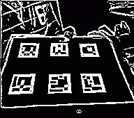
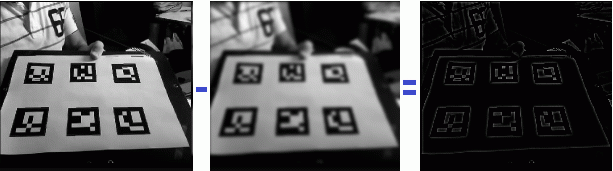

# 3. Realidad Aumentada (3/7)

_25-05-2011_ _Juan Mellado_

El tercer paso a la caza y captura de cuadriláteros que puedan contener marcadores es la _umbralización_ (menuda palabreja), que consiste en definir un valor umbral y compararlo con cada uno de los _pixels_ de la imagen. A los _pixels_ que estén por debajo del umbral se les asigna un valor, y a los que estén por encima otro. De esta forma se divide toda la población de valores en tan sólo dos grupos, reduciendo considerablemente la complejidad de la información a analizar.

## 3.1. Umbralización (_Adaptive Thresholding_)

Aplicar un valor umbral a una imagen presenta dos dificultades. La primera es decidir que valor concreto tomar, y la segunda es conseguir que dicho valor sirva para cualquier imagen posible que pueda llegar desde la _webcam_. Si los _pixels_ tienen un valor que se encuentra dentro del rango que va de 0 a 255, ¿cual es el mejor valor para el umbral? ¿128, que está en la mitad del rango? ¿Y por qué no 57?

Pues resulta que no se puede decidir de antemano sin echarle un vistazo antes a la imagen, ya que el mayor inconveniente que presenta este procedimiento es que es muy sensible a la iluminación. Con poca iluminación los _pixels_ tienden a tomar valores bajos, oscuros, cercanos al 0, y con mucha iluminación toman valores altos, claros, cercanos al 255. Y peor es el caso cuando la iluminación varía dentro de la propia imagen, con algunas zonas muy oscuras y otras muy claras.

Afortunadamente se han desarrollado soluciones distintas para tratar de resolver este problema del _thresholding_ básico. En el código fuente de ArUco, la librería que estoy tomando como referencia para la implementación, hay constancia de pruebas con tres algoritmos distintos. Incluso en uno de los comentarios se señala que un método llamado de _Canny_ normalmente debería ser el que mejor resultado ofreciera, pero que después de probarlo se encontraron con problemas debidos a que se generaban huecos no deseados en los contornos de los cuadriláteros que hacían imposible su correcta detección posterior.

Finalmente se decidieron por el _Adaptive Thresholding_. Este algoritmo no aplica el umbral de una manera global sobre todos los _pixels_ de la imagen, sino que tiene en cuenta las variaciones en la iluminación de una manera local para cada _pixel_ de forma individual. Algo que consigue tomando el valor original de cada _pixel_ de la imagen, y comparándolo con otro valor calculado que sea algún tipo de media de los valores de los _pixels_ que tiene alrededor. En las zonas homogéneas el valor del _pixel_ se asemejará mucho a la de la media de sus vecinos, mientras que en las zonas de transición abruptas, en los "bordes", se diferenciará de dicha media.



ArUco utiliza la función ```adaptiveThreshold``` de OpenCV, pasándole la imagen en escala de grises como imagen original, e indicándole que utilice un filtro _gaussiano_ para calcular los valores medios. Y de igual forma, en mi implementación en JavaScript, como expliqué en el artículo anterior, ya tengo calculadas una imagen en escala de grises y otra con un filtro _gaussiano_, por lo que puedo imitar el funcionamiento de dicha función. Al final, todo lo que hay que hacer es restar a la primera imagen la segunda y aplicar el umbral sobre la imagen resultante:



Un momento, ¿"_aplicar el umbral_"? ¿Pero qué valor finalmente? ¿El algoritmo no calcula el valor umbral? Pues no, lo único que ofrece es una imagen más propicia para realizar el _thresholding_ básico sin que se vea afectado por las variaciones de iluminación de la imagen original. ArUco utiliza un valor fijo de 7 como umbral. Puede parecer un poco arbitrario, pero da buen resultado.

A los pixels que están por debajo del umbral se les asigna un 1, y a los que están por encima un 0. De esta forma se obtiene una imagen "_binaria_", en el sentido de que sólo tiene dos valores (blanco y negro), reduciendo la cantidad de información a tratar a tan sólo un 12,5% (un octavo) de la que se encuentra presente en la imagen en escala de grises.

Algo que sería interesante probar en un futuro es utilizar otro tipo de filtros más económicos de calcular que el _gaussiano_, como una media ordinaria por ejemplo. O realizar una implementación en un _shader_ con WebGL.
