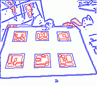

# 4. Realidad Aumentada (4/7)

_26-05-2011_ _Juan Mellado_

El siguiente paso del proceso es la detección de contornos, una operación un tanto distinta a las anteriores por dos motivos principales. El primero es que no consiste en iterar aplicando una misma función de forma monótona sobre todos los _pixels_ de la imagen. Y el segundo es que el resultado que se obtiene no es una nueva imagen, sino un colección de conjuntos de puntos sobre la imagen.

## 4.1. Detección de Contornos (_Suzuki_)

Para este paso se parte de la imagen resultante del _Adaptive Thresholding_ del paso anterior. Es decir, de una imagen que tan solo consta de _pixels_ con valor cero o uno. Sobre ella se aplica un algoritmo que la barre, empezando por su esquina superior izquierda, a la busca de un primer _pixel_ a uno, y que cuando lo encuentra es capaz de seguir la cadena de _pixels_ con valor uno que se encuentran unidos a él hasta volver al pixel de partida. Esa cadena de _pixels_ a uno encontrados se denomina contorno. Y es más, el algoritmo es capaz de encontrar todos los contornos presentes en la imagen, ya que cuando termina con uno empieza de nuevo el proceso hasta asegurarse de haber barrido la imagen por completo.



El algoritmo es bastante notable, ya que no sólo es capaz de encontrar los contornos exteriores, sino también los interiores a otros, y retornarlos clasificados jerárquicamente. En la imagen que puesto en este post he utilizado colores distintos para los contornos en función de que sean exteriores o interiores, y que se aprecie mejor el increíble trabajo que es capaz de hacer. Por cierto, las imágenes que estoy poniendo son el resultado de la ejecución de mi librería en JavaScript, dibujando directamente en un _canvas_ de HTML5.

ArUco utiliza la función ```findContours``` de OpenCV que implementa este algoritmo. En la documentación, como toda referencia de implementación, se refiere al "_paper_" original donde sus autores lo describen en detalle: "_Topological structural analysis of digitized binary images by border following_" _Satoshi Suzuki and Keiichi Abe_. [suzuki85]

No obstante, en la práctica existe toda una familia de algoritmos de extracción de contornos que recorren _pixels_ vecinos rotando a izquierda o derecha dependiendo del valor del _pixel_ en curso. Lo que diferencia a este es la forma en que etiqueta los _pixels_ visitados para catalogarlos y clasificarlos. El proceso completo es un poco largo de explicar, pero sus pautas generales no son demasiado complejas de entender. Básicamente hay un contador de contornos encontrados y un _buffer_ de _pixels_ recorridos. El contador se inicializa a cero y el _buffer_ con una copia de la imagen original. Se barre el _buffer_ de arriba abajo y de izquierda a derecha. Una transición de un _pixel_ 0 a otro 1 indica que se ha detectado un borde exterior, momento en que se suma uno al contador de contornos encontrados y se buscan todos los _pixels_ 1 vecinos del encontrado. Si el _pixel_ no tiene vecinos a 1 se cambia el valor del _pixel_ por el del contador con signo contrario y se empieza otra vez con el siguiente _pixel_. En caso contrario se cambia el valor del _pixel_ por el del contador, excepto que su valor sea mayor que 1, lo que significa que ya ha sido visitado, y se continúa buscando vecinos a 1 hasta retornar al _pixel_ inicial. Una transición de un _pixel_ con valor igual o mayor que 1 a otro 0 indica que se ha detectado un borde interior, momento en que se repite el mismo proceso usado para los contornos exteriores.

El algoritmo presenta una pequeña dificultad en los bordes de la imagen, y para solventarlo presupone que la imagen está rodeada por los cuatro costados de _pixels_ con valor 0. Es decir, que el buffer que utiliza tiene una fila más por encima y por debajo, y una columna más a derecha e izquierda, que la imagen original.

La implementación del algoritmo en OpenCV es bastante eficiente y es la que he seguido, pero de un manera mucho más simplificada, eliminando una serie de parámetros que admite la función original y que permiten controlar como quiere que se devuelvan los contornos, o la coordenada del _pixel_ concreto a partir del cual se quiere empezar a buscar contornos dentro de la imagen. De hecho, esto está siendo una constante a lo largo de todo el desarrollo. OpenCV es una librería que ofrece funciones que admiten muchos _paths_ de ejecución distintos, y me estoy limitando a implementar sólo aquellos que estoy usando realmente.
