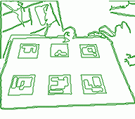
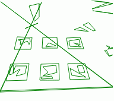
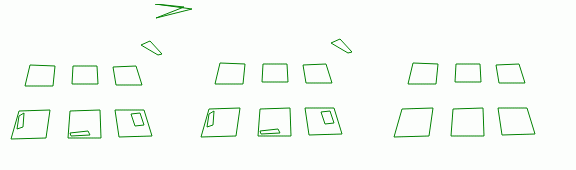
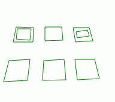
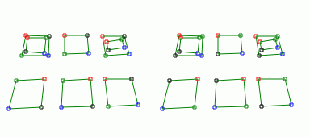

# 5. Realidad Aumentada (5/7)

_27-05-2011_ _Juan Mellado_

El siguiente eslabón de la cadena en la búsqueda de los cuadriláteros candidatos disminuye de forma drástica la información a procesar. Parte de los contornos encontrados en el paso anterior, los aproxima a polígonos, y los descarta rápidamente mediante una serie de decisiones muy sencillas e intuitivas.

## 5.1. Aproximación a Polígonos (_Douglas-Peucker_)

Los contornos de los que se parte para este paso son colecciones de puntos. Todos y cada uno de los _pixels_ que forman parte de ellos, ya que no se guardaron sólo las esquinas, sino cada _pixel_ individual encontrado. Esto permite tomar algunas decisiones tempranas, como por ejemplo descartar los contornos que no tengan un mínimo de puntos. Es decir, los más pequeños. ArUco descarta aquellos que no tengan al menos un 20% del ancho de la imagen. Es un número arbitrario que simplemente da buen resultado. En la primera imagen puede verse el resultado del descarte. Los contornos más pequeños, los _pixels_ aislados, han desaparecido.



Tratar los contornos como colecciones de puntos tiene sus ventajas, pero también sus inconvenientes. Por ejemplo, son difíciles de estudiar. Para solventar este problema se transportan a otro contexto, como es el de los polígonos, sobre el que existe mucha información y métodos disponibles para su análisis. ArUco utiliza la función ```approxPolyDP``` de OpenCV para convertir una colección de puntos en un polígono mediante el algoritmo de _Douglas-Peucker_.

Un buen ejemplo del propósito de este algoritmo es pensar en una bicicleta que registra su posición cada pocos metros con ayuda de un GPS. Si después de varios kilómetros consultamos la ruta completa que ha seguido, mirando todas las posiciones registradas por el GPS, esta parecerá bastante errática, con continuos pequeños giros a izquierda y derecha, cuando en realidad sabemos que su recorrido habrá consistido en ir de un punto A a otro B, pasando por una serie de puntos intermedios importantes. El algoritmo de _Douglas-Peucker_ lo que hace es suavizar esa línea errática, proporcionando una línea que se ajusta más al recorrido real sin perder los puntos intermedios importantes.



El algoritmo admite como entrada una lista de puntos y una distancia máxima permitida. Define un segmento que va desde el primer punto de la lista hasta el último, y calcula la distancia más corta que hay desde dicho segmento a todos y cada uno del resto de puntos de la lista. Si encuentra un punto a una distancia mayor que la máxima pasada como parámetro divide la lista y el segmento en dos, utilizando el punto encontrado como nuevo extremo. Y vuelve a empezar el proceso comprobando cada nueva lista contra cada nuevo segmento de forma individual, creando nuevas listas y segmentos si fuera necesario, de forma recursiva.

En la segunda imagen puede verse los polígonos resultantes de aplicar el algoritmo. Hay uno un poco "_feo_" que atraviesa la imagen. Puede parecer un error, pero en realidad no lo es. ArUco utiliza como distancia máxima para al algoritmo el 5% del número de puntos que tiene cada contorno de forma individual. El contorno "_feo_" tiene 2.218 puntos, por lo que distancia máxima permitida es de 110 _pixels_, lo que prácticamente descarta todos los puntos, excepto los más alejados.

La implementación que he hecho en JavaScript del algoritmo está tomada directamente del código de OpenCV, que incorpora un tratamiento específico para los contornos cerrados, e implementa la recursividad mediante un _array_ tratado como una pila.



En la tercera imagen se puede ver la ventaja de aproximar los contornos a polígonos. Por ejemplo, lo primero que puede hacerse es descartar los polígonos que no tengan cuatro lados, ya que recordemos que estamos buscando cuadriláteros. Aún así, algún polígono se puede escapar de la criba, como por ejemplo esa especie de triángulo degenerado de la parte superior derecha que también tiene cuatro lados. Afortunadamente también se puede descartar rápidamente quedándonos sólo con los polígonos convexos. Y aún así, hay pequeños polígonos aquí y allá. Pero también se pueden descartar rápidamente quedándonos sólo con aquellos que tengan un tamaño de lado mínimo. ArUco concretamente descarta todos aquellos cuyo lado mínimo no supere los 10 _pixels_ de largo. Como resultado de todos estos descartes se acaba teniendo seis candidatos, que además son los deseados.



Estos descartes son triviales de implementar. No obstante, ArUco incorpora un control adicional para un caso que puede llegar a darse, pero que durante el análisis de la imagen que estoy utilizando como referencia no ha sucedido. Debido a que en el paso previo se detectaron contornos tanto exteriores como interiores, puede ocurrir que se detecten dos cuadriláteros, uno dentro de otro, siendo necesario descartar el más interno. Para probar este caso he utilizado otra imagen prácticamente igual pero donde sí se reproducía esta situación.

Como se observa, hay dos cuadriláteros interiores que deberían descartarse. ArUco calcula la distancia media entre las esquinas de los polígonos y si encuentra dos que están muy cerca descarta el de menor perímetro, que necesariamente será el más interno. Entendiendo por "_muy cerca_" que se encuentren a menos de 10 _pixels_ de distancia.



Por último, indicar que esos dibujos con tantos colorines del final son el resultado de un paso previo necesario al cálculo de las distancias entre esquinas. Para que funcione correctamente el proceso, las esquinas tienen que estar ordenadas en el sentido contrario de las agujas del reloj. He utilizado los colores rojo-verde-azul-negro (RGBA) para indicar el orden antes y después del giro. Aunque yo los veo al revés.. eso del giro siempre me ha dado problemas. Y en cualquier caso, creo que para que el proceso de descarte fuera más eficaz sería necesario además comparar las esquinas partiendo de una referencia concreta común para los dos polígonos siendo comparados. Como por ejemplo partiendo de la esquina que se encuentre más arriba a la izquierda.
