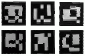
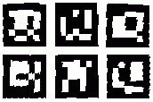

# 6. Realidad Aumentada (6/7)

_28-05-2011_ _Juan Mellado_

Este paso es el último en lo que a manipulación de imágenes se refiere. Admite como entrada la imagen en escala de grises creada en el primer paso, y los cuadriláteros candidatos encontrados en el último. Para cada cuadrilátero extrae la región de la imagen que cubre cada uno de ellos eliminando la transformación de perspectiva, es decir, la deformación que se produce en el marcador debido a la perspectiva.

## 6.1. Transformación de Perspectiva (_Homography_)

Cuando se toma una imagen de un marcador, y de hecho de cualquier objeto, se produce una deformación debido a la perspectiva. Los marcadores que son cuadrados pierden sus ángulos rectos y se convierten en cuadriláteros con lados más grandes que otros. El objetivo de ese paso es tratar de recuperar la imagen del marcador original. Es decir, superponer los cuadriláteros encontrados encima de la imagen original (en escala de grises), y proyectar la región de la imagen que cubren sobre un cuadrado, ya que esa es su forma original que se quiere restaurar.



A grandes rasgos, se trata de encontrar la operación que proyecte las cuatro esquinas de un cuadrilátero en las cuatro esquinas de un cuadrado. Y que además sirva para todos los puntos intermedios. Afortunadamente este es un procedimiento sobre el que existe mucha información, ya que es como el que se utiliza para aplicar texturas a los modelos tridimensionales, aunque en sentido contrario.

ArUco, la librería de realidad aumentada que estoy portando a JavaScript, utiliza dos funciones de OpenCV para este paso: ```getPerspectiveTransform``` y ```warpPerspective```. La primera calcula una matriz que multiplicada por un punto en el cuadrilátero origen devuelve un punto equivalente en el cuadrado destino. La segunda acepta una imagen, un cuadrilátero, una matriz de transformación, y retorna una nueva imagen del área cubierta por el cuadrilátero sobre la que se ha aplicado la matriz de transformación para eliminar la deformación debida a la perspectiva. El problema de estas dos funciones es que son demasiado complejas de portar directamente a JavaScript debido a que hacen uso de LAPACK, una librería matemática con la que resuelven el sistema de ecuaciones lineales necesario para calcular la transformación de perspectiva. Así que, aprovechando que estoy en un entorno mucho más controlado y menos genérico que al que tiene que enfrentarse OpenCV, he optado por una implementación mucho más liviana usando las ecuaciones de toda la vida expuestas por Paul Heckbert en su tesis ¿doctoral? titulada "_Fundamentals of Texture Mapping and Image Warping_". Este "_paper_" es un clásico, e incluso tiene un apéndice con código en C, mucho más sencillo de portar a JavaScript que el de OpenCV.

El resultado de este proceso es cada una de las figuras que he puesto en la primera imagen. Una para cada cuadrilátero candidato. ArUco utiliza un tamaño de 50x50 pixels para los cuadrados destino, aunque yo he preferido utilizar un tamaño de 49x49, ya que los marcadores son matrices de 7x7.

Para terminar, dos detalles acerca de la implementación. El primero es que en realidad se recorre el cuadrado y se calculan los puntos en el cuadrilátero, y no al revés, ya que es mucho más sencillo recorrer el cuadrado. Y el segundo es que no he implementado ningún tipo de interpolación, por lo que en cuanto se gira un poco la imagen aparecen los clásicos "_dientes de sierra_". Esto último no ocurre en ArUco, ya que que OpenCV utiliza interpolación bilineal para obtener una imagen mejor. En general, esta función de js-aruco es una de las más serias candidatas a ser modificadas y optimizadas.

## 6.2. Umbralización (_Otsu_)

Una vez obtenidas esas pequeñas imágenes del paso anterior hay que volver a comenzar el proceso de análisis por el principio. Es decir, aplicando un valor umbral que reduzca la cantidad de información a procesar. Por suerte, esta vez se pueden tomar decisiones de forma mucho menos subjetiva que al principio. El factor diferenciador está en el hecho de que los marcadores sólo tienen dos colores: blanco y negro, lo que permite automatizar el proceso de cálculo del valor umbral ideal.



El método de _Otsu_ se basa en el análisis del histograma de una imagen dada. Es decir, en el número de veces que aparece cada tono de gris dentro de ella. Divide el histograma en dos grandes grupos, de forma que a un lado quedan los valores que representan el "_fondo_" de la imagen y al otro los que representan el "_frente_". Matemáticamente se dice que calcula un valor tal que la varianza (dispersión de los tonos de gris) es mínima dentro de cada grupo, pero que es máxima entre los dos grupos.

El algoritmo es sencillo de implementar, y como se observa en la segunda imagen, resultante de aplicar a la primera imagen el valor umbral calculado por el método de _Otsu_, hace realmente un gran trabajo.
